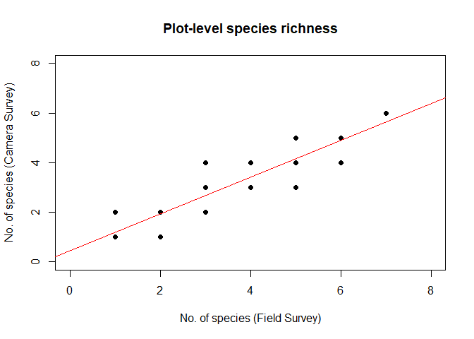
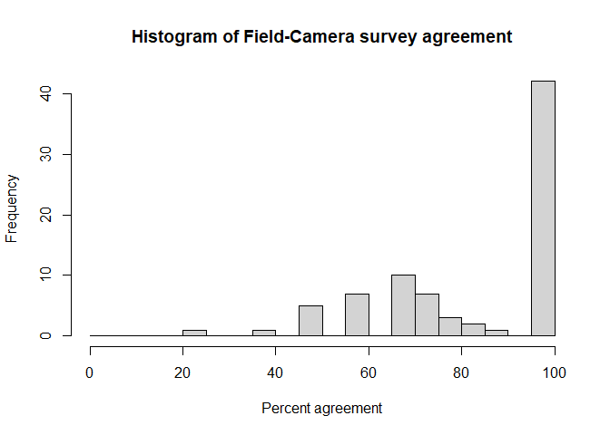
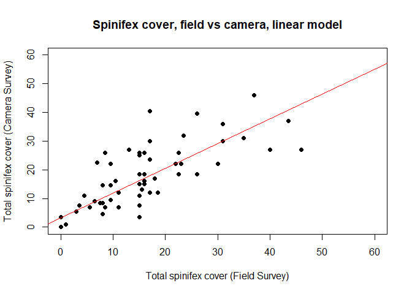
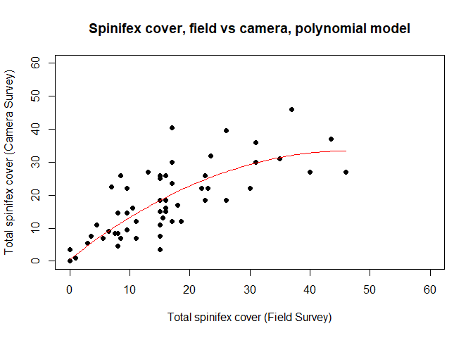
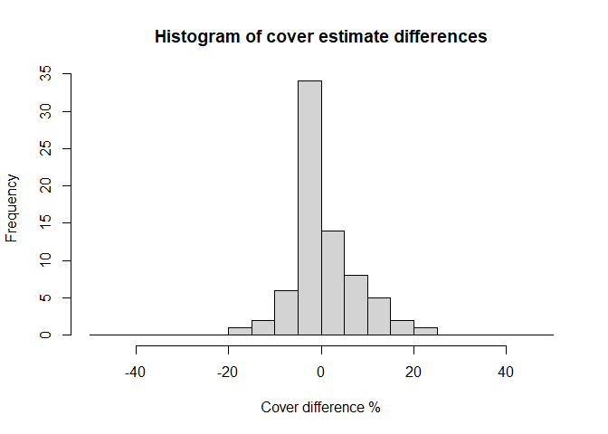
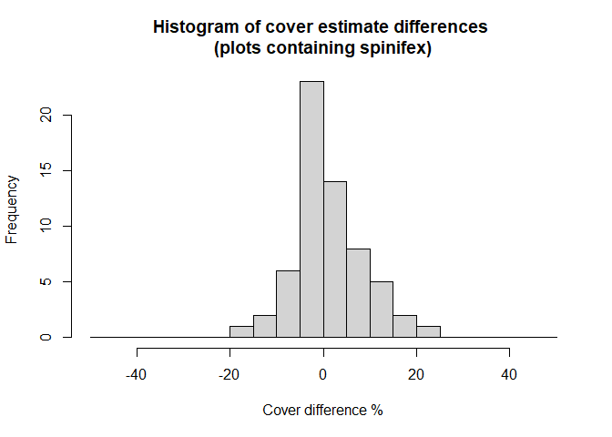
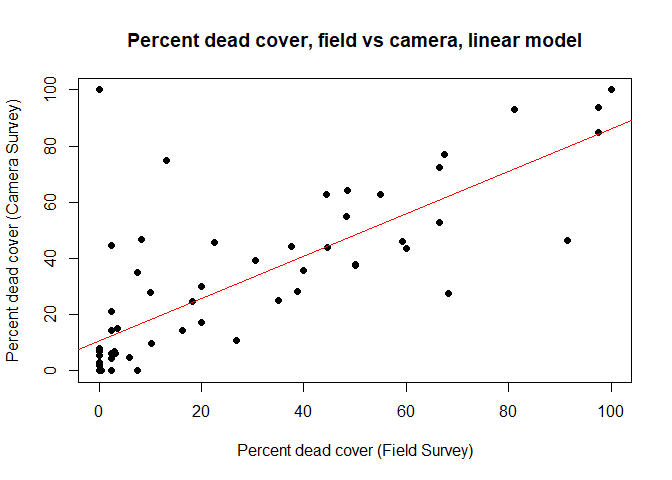
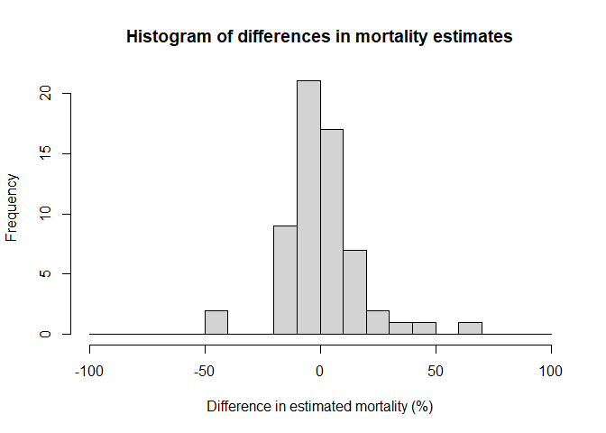

# Validation of 360-Degree Camera Data
Anonymized for review

# Validating ecological data extracted from 360-degree images using the pannotator package with field survey data

This file contains a preliminary assessment of the ability of data
extracted from 360-degree panospheric images using the pannotator
software to reliably capture important ecological variables that have
been reported in the accompanying paper. The analyses and results
reported in this document are based on data collected over a series of
validation plots located across Uluru-Kata Tjuta National Park,
Australia in which field survey data and 360-degree images were
collected and in the main study transect reported in the paper.

Here we focus on three sets of analyses that investigate the reliability
and repeatability of key ecological data presented in the paper:

1.  A comparison of plot-level plant species lists constructed from both
    360-degree camera images and accompanying field survey data (based
    on validation plots)

2.  A comparison of plant cover estimates, again using both 360-degree
    camera images and field survey data (based on validation plots)

3.  Consistency in the scoring of tree crown health by different users
    of the pannotator package (based on the main transect)

We note that the analyses presented here relate only to the data
collected in our study, and that research focusing on different species
or systems will likely require different methods for collecting
360-degree images and for calibration. However, based on our results we
draw general conclusions relevant to other study systems and provide
practical advice for collecting images and calibrating image-based data
in the accompanying paper.

## Data sources

The species and cover analyses conducted below are based on data
collected from a series of validation plots (20 m diameter) located on
the edges or corners of square transects that measure 1 km on each side.
The plots were established across Uluru-Kata Tjuta National Park to
capture variation in landforms and vegetation across the Park. Crown
data for desert oak (*Allocasuarina decaisneana*) were extracted from
360-degree images collected along the main 4 km long study transect
centred on S 25.35 degrees, W 130.72 degrees (see accompanying paper).

## Install the necessary packages for all code below


    Attaching package: 'dplyr'

    The following objects are masked from 'package:stats':

        filter, lag

    The following objects are masked from 'package:base':

        intersect, setdiff, setequal, union


    Attaching package: 'data.table'

    The following objects are masked from 'package:dplyr':

        between, first, last

    Linking to GEOS 3.11.2, GDAL 3.6.2, PROJ 9.2.0; sf_use_s2() is TRUE

    ── Attaching core tidyverse packages ──────────────────────── tidyverse 2.0.0 ──
    ✔ forcats   1.0.0     ✔ purrr     1.0.2
    ✔ lubridate 1.9.3     ✔ tibble    3.2.1
    ── Conflicts ────────────────────────────────────────── tidyverse_conflicts() ──
    ✖ data.table::between() masks dplyr::between()
    ✖ dplyr::filter()       masks stats::filter()
    ✖ data.table::first()   masks dplyr::first()
    ✖ lubridate::hour()     masks data.table::hour()
    ✖ lubridate::isoweek()  masks data.table::isoweek()
    ✖ dplyr::lag()          masks stats::lag()
    ✖ data.table::last()    masks dplyr::last()
    ✖ lubridate::mday()     masks data.table::mday()
    ✖ lubridate::minute()   masks data.table::minute()
    ✖ lubridate::month()    masks data.table::month()
    ✖ lubridate::quarter()  masks data.table::quarter()
    ✖ lubridate::second()   masks data.table::second()
    ✖ purrr::transpose()    masks data.table::transpose()
    ✖ lubridate::wday()     masks data.table::wday()
    ✖ lubridate::week()     masks data.table::week()
    ✖ lubridate::yday()     masks data.table::yday()
    ✖ lubridate::year()     masks data.table::year()
    ℹ Use the conflicted package (<http://conflicted.r-lib.org/>) to force all conflicts to become errors

## 1. Plant species data

All woody plant species (subshrubs \< 50 cm tall, shrubs \>= 50 cm tall
and trees) along with species of *Triodia* (spinifex grasses) were
identified inside 79 validation plots (20 m diameter) during field
surveys conducted in August 2022. Here we read in the .csv file and
create the R dataframe ‘species_data’.

The dataframe ‘species_data’ contains the following variables:

Column \[1\] (ID) = record identifier; \[2\] (Plot) = plot number, \[3\]
(Location) = location of plot along transect (NE, NW, SE, SW corner or
extra plot); \[4\] (Latitude) = latitude in decimal degrees; \[5\]
(Longitude) = longitude in decimal degrees; \[6\] (Closest_image) =
identity of closest 360-degree image (for pannotator annotation); \[7\]
(Camera_d_to_plot) = approximate distance (m) from camera image centre
to survey plot centre; \[8\] (No_Field_species) = number of species
identified in field survey; \[9\] (No_Camera_species) = number of
species identified in camera survey; \[10\] (In_field_not_camera) =
number of species unique to field survey;

\[11\] (Notes) = notes on errors in data collection, where
‘NoDiscrepancy’ = no differences between field survey and camera survey
species lists, ‘Inside5m’ = the species not identified (missed in the
survey) was within 5 m of the plot centre and camera, ‘Outside5m’ = the
species missed was more than 5m from the plot centre and camera, and
‘FieldError’ = the species was incorrectly recorded as absent in the
field survey;

\[12\]-\[14\] (Field_extra_Species_1, Field_extra_Species_2,
Field_extra_Species_3) = names of extra species recorded in the field
survey; \[15\] (In_camera_not_field) = number of species unique to
camera survey; \[16\] (C_E_Species_1) = names of extra species recorded
in the camera survey; \[17\] (Shared_species) = total number of shared
species in field and camera survey lists; \[18\] (Unique_species) =
total number of unique species in field and camera survey lists; \[19\]
(Agreement) = Agreement (%), measured as 100 X ((shared species) /
(shared + unique species));

\[20\]-\[51\] (AcacAneu, AlloDeca, Triodiasp, AlutMais, GrevErio,
AcacLigu, EucaGamo, DicrGile, AcacPrui, EremSpec, DodoVisc, AcacMell,
CodoCoti, GyroTepp, AcacMiny, EucaOxy, NewcSpod, AcacMait, ExocSpar,
HakeSpec, GrevSten, SanLanc, SennArte, GyroRamo GrevJunc, AcacAmmo,
EremLatr, EremGlab, EremGibs, RhagErem, EremLong, Acacia_sp) species
present in plots, with Both = species in both field and camera survey
lists; CameraOnly = species found only in camera survey list; FieldOnly
= species found only in field survey list; Absent = species not recorded
in either field or camera survey data.

The species are: AcacAneu = *Acacia aneur*a, AlloDeca = *Allocasuarina
decaisneana*, Triodiasp = *Triodia* species (*T. pungens, T. schinzii*
and *T. basedowii*), AlutMais = *Aluta maisonneuvei*, GrevErio =
*Grevillea eriostachya*, AcacLigu = *Acacia ligulata*, EucaGamo =
*Eucalyptus gammophylla*, DicrGile = *Dicrastylis gilesii*, AcacPrui =
Acacia pruinocarpa, EremSpec = *Eremophila* sp., DodoVisc = *Dodonaea
viscosa,* AcacMell = *Acacia melliodora*, CodoCoti = *Codonocarpus
cotinifolius*, GyroTepp = *Gyrostemon tepperi*, AcacMiny = *Acacia
minyura*, EucaOxy = *Eucalyptus oxymitra*, NewcSpod = *Newcastelia
spodiotricha*, AcacMait = *Acacia maitlandii*, ExocSpar = *Exocarpos
sparteus*, HakeSpec = *Hakea* species , GrevSten = *Grevillea
stenobotrya*, SanLanc = *Santalum lanceolatum*, SennArte = *Senna
artemisiodes*, GyroRamo = *Gyrostemon ramulosum*, GrevJunc = *Grevillea
juncifolia*, AcacAmmo = *Acacia ammobia* , EremLatr = *Eremophila
latrobei*, EremGlab = *Eremophila glabra*, EremGibs = *Eremophila
gibsonii* , RhagErem = *Rhagodia eremaea* , EremLong = *Eremophila
longifolia*, Acacia_sp = *Acacia* species.

``` r
species_data <- read_csv("./Data_files/validation_species.csv", show_col_types = FALSE)

# confirm that there are 79 plots of species data
cat("The number of rows in the dataframe is: ", nrow(species_data))

# initialize table counter
table_counter <- 0

# function to generate table numbers and captions
table_caption <- function(caption) {
  table_counter <<- table_counter + 1
  paste("Table", table_counter, ":", caption)
}

# show the first 10 rows of the dataframe
#kable(head(species_data, 10), format = "html", caption="Species calibration data frame") 
```

    The number of rows in the dataframe is:  79

We begin by comparing the mean species number across plots using species
lists compiled from field survey data and camera images scored in the
pannotator package.

``` r
# find the mean number of species in the field surveys
Field_mean <- summary(species_data$No_Field_species)
cat("The summary for the number of species based on field survey data is:\n")
print(Field_mean)
cat("\n")

# find the mean number of species in the camera surveys
Camera_mean <- summary(species_data$No_Camera_species)
cat("The summary for the number of species based on camera image data is:\n")
print(Camera_mean)
cat("\n")
```

    The summary for the number of species based on field survey data is:
       Min. 1st Qu.  Median    Mean 3rd Qu.    Max. 
      1.000   2.000   3.000   3.266   5.000   7.000 

    The summary for the number of species based on camera image data is:
       Min. 1st Qu.  Median    Mean 3rd Qu.    Max. 
      1.000   2.000   3.000   2.861   4.000   6.000 

The data show that on average we recorded 3.3 species per plot based on
field surveys and 2.9 species based on camera images. Thus, there was a
weak tendency to record fewer species using camera images. Now we
determine the relationship between plot-level species counts in the
field survey versus camera survey counts.

``` r
# abline adds a linear model to the plot.
plot_sp_richness <- plot(species_data$No_Field_species, species_data$No_Camera_species,
                         main = "Plot-level species richness",
                         xlab = "No. of species (Field Survey)",
                         ylab = "No. of species (Camera Survey)",
                         pch = 16,  # Use filled circles as data points
                         col = "black",  # Set point color 
                         ylim = c(0, 8),  # Set y-axis limits
                         xlim = c(0, 8))  # Set x-axis limits
                    abline(lm(No_Camera_species ~ No_Field_species, data = species_data), col = "red")
```



``` r
# create linear model for species data
model <- lm(No_Camera_species ~ No_Field_species, data = species_data)
cat("Model results:\n")
print(model)

# summarise linear model
model_summary <- summary(model)
cat("Model summary:\n")
print(model_summary)
```

    Model results:

    Call:
    lm(formula = No_Camera_species ~ No_Field_species, data = species_data)

    Coefficients:
         (Intercept)  No_Field_species  
              0.4394            0.7414  

    Model summary:

    Call:
    lm(formula = No_Camera_species ~ No_Field_species, data = species_data)

    Residuals:
         Min       1Q   Median       3Q      Max 
    -1.14654 -0.18080  0.07777  0.33633  1.33633 

    Coefficients:
                     Estimate Std. Error t value Pr(>|t|)    
    (Intercept)       0.43936    0.14054   3.126   0.0025 ** 
    No_Field_species  0.74144    0.03885  19.087   <2e-16 ***
    ---
    Signif. codes:  0 '***' 0.001 '**' 0.01 '*' 0.05 '.' 0.1 ' ' 1

    Residual standard error: 0.5374 on 77 degrees of freedom
    Multiple R-squared:  0.8255,    Adjusted R-squared:  0.8233 
    F-statistic: 364.3 on 1 and 77 DF,  p-value: < 2.2e-16

There is a strong positive relationship between species counts in plots
based on field survey and camera survey data which explains 82.3 % of
the variation in the data (*p* \< 6.3825904^{-31}). The slope (0.74)
again indicates a weak tendency for species lists compiled using camera
imagery to be smaller than those based on field survey data.

Now we assess the percentage agreement in the species lists based on
field survey and camera survey data. The percentage agreement (A) is
measured as A = 100 X ((shared species) / (shared + unique species)).

``` r
Mean_agreement = summary(species_data$Agreement)
cat("The summary for % agreement between field & camera survey species lists is:\n")
print(Mean_agreement)

# construct a histogram of the % agreement between mean plot-level species counts based on field and camera surveys
hist_data <- hist(species_data$Agreement, breaks = seq(0, 100, by = 5),
                  main = "Histogram of Field-Camera survey agreement",
                  xlab = "Percent agreement",
                  ylab = "Frequency")
```



    The summary for % agreement between field & camera survey species lists is:
       Min. 1st Qu.  Median    Mean 3rd Qu.    Max. 
      25.00   66.67  100.00   83.75  100.00  100.00 

On average there was 84% agreement between field survey and camera
survey species lists. The histogram shows that a majority of plots were
in 100% agreement, with a second cluster at 65-90% agreement. A small
number of plots had lower agreement.

We now investigate which species were contributing to the lack of
agreement in species lists in certain plots. First we construct a list
of the species that were missed in the camera surveys of each plot
(i.e., were found only in the field survey), with the number of
occasions of each. There are three columns of species found only in the
field survey, labelled Field_extra_Species_1, Field_extra_Species_2, and
Field_extra_Species_3. Next we construct a list of the species that were
recorded ONLY in the camera surveys of each plot (i.e., were not
recorded in the field survey), with counts of each. There is one column
of species found only in the camera survey, labelled C_E_Species_1.

``` r
# summarise results for each of the field extra species columns
summary_1 <- species_data %>%
             filter(!is.na(Field_extra_Species_1)) %>%
             count(Field_extra_Species_1, sort = TRUE) %>%
             rename(Species = Field_extra_Species_1) %>%
             mutate(Species = as.character(Species))

summary_2 <- species_data %>%
             filter(!is.na(Field_extra_Species_2)) %>%
             count(Field_extra_Species_2, sort = TRUE) %>% 
             rename(Species = Field_extra_Species_2) %>%
             mutate(Species = as.character(Species))

summary_3 <- species_data %>%
             filter(!is.na(Field_extra_Species_3)) %>%
             count(Field_extra_Species_3, sort = TRUE) %>%
             rename(Species = Field_extra_Species_3) %>%
             mutate(Species = as.character(Species))

field_only_species <- bind_rows(summary_1, summary_2, summary_3) %>%
                      group_by(Species) %>%
                      summarise(n = sum(n)) %>%
                      arrange(desc(n))


# print table using gt
field_only_species_gt_table <- gt(field_only_species) %>%
  tab_options(
    table.align = "center",
    table.font.size = px(10),
    column_labels.font.size = px(16),
    heading.align = "center",
    heading.title.font.size = px(20),
    quarto.use_bootstrap = TRUE
  ) %>%
  opt_row_striping() %>%
  tab_header(
    title = table_caption("Extra species in field surveys")
  )

field_only_species_gt_table
```

<div id="atqympafao" style="padding-left:0px;padding-right:0px;padding-top:10px;padding-bottom:10px;overflow-x:auto;overflow-y:auto;width:auto;height:auto;">
<style>#atqympafao table {
  font-family: system-ui, 'Segoe UI', Roboto, Helvetica, Arial, sans-serif, 'Apple Color Emoji', 'Segoe UI Emoji', 'Segoe UI Symbol', 'Noto Color Emoji';
  -webkit-font-smoothing: antialiased;
  -moz-osx-font-smoothing: grayscale;
}

#atqympafao thead, #atqympafao tbody, #atqympafao tfoot, #atqympafao tr, #atqympafao td, #atqympafao th {
  border-style: none;
}

#atqympafao p {
  margin: 0;
  padding: 0;
}

#atqympafao .gt_table {
  display: table;
  border-collapse: collapse;
  line-height: normal;
  margin-left: auto;
  margin-right: auto;
  color: #333333;
  font-size: 10px;
  font-weight: normal;
  font-style: normal;
  background-color: #FFFFFF;
  width: auto;
  border-top-style: solid;
  border-top-width: 2px;
  border-top-color: #A8A8A8;
  border-right-style: none;
  border-right-width: 2px;
  border-right-color: #D3D3D3;
  border-bottom-style: solid;
  border-bottom-width: 2px;
  border-bottom-color: #A8A8A8;
  border-left-style: none;
  border-left-width: 2px;
  border-left-color: #D3D3D3;
}

#atqympafao .gt_caption {
  padding-top: 4px;
  padding-bottom: 4px;
}

#atqympafao .gt_title {
  color: #333333;
  font-size: 20px;
  font-weight: initial;
  padding-top: 4px;
  padding-bottom: 4px;
  padding-left: 5px;
  padding-right: 5px;
  border-bottom-color: #FFFFFF;
  border-bottom-width: 0;
}

#atqympafao .gt_subtitle {
  color: #333333;
  font-size: 85%;
  font-weight: initial;
  padding-top: 3px;
  padding-bottom: 5px;
  padding-left: 5px;
  padding-right: 5px;
  border-top-color: #FFFFFF;
  border-top-width: 0;
}

#atqympafao .gt_heading {
  background-color: #FFFFFF;
  text-align: center;
  border-bottom-color: #FFFFFF;
  border-left-style: none;
  border-left-width: 1px;
  border-left-color: #D3D3D3;
  border-right-style: none;
  border-right-width: 1px;
  border-right-color: #D3D3D3;
}

#atqympafao .gt_bottom_border {
  border-bottom-style: solid;
  border-bottom-width: 2px;
  border-bottom-color: #D3D3D3;
}

#atqympafao .gt_col_headings {
  border-top-style: solid;
  border-top-width: 2px;
  border-top-color: #D3D3D3;
  border-bottom-style: solid;
  border-bottom-width: 2px;
  border-bottom-color: #D3D3D3;
  border-left-style: none;
  border-left-width: 1px;
  border-left-color: #D3D3D3;
  border-right-style: none;
  border-right-width: 1px;
  border-right-color: #D3D3D3;
}

#atqympafao .gt_col_heading {
  color: #333333;
  background-color: #FFFFFF;
  font-size: 16px;
  font-weight: normal;
  text-transform: inherit;
  border-left-style: none;
  border-left-width: 1px;
  border-left-color: #D3D3D3;
  border-right-style: none;
  border-right-width: 1px;
  border-right-color: #D3D3D3;
  vertical-align: bottom;
  padding-top: 5px;
  padding-bottom: 6px;
  padding-left: 5px;
  padding-right: 5px;
  overflow-x: hidden;
}

#atqympafao .gt_column_spanner_outer {
  color: #333333;
  background-color: #FFFFFF;
  font-size: 16px;
  font-weight: normal;
  text-transform: inherit;
  padding-top: 0;
  padding-bottom: 0;
  padding-left: 4px;
  padding-right: 4px;
}

#atqympafao .gt_column_spanner_outer:first-child {
  padding-left: 0;
}

#atqympafao .gt_column_spanner_outer:last-child {
  padding-right: 0;
}

#atqympafao .gt_column_spanner {
  border-bottom-style: solid;
  border-bottom-width: 2px;
  border-bottom-color: #D3D3D3;
  vertical-align: bottom;
  padding-top: 5px;
  padding-bottom: 5px;
  overflow-x: hidden;
  display: inline-block;
  width: 100%;
}

#atqympafao .gt_spanner_row {
  border-bottom-style: hidden;
}

#atqympafao .gt_group_heading {
  padding-top: 8px;
  padding-bottom: 8px;
  padding-left: 5px;
  padding-right: 5px;
  color: #333333;
  background-color: #FFFFFF;
  font-size: 100%;
  font-weight: initial;
  text-transform: inherit;
  border-top-style: solid;
  border-top-width: 2px;
  border-top-color: #D3D3D3;
  border-bottom-style: solid;
  border-bottom-width: 2px;
  border-bottom-color: #D3D3D3;
  border-left-style: none;
  border-left-width: 1px;
  border-left-color: #D3D3D3;
  border-right-style: none;
  border-right-width: 1px;
  border-right-color: #D3D3D3;
  vertical-align: middle;
  text-align: left;
}

#atqympafao .gt_empty_group_heading {
  padding: 0.5px;
  color: #333333;
  background-color: #FFFFFF;
  font-size: 100%;
  font-weight: initial;
  border-top-style: solid;
  border-top-width: 2px;
  border-top-color: #D3D3D3;
  border-bottom-style: solid;
  border-bottom-width: 2px;
  border-bottom-color: #D3D3D3;
  vertical-align: middle;
}

#atqympafao .gt_from_md > :first-child {
  margin-top: 0;
}

#atqympafao .gt_from_md > :last-child {
  margin-bottom: 0;
}

#atqympafao .gt_row {
  padding-top: 8px;
  padding-bottom: 8px;
  padding-left: 5px;
  padding-right: 5px;
  margin: 10px;
  border-top-style: solid;
  border-top-width: 1px;
  border-top-color: #D3D3D3;
  border-left-style: none;
  border-left-width: 1px;
  border-left-color: #D3D3D3;
  border-right-style: none;
  border-right-width: 1px;
  border-right-color: #D3D3D3;
  vertical-align: middle;
  overflow-x: hidden;
}

#atqympafao .gt_stub {
  color: #333333;
  background-color: #FFFFFF;
  font-size: 100%;
  font-weight: initial;
  text-transform: inherit;
  border-right-style: solid;
  border-right-width: 2px;
  border-right-color: #D3D3D3;
  padding-left: 5px;
  padding-right: 5px;
}

#atqympafao .gt_stub_row_group {
  color: #333333;
  background-color: #FFFFFF;
  font-size: 100%;
  font-weight: initial;
  text-transform: inherit;
  border-right-style: solid;
  border-right-width: 2px;
  border-right-color: #D3D3D3;
  padding-left: 5px;
  padding-right: 5px;
  vertical-align: top;
}

#atqympafao .gt_row_group_first td {
  border-top-width: 2px;
}

#atqympafao .gt_row_group_first th {
  border-top-width: 2px;
}

#atqympafao .gt_summary_row {
  color: #333333;
  background-color: #FFFFFF;
  text-transform: inherit;
  padding-top: 8px;
  padding-bottom: 8px;
  padding-left: 5px;
  padding-right: 5px;
}

#atqympafao .gt_first_summary_row {
  border-top-style: solid;
  border-top-color: #D3D3D3;
}

#atqympafao .gt_first_summary_row.thick {
  border-top-width: 2px;
}

#atqympafao .gt_last_summary_row {
  padding-top: 8px;
  padding-bottom: 8px;
  padding-left: 5px;
  padding-right: 5px;
  border-bottom-style: solid;
  border-bottom-width: 2px;
  border-bottom-color: #D3D3D3;
}

#atqympafao .gt_grand_summary_row {
  color: #333333;
  background-color: #FFFFFF;
  text-transform: inherit;
  padding-top: 8px;
  padding-bottom: 8px;
  padding-left: 5px;
  padding-right: 5px;
}

#atqympafao .gt_first_grand_summary_row {
  padding-top: 8px;
  padding-bottom: 8px;
  padding-left: 5px;
  padding-right: 5px;
  border-top-style: double;
  border-top-width: 6px;
  border-top-color: #D3D3D3;
}

#atqympafao .gt_last_grand_summary_row_top {
  padding-top: 8px;
  padding-bottom: 8px;
  padding-left: 5px;
  padding-right: 5px;
  border-bottom-style: double;
  border-bottom-width: 6px;
  border-bottom-color: #D3D3D3;
}

#atqympafao .gt_striped {
  background-color: rgba(128, 128, 128, 0.05);
}

#atqympafao .gt_table_body {
  border-top-style: solid;
  border-top-width: 2px;
  border-top-color: #D3D3D3;
  border-bottom-style: solid;
  border-bottom-width: 2px;
  border-bottom-color: #D3D3D3;
}

#atqympafao .gt_footnotes {
  color: #333333;
  background-color: #FFFFFF;
  border-bottom-style: none;
  border-bottom-width: 2px;
  border-bottom-color: #D3D3D3;
  border-left-style: none;
  border-left-width: 2px;
  border-left-color: #D3D3D3;
  border-right-style: none;
  border-right-width: 2px;
  border-right-color: #D3D3D3;
}

#atqympafao .gt_footnote {
  margin: 0px;
  font-size: 90%;
  padding-top: 4px;
  padding-bottom: 4px;
  padding-left: 5px;
  padding-right: 5px;
}

#atqympafao .gt_sourcenotes {
  color: #333333;
  background-color: #FFFFFF;
  border-bottom-style: none;
  border-bottom-width: 2px;
  border-bottom-color: #D3D3D3;
  border-left-style: none;
  border-left-width: 2px;
  border-left-color: #D3D3D3;
  border-right-style: none;
  border-right-width: 2px;
  border-right-color: #D3D3D3;
}

#atqympafao .gt_sourcenote {
  font-size: 90%;
  padding-top: 4px;
  padding-bottom: 4px;
  padding-left: 5px;
  padding-right: 5px;
}

#atqympafao .gt_left {
  text-align: left;
}

#atqympafao .gt_center {
  text-align: center;
}

#atqympafao .gt_right {
  text-align: right;
  font-variant-numeric: tabular-nums;
}

#atqympafao .gt_font_normal {
  font-weight: normal;
}

#atqympafao .gt_font_bold {
  font-weight: bold;
}

#atqympafao .gt_font_italic {
  font-style: italic;
}

#atqympafao .gt_super {
  font-size: 65%;
}

#atqympafao .gt_footnote_marks {
  font-size: 75%;
  vertical-align: 0.4em;
  position: initial;
}

#atqympafao .gt_asterisk {
  font-size: 100%;
  vertical-align: 0;
}

#atqympafao .gt_indent_1 {
  text-indent: 5px;
}

#atqympafao .gt_indent_2 {
  text-indent: 10px;
}

#atqympafao .gt_indent_3 {
  text-indent: 15px;
}

#atqympafao .gt_indent_4 {
  text-indent: 20px;
}

#atqympafao .gt_indent_5 {
  text-indent: 25px;
}
</style>

| Table 1 : Extra species in field surveys |     |
|------------------------------------------|-----|
| Species                                  | n   |
| Triodia_schinzii                         | 11  |
| Acacia_ligulata                          | 4   |
| Aluta_maisonneuvei                       | 3   |
| Acacia_melliodora                        | 2   |
| Acacia_minyura                           | 2   |
| Eremophila_glabra                        | 2   |
| Eremophila_latrobei                      | 2   |
| Eremophila_longifolia                    | 2   |
| Grevillea_juncifolia                     | 2   |
| Acacia sp.                               | 1   |
| Acacia_maitlandii                        | 1   |
| Codonocarpus_cotinifolius                | 1   |
| Dodonea_viscosa                          | 1   |
| Eucalyptus_oxymitra                      | 1   |
| Grevillea_eriostachya                    | 1   |
| Grevillea_stenobotrys                    | 1   |
| Hakea\_?\_lorea                          | 1   |
| Rhagodia_eremaea                         | 1   |
| Santalum_lanceolatum                     | 1   |
| Senna_artemisiodes                       | 1   |

</div>

``` r
# summarise results for each of the species recorded in camera images only
camera_only_species <- species_data %>%
                       filter(!is.na(C_E_Species_1))  %>%
                       count(C_E_Species_1, sort = TRUE) %>%
                       rename(Species = 1) %>%
                       mutate(Species = as.character(Species))

camera_only_species_gt_table <- gt(camera_only_species) %>%
  tab_options(
    table.align = "center",
    table.font.size = px(10),
    column_labels.font.size = px(16),
    heading.align = "center",
    heading.title.font.size = px(20),
    quarto.use_bootstrap = TRUE
  ) %>%
  opt_row_striping() %>%
  tab_header(
    title = table_caption("Extra species in camera surveys")
  )

camera_only_species_gt_table
```

<div id="xjxzrabzys" style="padding-left:0px;padding-right:0px;padding-top:10px;padding-bottom:10px;overflow-x:auto;overflow-y:auto;width:auto;height:auto;">
<style>#xjxzrabzys table {
  font-family: system-ui, 'Segoe UI', Roboto, Helvetica, Arial, sans-serif, 'Apple Color Emoji', 'Segoe UI Emoji', 'Segoe UI Symbol', 'Noto Color Emoji';
  -webkit-font-smoothing: antialiased;
  -moz-osx-font-smoothing: grayscale;
}

#xjxzrabzys thead, #xjxzrabzys tbody, #xjxzrabzys tfoot, #xjxzrabzys tr, #xjxzrabzys td, #xjxzrabzys th {
  border-style: none;
}

#xjxzrabzys p {
  margin: 0;
  padding: 0;
}

#xjxzrabzys .gt_table {
  display: table;
  border-collapse: collapse;
  line-height: normal;
  margin-left: auto;
  margin-right: auto;
  color: #333333;
  font-size: 10px;
  font-weight: normal;
  font-style: normal;
  background-color: #FFFFFF;
  width: auto;
  border-top-style: solid;
  border-top-width: 2px;
  border-top-color: #A8A8A8;
  border-right-style: none;
  border-right-width: 2px;
  border-right-color: #D3D3D3;
  border-bottom-style: solid;
  border-bottom-width: 2px;
  border-bottom-color: #A8A8A8;
  border-left-style: none;
  border-left-width: 2px;
  border-left-color: #D3D3D3;
}

#xjxzrabzys .gt_caption {
  padding-top: 4px;
  padding-bottom: 4px;
}

#xjxzrabzys .gt_title {
  color: #333333;
  font-size: 20px;
  font-weight: initial;
  padding-top: 4px;
  padding-bottom: 4px;
  padding-left: 5px;
  padding-right: 5px;
  border-bottom-color: #FFFFFF;
  border-bottom-width: 0;
}

#xjxzrabzys .gt_subtitle {
  color: #333333;
  font-size: 85%;
  font-weight: initial;
  padding-top: 3px;
  padding-bottom: 5px;
  padding-left: 5px;
  padding-right: 5px;
  border-top-color: #FFFFFF;
  border-top-width: 0;
}

#xjxzrabzys .gt_heading {
  background-color: #FFFFFF;
  text-align: center;
  border-bottom-color: #FFFFFF;
  border-left-style: none;
  border-left-width: 1px;
  border-left-color: #D3D3D3;
  border-right-style: none;
  border-right-width: 1px;
  border-right-color: #D3D3D3;
}

#xjxzrabzys .gt_bottom_border {
  border-bottom-style: solid;
  border-bottom-width: 2px;
  border-bottom-color: #D3D3D3;
}

#xjxzrabzys .gt_col_headings {
  border-top-style: solid;
  border-top-width: 2px;
  border-top-color: #D3D3D3;
  border-bottom-style: solid;
  border-bottom-width: 2px;
  border-bottom-color: #D3D3D3;
  border-left-style: none;
  border-left-width: 1px;
  border-left-color: #D3D3D3;
  border-right-style: none;
  border-right-width: 1px;
  border-right-color: #D3D3D3;
}

#xjxzrabzys .gt_col_heading {
  color: #333333;
  background-color: #FFFFFF;
  font-size: 16px;
  font-weight: normal;
  text-transform: inherit;
  border-left-style: none;
  border-left-width: 1px;
  border-left-color: #D3D3D3;
  border-right-style: none;
  border-right-width: 1px;
  border-right-color: #D3D3D3;
  vertical-align: bottom;
  padding-top: 5px;
  padding-bottom: 6px;
  padding-left: 5px;
  padding-right: 5px;
  overflow-x: hidden;
}

#xjxzrabzys .gt_column_spanner_outer {
  color: #333333;
  background-color: #FFFFFF;
  font-size: 16px;
  font-weight: normal;
  text-transform: inherit;
  padding-top: 0;
  padding-bottom: 0;
  padding-left: 4px;
  padding-right: 4px;
}

#xjxzrabzys .gt_column_spanner_outer:first-child {
  padding-left: 0;
}

#xjxzrabzys .gt_column_spanner_outer:last-child {
  padding-right: 0;
}

#xjxzrabzys .gt_column_spanner {
  border-bottom-style: solid;
  border-bottom-width: 2px;
  border-bottom-color: #D3D3D3;
  vertical-align: bottom;
  padding-top: 5px;
  padding-bottom: 5px;
  overflow-x: hidden;
  display: inline-block;
  width: 100%;
}

#xjxzrabzys .gt_spanner_row {
  border-bottom-style: hidden;
}

#xjxzrabzys .gt_group_heading {
  padding-top: 8px;
  padding-bottom: 8px;
  padding-left: 5px;
  padding-right: 5px;
  color: #333333;
  background-color: #FFFFFF;
  font-size: 100%;
  font-weight: initial;
  text-transform: inherit;
  border-top-style: solid;
  border-top-width: 2px;
  border-top-color: #D3D3D3;
  border-bottom-style: solid;
  border-bottom-width: 2px;
  border-bottom-color: #D3D3D3;
  border-left-style: none;
  border-left-width: 1px;
  border-left-color: #D3D3D3;
  border-right-style: none;
  border-right-width: 1px;
  border-right-color: #D3D3D3;
  vertical-align: middle;
  text-align: left;
}

#xjxzrabzys .gt_empty_group_heading {
  padding: 0.5px;
  color: #333333;
  background-color: #FFFFFF;
  font-size: 100%;
  font-weight: initial;
  border-top-style: solid;
  border-top-width: 2px;
  border-top-color: #D3D3D3;
  border-bottom-style: solid;
  border-bottom-width: 2px;
  border-bottom-color: #D3D3D3;
  vertical-align: middle;
}

#xjxzrabzys .gt_from_md > :first-child {
  margin-top: 0;
}

#xjxzrabzys .gt_from_md > :last-child {
  margin-bottom: 0;
}

#xjxzrabzys .gt_row {
  padding-top: 8px;
  padding-bottom: 8px;
  padding-left: 5px;
  padding-right: 5px;
  margin: 10px;
  border-top-style: solid;
  border-top-width: 1px;
  border-top-color: #D3D3D3;
  border-left-style: none;
  border-left-width: 1px;
  border-left-color: #D3D3D3;
  border-right-style: none;
  border-right-width: 1px;
  border-right-color: #D3D3D3;
  vertical-align: middle;
  overflow-x: hidden;
}

#xjxzrabzys .gt_stub {
  color: #333333;
  background-color: #FFFFFF;
  font-size: 100%;
  font-weight: initial;
  text-transform: inherit;
  border-right-style: solid;
  border-right-width: 2px;
  border-right-color: #D3D3D3;
  padding-left: 5px;
  padding-right: 5px;
}

#xjxzrabzys .gt_stub_row_group {
  color: #333333;
  background-color: #FFFFFF;
  font-size: 100%;
  font-weight: initial;
  text-transform: inherit;
  border-right-style: solid;
  border-right-width: 2px;
  border-right-color: #D3D3D3;
  padding-left: 5px;
  padding-right: 5px;
  vertical-align: top;
}

#xjxzrabzys .gt_row_group_first td {
  border-top-width: 2px;
}

#xjxzrabzys .gt_row_group_first th {
  border-top-width: 2px;
}

#xjxzrabzys .gt_summary_row {
  color: #333333;
  background-color: #FFFFFF;
  text-transform: inherit;
  padding-top: 8px;
  padding-bottom: 8px;
  padding-left: 5px;
  padding-right: 5px;
}

#xjxzrabzys .gt_first_summary_row {
  border-top-style: solid;
  border-top-color: #D3D3D3;
}

#xjxzrabzys .gt_first_summary_row.thick {
  border-top-width: 2px;
}

#xjxzrabzys .gt_last_summary_row {
  padding-top: 8px;
  padding-bottom: 8px;
  padding-left: 5px;
  padding-right: 5px;
  border-bottom-style: solid;
  border-bottom-width: 2px;
  border-bottom-color: #D3D3D3;
}

#xjxzrabzys .gt_grand_summary_row {
  color: #333333;
  background-color: #FFFFFF;
  text-transform: inherit;
  padding-top: 8px;
  padding-bottom: 8px;
  padding-left: 5px;
  padding-right: 5px;
}

#xjxzrabzys .gt_first_grand_summary_row {
  padding-top: 8px;
  padding-bottom: 8px;
  padding-left: 5px;
  padding-right: 5px;
  border-top-style: double;
  border-top-width: 6px;
  border-top-color: #D3D3D3;
}

#xjxzrabzys .gt_last_grand_summary_row_top {
  padding-top: 8px;
  padding-bottom: 8px;
  padding-left: 5px;
  padding-right: 5px;
  border-bottom-style: double;
  border-bottom-width: 6px;
  border-bottom-color: #D3D3D3;
}

#xjxzrabzys .gt_striped {
  background-color: rgba(128, 128, 128, 0.05);
}

#xjxzrabzys .gt_table_body {
  border-top-style: solid;
  border-top-width: 2px;
  border-top-color: #D3D3D3;
  border-bottom-style: solid;
  border-bottom-width: 2px;
  border-bottom-color: #D3D3D3;
}

#xjxzrabzys .gt_footnotes {
  color: #333333;
  background-color: #FFFFFF;
  border-bottom-style: none;
  border-bottom-width: 2px;
  border-bottom-color: #D3D3D3;
  border-left-style: none;
  border-left-width: 2px;
  border-left-color: #D3D3D3;
  border-right-style: none;
  border-right-width: 2px;
  border-right-color: #D3D3D3;
}

#xjxzrabzys .gt_footnote {
  margin: 0px;
  font-size: 90%;
  padding-top: 4px;
  padding-bottom: 4px;
  padding-left: 5px;
  padding-right: 5px;
}

#xjxzrabzys .gt_sourcenotes {
  color: #333333;
  background-color: #FFFFFF;
  border-bottom-style: none;
  border-bottom-width: 2px;
  border-bottom-color: #D3D3D3;
  border-left-style: none;
  border-left-width: 2px;
  border-left-color: #D3D3D3;
  border-right-style: none;
  border-right-width: 2px;
  border-right-color: #D3D3D3;
}

#xjxzrabzys .gt_sourcenote {
  font-size: 90%;
  padding-top: 4px;
  padding-bottom: 4px;
  padding-left: 5px;
  padding-right: 5px;
}

#xjxzrabzys .gt_left {
  text-align: left;
}

#xjxzrabzys .gt_center {
  text-align: center;
}

#xjxzrabzys .gt_right {
  text-align: right;
  font-variant-numeric: tabular-nums;
}

#xjxzrabzys .gt_font_normal {
  font-weight: normal;
}

#xjxzrabzys .gt_font_bold {
  font-weight: bold;
}

#xjxzrabzys .gt_font_italic {
  font-style: italic;
}

#xjxzrabzys .gt_super {
  font-size: 65%;
}

#xjxzrabzys .gt_footnote_marks {
  font-size: 75%;
  vertical-align: 0.4em;
  position: initial;
}

#xjxzrabzys .gt_asterisk {
  font-size: 100%;
  vertical-align: 0;
}

#xjxzrabzys .gt_indent_1 {
  text-indent: 5px;
}

#xjxzrabzys .gt_indent_2 {
  text-indent: 10px;
}

#xjxzrabzys .gt_indent_3 {
  text-indent: 15px;
}

#xjxzrabzys .gt_indent_4 {
  text-indent: 20px;
}

#xjxzrabzys .gt_indent_5 {
  text-indent: 25px;
}
</style>

| Table 2 : Extra species in camera surveys |     |
|-------------------------------------------|-----|
| Species                                   | n   |
| Aluta_maisonneuvei                        | 4   |
| Acacia_aneura                             | 3   |
| Triodia_sp.                               | 3   |
| Acacia_maitlandii                         | 1   |
| Grevillea_eriostachya                     | 1   |
| Newcastelia_spodiotricha                  | 1   |

</div>

These data show that the most common species identified only in the
field survey of a given plot was *Triodia schinzii*, a spinifex grass.
In many plots *Triodia pungens* and *Triodia schinzii* were both
present, but it was not generally possible to distinguish these taxa,
the difference of which can usually only be determined by panicle or
floral structure. *Acacia ligulata* and *Aluta maisonneuvei* were also
missed in the camera surveys 4 and 3 times respectively, but these were
often in burnt plots. Other species, usually shrubs, were occasionally
missed.

We now determine some circumstances under which species were not
recorded in the two surveys. For this we have the variable
species_data$Notes, which has the categories ‘NoDiscrepancy’ = the field
and camera survey lists were the same, ‘Outside5m’ = detected in field
survey 5 m to 10 m from the plot centre but not in the camera survey,
‘Inside5m’ = detected in field survey within 5 m of the plot centre but
not in the camera survey, and ‘FieldError’ where an error was made in
the field survey.

``` r
# count occurrences in 'Notes' column and sort the results
df <- species_data %>%
      count(Notes, sort = TRUE)

# calculate the total number of records
total <- sum(df$n)

# calculate the total number of discrepancies in plots species lists
# need to filter by specific Notes values corresponding to discrepancies
disc <- df %>%
        filter(Notes %in% c("Inside5m", "Outside5m", "FieldError")) %>%
        summarise(total_discrepancies = sum(n)) %>%
        pull(total_discrepancies)

# calculate the percentage of discrepancies
pcnt_disc <- 100 * (disc / total)

# print the percentage of discrepancies
cat(paste("Percentage of discrepancies:", round(pcnt_disc, 1), "%"))
cat("\n")

df_gt_table <- gt(df) %>%
  tab_options(
    table.align = "center",
    table.font.size = px(10),
    column_labels.font.size = px(16),
    heading.align = "center",
    heading.title.font.size = px(20)
  ) %>%
  opt_row_striping() %>%
  tab_header(
    title = table_caption("Discrepancies between field & camera surveys")
  )

df_gt_table
```

    Percentage of discrepancies: 45.6 %

<div id="vuslcaqaqx" style="padding-left:0px;padding-right:0px;padding-top:10px;padding-bottom:10px;overflow-x:auto;overflow-y:auto;width:auto;height:auto;">
<style>#vuslcaqaqx table {
  font-family: system-ui, 'Segoe UI', Roboto, Helvetica, Arial, sans-serif, 'Apple Color Emoji', 'Segoe UI Emoji', 'Segoe UI Symbol', 'Noto Color Emoji';
  -webkit-font-smoothing: antialiased;
  -moz-osx-font-smoothing: grayscale;
}

#vuslcaqaqx thead, #vuslcaqaqx tbody, #vuslcaqaqx tfoot, #vuslcaqaqx tr, #vuslcaqaqx td, #vuslcaqaqx th {
  border-style: none;
}

#vuslcaqaqx p {
  margin: 0;
  padding: 0;
}

#vuslcaqaqx .gt_table {
  display: table;
  border-collapse: collapse;
  line-height: normal;
  margin-left: auto;
  margin-right: auto;
  color: #333333;
  font-size: 10px;
  font-weight: normal;
  font-style: normal;
  background-color: #FFFFFF;
  width: auto;
  border-top-style: solid;
  border-top-width: 2px;
  border-top-color: #A8A8A8;
  border-right-style: none;
  border-right-width: 2px;
  border-right-color: #D3D3D3;
  border-bottom-style: solid;
  border-bottom-width: 2px;
  border-bottom-color: #A8A8A8;
  border-left-style: none;
  border-left-width: 2px;
  border-left-color: #D3D3D3;
}

#vuslcaqaqx .gt_caption {
  padding-top: 4px;
  padding-bottom: 4px;
}

#vuslcaqaqx .gt_title {
  color: #333333;
  font-size: 20px;
  font-weight: initial;
  padding-top: 4px;
  padding-bottom: 4px;
  padding-left: 5px;
  padding-right: 5px;
  border-bottom-color: #FFFFFF;
  border-bottom-width: 0;
}

#vuslcaqaqx .gt_subtitle {
  color: #333333;
  font-size: 85%;
  font-weight: initial;
  padding-top: 3px;
  padding-bottom: 5px;
  padding-left: 5px;
  padding-right: 5px;
  border-top-color: #FFFFFF;
  border-top-width: 0;
}

#vuslcaqaqx .gt_heading {
  background-color: #FFFFFF;
  text-align: center;
  border-bottom-color: #FFFFFF;
  border-left-style: none;
  border-left-width: 1px;
  border-left-color: #D3D3D3;
  border-right-style: none;
  border-right-width: 1px;
  border-right-color: #D3D3D3;
}

#vuslcaqaqx .gt_bottom_border {
  border-bottom-style: solid;
  border-bottom-width: 2px;
  border-bottom-color: #D3D3D3;
}

#vuslcaqaqx .gt_col_headings {
  border-top-style: solid;
  border-top-width: 2px;
  border-top-color: #D3D3D3;
  border-bottom-style: solid;
  border-bottom-width: 2px;
  border-bottom-color: #D3D3D3;
  border-left-style: none;
  border-left-width: 1px;
  border-left-color: #D3D3D3;
  border-right-style: none;
  border-right-width: 1px;
  border-right-color: #D3D3D3;
}

#vuslcaqaqx .gt_col_heading {
  color: #333333;
  background-color: #FFFFFF;
  font-size: 16px;
  font-weight: normal;
  text-transform: inherit;
  border-left-style: none;
  border-left-width: 1px;
  border-left-color: #D3D3D3;
  border-right-style: none;
  border-right-width: 1px;
  border-right-color: #D3D3D3;
  vertical-align: bottom;
  padding-top: 5px;
  padding-bottom: 6px;
  padding-left: 5px;
  padding-right: 5px;
  overflow-x: hidden;
}

#vuslcaqaqx .gt_column_spanner_outer {
  color: #333333;
  background-color: #FFFFFF;
  font-size: 16px;
  font-weight: normal;
  text-transform: inherit;
  padding-top: 0;
  padding-bottom: 0;
  padding-left: 4px;
  padding-right: 4px;
}

#vuslcaqaqx .gt_column_spanner_outer:first-child {
  padding-left: 0;
}

#vuslcaqaqx .gt_column_spanner_outer:last-child {
  padding-right: 0;
}

#vuslcaqaqx .gt_column_spanner {
  border-bottom-style: solid;
  border-bottom-width: 2px;
  border-bottom-color: #D3D3D3;
  vertical-align: bottom;
  padding-top: 5px;
  padding-bottom: 5px;
  overflow-x: hidden;
  display: inline-block;
  width: 100%;
}

#vuslcaqaqx .gt_spanner_row {
  border-bottom-style: hidden;
}

#vuslcaqaqx .gt_group_heading {
  padding-top: 8px;
  padding-bottom: 8px;
  padding-left: 5px;
  padding-right: 5px;
  color: #333333;
  background-color: #FFFFFF;
  font-size: 100%;
  font-weight: initial;
  text-transform: inherit;
  border-top-style: solid;
  border-top-width: 2px;
  border-top-color: #D3D3D3;
  border-bottom-style: solid;
  border-bottom-width: 2px;
  border-bottom-color: #D3D3D3;
  border-left-style: none;
  border-left-width: 1px;
  border-left-color: #D3D3D3;
  border-right-style: none;
  border-right-width: 1px;
  border-right-color: #D3D3D3;
  vertical-align: middle;
  text-align: left;
}

#vuslcaqaqx .gt_empty_group_heading {
  padding: 0.5px;
  color: #333333;
  background-color: #FFFFFF;
  font-size: 100%;
  font-weight: initial;
  border-top-style: solid;
  border-top-width: 2px;
  border-top-color: #D3D3D3;
  border-bottom-style: solid;
  border-bottom-width: 2px;
  border-bottom-color: #D3D3D3;
  vertical-align: middle;
}

#vuslcaqaqx .gt_from_md > :first-child {
  margin-top: 0;
}

#vuslcaqaqx .gt_from_md > :last-child {
  margin-bottom: 0;
}

#vuslcaqaqx .gt_row {
  padding-top: 8px;
  padding-bottom: 8px;
  padding-left: 5px;
  padding-right: 5px;
  margin: 10px;
  border-top-style: solid;
  border-top-width: 1px;
  border-top-color: #D3D3D3;
  border-left-style: none;
  border-left-width: 1px;
  border-left-color: #D3D3D3;
  border-right-style: none;
  border-right-width: 1px;
  border-right-color: #D3D3D3;
  vertical-align: middle;
  overflow-x: hidden;
}

#vuslcaqaqx .gt_stub {
  color: #333333;
  background-color: #FFFFFF;
  font-size: 100%;
  font-weight: initial;
  text-transform: inherit;
  border-right-style: solid;
  border-right-width: 2px;
  border-right-color: #D3D3D3;
  padding-left: 5px;
  padding-right: 5px;
}

#vuslcaqaqx .gt_stub_row_group {
  color: #333333;
  background-color: #FFFFFF;
  font-size: 100%;
  font-weight: initial;
  text-transform: inherit;
  border-right-style: solid;
  border-right-width: 2px;
  border-right-color: #D3D3D3;
  padding-left: 5px;
  padding-right: 5px;
  vertical-align: top;
}

#vuslcaqaqx .gt_row_group_first td {
  border-top-width: 2px;
}

#vuslcaqaqx .gt_row_group_first th {
  border-top-width: 2px;
}

#vuslcaqaqx .gt_summary_row {
  color: #333333;
  background-color: #FFFFFF;
  text-transform: inherit;
  padding-top: 8px;
  padding-bottom: 8px;
  padding-left: 5px;
  padding-right: 5px;
}

#vuslcaqaqx .gt_first_summary_row {
  border-top-style: solid;
  border-top-color: #D3D3D3;
}

#vuslcaqaqx .gt_first_summary_row.thick {
  border-top-width: 2px;
}

#vuslcaqaqx .gt_last_summary_row {
  padding-top: 8px;
  padding-bottom: 8px;
  padding-left: 5px;
  padding-right: 5px;
  border-bottom-style: solid;
  border-bottom-width: 2px;
  border-bottom-color: #D3D3D3;
}

#vuslcaqaqx .gt_grand_summary_row {
  color: #333333;
  background-color: #FFFFFF;
  text-transform: inherit;
  padding-top: 8px;
  padding-bottom: 8px;
  padding-left: 5px;
  padding-right: 5px;
}

#vuslcaqaqx .gt_first_grand_summary_row {
  padding-top: 8px;
  padding-bottom: 8px;
  padding-left: 5px;
  padding-right: 5px;
  border-top-style: double;
  border-top-width: 6px;
  border-top-color: #D3D3D3;
}

#vuslcaqaqx .gt_last_grand_summary_row_top {
  padding-top: 8px;
  padding-bottom: 8px;
  padding-left: 5px;
  padding-right: 5px;
  border-bottom-style: double;
  border-bottom-width: 6px;
  border-bottom-color: #D3D3D3;
}

#vuslcaqaqx .gt_striped {
  background-color: rgba(128, 128, 128, 0.05);
}

#vuslcaqaqx .gt_table_body {
  border-top-style: solid;
  border-top-width: 2px;
  border-top-color: #D3D3D3;
  border-bottom-style: solid;
  border-bottom-width: 2px;
  border-bottom-color: #D3D3D3;
}

#vuslcaqaqx .gt_footnotes {
  color: #333333;
  background-color: #FFFFFF;
  border-bottom-style: none;
  border-bottom-width: 2px;
  border-bottom-color: #D3D3D3;
  border-left-style: none;
  border-left-width: 2px;
  border-left-color: #D3D3D3;
  border-right-style: none;
  border-right-width: 2px;
  border-right-color: #D3D3D3;
}

#vuslcaqaqx .gt_footnote {
  margin: 0px;
  font-size: 90%;
  padding-top: 4px;
  padding-bottom: 4px;
  padding-left: 5px;
  padding-right: 5px;
}

#vuslcaqaqx .gt_sourcenotes {
  color: #333333;
  background-color: #FFFFFF;
  border-bottom-style: none;
  border-bottom-width: 2px;
  border-bottom-color: #D3D3D3;
  border-left-style: none;
  border-left-width: 2px;
  border-left-color: #D3D3D3;
  border-right-style: none;
  border-right-width: 2px;
  border-right-color: #D3D3D3;
}

#vuslcaqaqx .gt_sourcenote {
  font-size: 90%;
  padding-top: 4px;
  padding-bottom: 4px;
  padding-left: 5px;
  padding-right: 5px;
}

#vuslcaqaqx .gt_left {
  text-align: left;
}

#vuslcaqaqx .gt_center {
  text-align: center;
}

#vuslcaqaqx .gt_right {
  text-align: right;
  font-variant-numeric: tabular-nums;
}

#vuslcaqaqx .gt_font_normal {
  font-weight: normal;
}

#vuslcaqaqx .gt_font_bold {
  font-weight: bold;
}

#vuslcaqaqx .gt_font_italic {
  font-style: italic;
}

#vuslcaqaqx .gt_super {
  font-size: 65%;
}

#vuslcaqaqx .gt_footnote_marks {
  font-size: 75%;
  vertical-align: 0.4em;
  position: initial;
}

#vuslcaqaqx .gt_asterisk {
  font-size: 100%;
  vertical-align: 0;
}

#vuslcaqaqx .gt_indent_1 {
  text-indent: 5px;
}

#vuslcaqaqx .gt_indent_2 {
  text-indent: 10px;
}

#vuslcaqaqx .gt_indent_3 {
  text-indent: 15px;
}

#vuslcaqaqx .gt_indent_4 {
  text-indent: 20px;
}

#vuslcaqaqx .gt_indent_5 {
  text-indent: 25px;
}
</style>

| Table 3 : Discrepancies between field & camera surveys |     |
|--------------------------------------------------------|-----|
| Notes                                                  | n   |
| NoDiscrepancy                                          | 43  |
| Outside5m                                              | 22  |
| Inside5m                                               | 11  |
| FieldError                                             | 3   |

</div>

These data show that there was discrepancy in species lists generate
from field and camera surveys in 46% of plots (in 36 of 79 plots), and
that in 22 plots (28%) at least one species located more than 5 m from
the centre of the plot was missed in the camera survey. In 11 plots
(14%) a species was missed in the camera survey when it occurred less
than 5 m from the centre of the plot.

We now determine which species were missed \< 5 m and \> 5 m from the
plot centre. Those missed \< 5 m from the plot centre are the most
serious because they fall within the area used to determine species
counts in subsequent camera-based surveys (see accompanying paper).

``` r
# Filtering species_data for notes "Inside5m" and removing rows with NA's in Field_extra_Species_1 and Field_extra_Species_2
species_data_L5 <- species_data %>%
                   filter(Notes == "Inside5m") %>%
                   filter(complete.cases(Field_extra_Species_1))

# Get the species counts for Field_extra_Species_1
summary_1_L5 <- species_data_L5 %>%
                count(Field_extra_Species_1, sort = TRUE) %>%
                rename(Species = Field_extra_Species_1) %>%
                mutate(Species = as.character(Species))

# Get the species counts for Field_extra_Species_2
summary_2_L5 <- species_data_L5 %>%
                filter(!is.na(Field_extra_Species_2)) %>%
                count(Field_extra_Species_2, sort = TRUE) %>%
                rename(Species = Field_extra_Species_2) %>%
                mutate(Species = as.character(Species))

# Combine the counts from both columns
Less5_summary <- bind_rows(summary_1_L5, summary_2_L5) %>%
                 group_by(Species) %>%
                 summarise(n = sum(n)) %>%
                 arrange(desc(n))


Less5_summary_gt_table <- gt(Less5_summary) %>%
  tab_options(
    table.align = "center",
    table.font.size = px(10),
    column_labels.font.size = px(16),
    heading.align = "center",
    heading.title.font.size = px(20)
  ) %>%
  opt_row_striping() %>%
  tab_header(title = table_caption("Species missed inside 5 metres"))

Less5_summary_gt_table

# get the total count of missed Triodia schinzii < 5 m from the plot center
Triodia_index <- which(Less5_summary$Species == "Triodia_schinzii")
Triodia_count <- Less5_summary$n[Triodia_index]

# using `summarize` to calculate the total count from Less5_summary
Total_count <- Less5_summary %>%
               summarize(total = sum(n)) %>%
               pull(total)

# calculate the percentage of Triodia schinzii
Triodia_pcnt <- round(100 * (Triodia_count/Total_count),1)
cat(paste("Missed Triodia schinzii (< 5 m) as % of total: ", Triodia_pcnt, "%"))
cat("\n")
```

<div id="pojhydsyev" style="padding-left:0px;padding-right:0px;padding-top:10px;padding-bottom:10px;overflow-x:auto;overflow-y:auto;width:auto;height:auto;">
<style>#pojhydsyev table {
  font-family: system-ui, 'Segoe UI', Roboto, Helvetica, Arial, sans-serif, 'Apple Color Emoji', 'Segoe UI Emoji', 'Segoe UI Symbol', 'Noto Color Emoji';
  -webkit-font-smoothing: antialiased;
  -moz-osx-font-smoothing: grayscale;
}

#pojhydsyev thead, #pojhydsyev tbody, #pojhydsyev tfoot, #pojhydsyev tr, #pojhydsyev td, #pojhydsyev th {
  border-style: none;
}

#pojhydsyev p {
  margin: 0;
  padding: 0;
}

#pojhydsyev .gt_table {
  display: table;
  border-collapse: collapse;
  line-height: normal;
  margin-left: auto;
  margin-right: auto;
  color: #333333;
  font-size: 10px;
  font-weight: normal;
  font-style: normal;
  background-color: #FFFFFF;
  width: auto;
  border-top-style: solid;
  border-top-width: 2px;
  border-top-color: #A8A8A8;
  border-right-style: none;
  border-right-width: 2px;
  border-right-color: #D3D3D3;
  border-bottom-style: solid;
  border-bottom-width: 2px;
  border-bottom-color: #A8A8A8;
  border-left-style: none;
  border-left-width: 2px;
  border-left-color: #D3D3D3;
}

#pojhydsyev .gt_caption {
  padding-top: 4px;
  padding-bottom: 4px;
}

#pojhydsyev .gt_title {
  color: #333333;
  font-size: 20px;
  font-weight: initial;
  padding-top: 4px;
  padding-bottom: 4px;
  padding-left: 5px;
  padding-right: 5px;
  border-bottom-color: #FFFFFF;
  border-bottom-width: 0;
}

#pojhydsyev .gt_subtitle {
  color: #333333;
  font-size: 85%;
  font-weight: initial;
  padding-top: 3px;
  padding-bottom: 5px;
  padding-left: 5px;
  padding-right: 5px;
  border-top-color: #FFFFFF;
  border-top-width: 0;
}

#pojhydsyev .gt_heading {
  background-color: #FFFFFF;
  text-align: center;
  border-bottom-color: #FFFFFF;
  border-left-style: none;
  border-left-width: 1px;
  border-left-color: #D3D3D3;
  border-right-style: none;
  border-right-width: 1px;
  border-right-color: #D3D3D3;
}

#pojhydsyev .gt_bottom_border {
  border-bottom-style: solid;
  border-bottom-width: 2px;
  border-bottom-color: #D3D3D3;
}

#pojhydsyev .gt_col_headings {
  border-top-style: solid;
  border-top-width: 2px;
  border-top-color: #D3D3D3;
  border-bottom-style: solid;
  border-bottom-width: 2px;
  border-bottom-color: #D3D3D3;
  border-left-style: none;
  border-left-width: 1px;
  border-left-color: #D3D3D3;
  border-right-style: none;
  border-right-width: 1px;
  border-right-color: #D3D3D3;
}

#pojhydsyev .gt_col_heading {
  color: #333333;
  background-color: #FFFFFF;
  font-size: 16px;
  font-weight: normal;
  text-transform: inherit;
  border-left-style: none;
  border-left-width: 1px;
  border-left-color: #D3D3D3;
  border-right-style: none;
  border-right-width: 1px;
  border-right-color: #D3D3D3;
  vertical-align: bottom;
  padding-top: 5px;
  padding-bottom: 6px;
  padding-left: 5px;
  padding-right: 5px;
  overflow-x: hidden;
}

#pojhydsyev .gt_column_spanner_outer {
  color: #333333;
  background-color: #FFFFFF;
  font-size: 16px;
  font-weight: normal;
  text-transform: inherit;
  padding-top: 0;
  padding-bottom: 0;
  padding-left: 4px;
  padding-right: 4px;
}

#pojhydsyev .gt_column_spanner_outer:first-child {
  padding-left: 0;
}

#pojhydsyev .gt_column_spanner_outer:last-child {
  padding-right: 0;
}

#pojhydsyev .gt_column_spanner {
  border-bottom-style: solid;
  border-bottom-width: 2px;
  border-bottom-color: #D3D3D3;
  vertical-align: bottom;
  padding-top: 5px;
  padding-bottom: 5px;
  overflow-x: hidden;
  display: inline-block;
  width: 100%;
}

#pojhydsyev .gt_spanner_row {
  border-bottom-style: hidden;
}

#pojhydsyev .gt_group_heading {
  padding-top: 8px;
  padding-bottom: 8px;
  padding-left: 5px;
  padding-right: 5px;
  color: #333333;
  background-color: #FFFFFF;
  font-size: 100%;
  font-weight: initial;
  text-transform: inherit;
  border-top-style: solid;
  border-top-width: 2px;
  border-top-color: #D3D3D3;
  border-bottom-style: solid;
  border-bottom-width: 2px;
  border-bottom-color: #D3D3D3;
  border-left-style: none;
  border-left-width: 1px;
  border-left-color: #D3D3D3;
  border-right-style: none;
  border-right-width: 1px;
  border-right-color: #D3D3D3;
  vertical-align: middle;
  text-align: left;
}

#pojhydsyev .gt_empty_group_heading {
  padding: 0.5px;
  color: #333333;
  background-color: #FFFFFF;
  font-size: 100%;
  font-weight: initial;
  border-top-style: solid;
  border-top-width: 2px;
  border-top-color: #D3D3D3;
  border-bottom-style: solid;
  border-bottom-width: 2px;
  border-bottom-color: #D3D3D3;
  vertical-align: middle;
}

#pojhydsyev .gt_from_md > :first-child {
  margin-top: 0;
}

#pojhydsyev .gt_from_md > :last-child {
  margin-bottom: 0;
}

#pojhydsyev .gt_row {
  padding-top: 8px;
  padding-bottom: 8px;
  padding-left: 5px;
  padding-right: 5px;
  margin: 10px;
  border-top-style: solid;
  border-top-width: 1px;
  border-top-color: #D3D3D3;
  border-left-style: none;
  border-left-width: 1px;
  border-left-color: #D3D3D3;
  border-right-style: none;
  border-right-width: 1px;
  border-right-color: #D3D3D3;
  vertical-align: middle;
  overflow-x: hidden;
}

#pojhydsyev .gt_stub {
  color: #333333;
  background-color: #FFFFFF;
  font-size: 100%;
  font-weight: initial;
  text-transform: inherit;
  border-right-style: solid;
  border-right-width: 2px;
  border-right-color: #D3D3D3;
  padding-left: 5px;
  padding-right: 5px;
}

#pojhydsyev .gt_stub_row_group {
  color: #333333;
  background-color: #FFFFFF;
  font-size: 100%;
  font-weight: initial;
  text-transform: inherit;
  border-right-style: solid;
  border-right-width: 2px;
  border-right-color: #D3D3D3;
  padding-left: 5px;
  padding-right: 5px;
  vertical-align: top;
}

#pojhydsyev .gt_row_group_first td {
  border-top-width: 2px;
}

#pojhydsyev .gt_row_group_first th {
  border-top-width: 2px;
}

#pojhydsyev .gt_summary_row {
  color: #333333;
  background-color: #FFFFFF;
  text-transform: inherit;
  padding-top: 8px;
  padding-bottom: 8px;
  padding-left: 5px;
  padding-right: 5px;
}

#pojhydsyev .gt_first_summary_row {
  border-top-style: solid;
  border-top-color: #D3D3D3;
}

#pojhydsyev .gt_first_summary_row.thick {
  border-top-width: 2px;
}

#pojhydsyev .gt_last_summary_row {
  padding-top: 8px;
  padding-bottom: 8px;
  padding-left: 5px;
  padding-right: 5px;
  border-bottom-style: solid;
  border-bottom-width: 2px;
  border-bottom-color: #D3D3D3;
}

#pojhydsyev .gt_grand_summary_row {
  color: #333333;
  background-color: #FFFFFF;
  text-transform: inherit;
  padding-top: 8px;
  padding-bottom: 8px;
  padding-left: 5px;
  padding-right: 5px;
}

#pojhydsyev .gt_first_grand_summary_row {
  padding-top: 8px;
  padding-bottom: 8px;
  padding-left: 5px;
  padding-right: 5px;
  border-top-style: double;
  border-top-width: 6px;
  border-top-color: #D3D3D3;
}

#pojhydsyev .gt_last_grand_summary_row_top {
  padding-top: 8px;
  padding-bottom: 8px;
  padding-left: 5px;
  padding-right: 5px;
  border-bottom-style: double;
  border-bottom-width: 6px;
  border-bottom-color: #D3D3D3;
}

#pojhydsyev .gt_striped {
  background-color: rgba(128, 128, 128, 0.05);
}

#pojhydsyev .gt_table_body {
  border-top-style: solid;
  border-top-width: 2px;
  border-top-color: #D3D3D3;
  border-bottom-style: solid;
  border-bottom-width: 2px;
  border-bottom-color: #D3D3D3;
}

#pojhydsyev .gt_footnotes {
  color: #333333;
  background-color: #FFFFFF;
  border-bottom-style: none;
  border-bottom-width: 2px;
  border-bottom-color: #D3D3D3;
  border-left-style: none;
  border-left-width: 2px;
  border-left-color: #D3D3D3;
  border-right-style: none;
  border-right-width: 2px;
  border-right-color: #D3D3D3;
}

#pojhydsyev .gt_footnote {
  margin: 0px;
  font-size: 90%;
  padding-top: 4px;
  padding-bottom: 4px;
  padding-left: 5px;
  padding-right: 5px;
}

#pojhydsyev .gt_sourcenotes {
  color: #333333;
  background-color: #FFFFFF;
  border-bottom-style: none;
  border-bottom-width: 2px;
  border-bottom-color: #D3D3D3;
  border-left-style: none;
  border-left-width: 2px;
  border-left-color: #D3D3D3;
  border-right-style: none;
  border-right-width: 2px;
  border-right-color: #D3D3D3;
}

#pojhydsyev .gt_sourcenote {
  font-size: 90%;
  padding-top: 4px;
  padding-bottom: 4px;
  padding-left: 5px;
  padding-right: 5px;
}

#pojhydsyev .gt_left {
  text-align: left;
}

#pojhydsyev .gt_center {
  text-align: center;
}

#pojhydsyev .gt_right {
  text-align: right;
  font-variant-numeric: tabular-nums;
}

#pojhydsyev .gt_font_normal {
  font-weight: normal;
}

#pojhydsyev .gt_font_bold {
  font-weight: bold;
}

#pojhydsyev .gt_font_italic {
  font-style: italic;
}

#pojhydsyev .gt_super {
  font-size: 65%;
}

#pojhydsyev .gt_footnote_marks {
  font-size: 75%;
  vertical-align: 0.4em;
  position: initial;
}

#pojhydsyev .gt_asterisk {
  font-size: 100%;
  vertical-align: 0;
}

#pojhydsyev .gt_indent_1 {
  text-indent: 5px;
}

#pojhydsyev .gt_indent_2 {
  text-indent: 10px;
}

#pojhydsyev .gt_indent_3 {
  text-indent: 15px;
}

#pojhydsyev .gt_indent_4 {
  text-indent: 20px;
}

#pojhydsyev .gt_indent_5 {
  text-indent: 25px;
}
</style>

| Table 4 : Species missed inside 5 metres |     |
|------------------------------------------|-----|
| Species                                  | n   |
| Triodia_schinzii                         | 7   |
| Acacia_ligulata                          | 1   |
| Acacia_melliodora                        | 1   |
| Eremophila_glabra                        | 1   |
| Eucalyptus_oxymitra                      | 1   |
| Rhagodia_eremaea                         | 1   |

</div>

    Missed Triodia schinzii (< 5 m) as % of total:  58.3 %

Now do the same for species greater than 5 m

``` r
# Filtering species_data for notes "Outside5m" and removing rows with NA's in Field_extra_Species_1 and Field_extra_Species_2
species_data_Gr5 <- species_data %>%
                   filter(Notes == "Outside5m") %>%
                   filter(complete.cases(Field_extra_Species_1))

# Get the species counts for Field_extra_Species_1
summary_1_Gr5 <- species_data_Gr5 %>%
                count(Field_extra_Species_1, sort = TRUE) %>%
                rename(Species = Field_extra_Species_1) %>%
                mutate(Species = as.character(Species))

# Get the species counts for Field_extra_Species_2
summary_2_Gr5 <- species_data_Gr5 %>%
                filter(!is.na(Field_extra_Species_2)) %>%
                count(Field_extra_Species_2, sort = TRUE) %>%
                rename(Species = Field_extra_Species_2) %>%
                mutate(Species = as.character(Species))

# Combine the counts from both columns
Gr5_summary <- bind_rows(summary_1_Gr5, summary_2_Gr5) %>%
                 group_by(Species) %>%
                 summarise(n = sum(n)) %>%
                 arrange(desc(n))

Gr5_summary_gt_table <- gt(Gr5_summary) %>%
  tab_options(
    table.align = "center",
    table.font.size = px(10),
    column_labels.font.size = px(16),
    heading.align = "center",
    heading.title.font.size = px(20)
  ) %>%
  opt_row_striping() %>%
  tab_header(
    title = table_caption("Species missed outside 5 metres")
  )

Gr5_summary_gt_table
```

<div id="dxzkihumxj" style="padding-left:0px;padding-right:0px;padding-top:10px;padding-bottom:10px;overflow-x:auto;overflow-y:auto;width:auto;height:auto;">
<style>#dxzkihumxj table {
  font-family: system-ui, 'Segoe UI', Roboto, Helvetica, Arial, sans-serif, 'Apple Color Emoji', 'Segoe UI Emoji', 'Segoe UI Symbol', 'Noto Color Emoji';
  -webkit-font-smoothing: antialiased;
  -moz-osx-font-smoothing: grayscale;
}

#dxzkihumxj thead, #dxzkihumxj tbody, #dxzkihumxj tfoot, #dxzkihumxj tr, #dxzkihumxj td, #dxzkihumxj th {
  border-style: none;
}

#dxzkihumxj p {
  margin: 0;
  padding: 0;
}

#dxzkihumxj .gt_table {
  display: table;
  border-collapse: collapse;
  line-height: normal;
  margin-left: auto;
  margin-right: auto;
  color: #333333;
  font-size: 10px;
  font-weight: normal;
  font-style: normal;
  background-color: #FFFFFF;
  width: auto;
  border-top-style: solid;
  border-top-width: 2px;
  border-top-color: #A8A8A8;
  border-right-style: none;
  border-right-width: 2px;
  border-right-color: #D3D3D3;
  border-bottom-style: solid;
  border-bottom-width: 2px;
  border-bottom-color: #A8A8A8;
  border-left-style: none;
  border-left-width: 2px;
  border-left-color: #D3D3D3;
}

#dxzkihumxj .gt_caption {
  padding-top: 4px;
  padding-bottom: 4px;
}

#dxzkihumxj .gt_title {
  color: #333333;
  font-size: 20px;
  font-weight: initial;
  padding-top: 4px;
  padding-bottom: 4px;
  padding-left: 5px;
  padding-right: 5px;
  border-bottom-color: #FFFFFF;
  border-bottom-width: 0;
}

#dxzkihumxj .gt_subtitle {
  color: #333333;
  font-size: 85%;
  font-weight: initial;
  padding-top: 3px;
  padding-bottom: 5px;
  padding-left: 5px;
  padding-right: 5px;
  border-top-color: #FFFFFF;
  border-top-width: 0;
}

#dxzkihumxj .gt_heading {
  background-color: #FFFFFF;
  text-align: center;
  border-bottom-color: #FFFFFF;
  border-left-style: none;
  border-left-width: 1px;
  border-left-color: #D3D3D3;
  border-right-style: none;
  border-right-width: 1px;
  border-right-color: #D3D3D3;
}

#dxzkihumxj .gt_bottom_border {
  border-bottom-style: solid;
  border-bottom-width: 2px;
  border-bottom-color: #D3D3D3;
}

#dxzkihumxj .gt_col_headings {
  border-top-style: solid;
  border-top-width: 2px;
  border-top-color: #D3D3D3;
  border-bottom-style: solid;
  border-bottom-width: 2px;
  border-bottom-color: #D3D3D3;
  border-left-style: none;
  border-left-width: 1px;
  border-left-color: #D3D3D3;
  border-right-style: none;
  border-right-width: 1px;
  border-right-color: #D3D3D3;
}

#dxzkihumxj .gt_col_heading {
  color: #333333;
  background-color: #FFFFFF;
  font-size: 16px;
  font-weight: normal;
  text-transform: inherit;
  border-left-style: none;
  border-left-width: 1px;
  border-left-color: #D3D3D3;
  border-right-style: none;
  border-right-width: 1px;
  border-right-color: #D3D3D3;
  vertical-align: bottom;
  padding-top: 5px;
  padding-bottom: 6px;
  padding-left: 5px;
  padding-right: 5px;
  overflow-x: hidden;
}

#dxzkihumxj .gt_column_spanner_outer {
  color: #333333;
  background-color: #FFFFFF;
  font-size: 16px;
  font-weight: normal;
  text-transform: inherit;
  padding-top: 0;
  padding-bottom: 0;
  padding-left: 4px;
  padding-right: 4px;
}

#dxzkihumxj .gt_column_spanner_outer:first-child {
  padding-left: 0;
}

#dxzkihumxj .gt_column_spanner_outer:last-child {
  padding-right: 0;
}

#dxzkihumxj .gt_column_spanner {
  border-bottom-style: solid;
  border-bottom-width: 2px;
  border-bottom-color: #D3D3D3;
  vertical-align: bottom;
  padding-top: 5px;
  padding-bottom: 5px;
  overflow-x: hidden;
  display: inline-block;
  width: 100%;
}

#dxzkihumxj .gt_spanner_row {
  border-bottom-style: hidden;
}

#dxzkihumxj .gt_group_heading {
  padding-top: 8px;
  padding-bottom: 8px;
  padding-left: 5px;
  padding-right: 5px;
  color: #333333;
  background-color: #FFFFFF;
  font-size: 100%;
  font-weight: initial;
  text-transform: inherit;
  border-top-style: solid;
  border-top-width: 2px;
  border-top-color: #D3D3D3;
  border-bottom-style: solid;
  border-bottom-width: 2px;
  border-bottom-color: #D3D3D3;
  border-left-style: none;
  border-left-width: 1px;
  border-left-color: #D3D3D3;
  border-right-style: none;
  border-right-width: 1px;
  border-right-color: #D3D3D3;
  vertical-align: middle;
  text-align: left;
}

#dxzkihumxj .gt_empty_group_heading {
  padding: 0.5px;
  color: #333333;
  background-color: #FFFFFF;
  font-size: 100%;
  font-weight: initial;
  border-top-style: solid;
  border-top-width: 2px;
  border-top-color: #D3D3D3;
  border-bottom-style: solid;
  border-bottom-width: 2px;
  border-bottom-color: #D3D3D3;
  vertical-align: middle;
}

#dxzkihumxj .gt_from_md > :first-child {
  margin-top: 0;
}

#dxzkihumxj .gt_from_md > :last-child {
  margin-bottom: 0;
}

#dxzkihumxj .gt_row {
  padding-top: 8px;
  padding-bottom: 8px;
  padding-left: 5px;
  padding-right: 5px;
  margin: 10px;
  border-top-style: solid;
  border-top-width: 1px;
  border-top-color: #D3D3D3;
  border-left-style: none;
  border-left-width: 1px;
  border-left-color: #D3D3D3;
  border-right-style: none;
  border-right-width: 1px;
  border-right-color: #D3D3D3;
  vertical-align: middle;
  overflow-x: hidden;
}

#dxzkihumxj .gt_stub {
  color: #333333;
  background-color: #FFFFFF;
  font-size: 100%;
  font-weight: initial;
  text-transform: inherit;
  border-right-style: solid;
  border-right-width: 2px;
  border-right-color: #D3D3D3;
  padding-left: 5px;
  padding-right: 5px;
}

#dxzkihumxj .gt_stub_row_group {
  color: #333333;
  background-color: #FFFFFF;
  font-size: 100%;
  font-weight: initial;
  text-transform: inherit;
  border-right-style: solid;
  border-right-width: 2px;
  border-right-color: #D3D3D3;
  padding-left: 5px;
  padding-right: 5px;
  vertical-align: top;
}

#dxzkihumxj .gt_row_group_first td {
  border-top-width: 2px;
}

#dxzkihumxj .gt_row_group_first th {
  border-top-width: 2px;
}

#dxzkihumxj .gt_summary_row {
  color: #333333;
  background-color: #FFFFFF;
  text-transform: inherit;
  padding-top: 8px;
  padding-bottom: 8px;
  padding-left: 5px;
  padding-right: 5px;
}

#dxzkihumxj .gt_first_summary_row {
  border-top-style: solid;
  border-top-color: #D3D3D3;
}

#dxzkihumxj .gt_first_summary_row.thick {
  border-top-width: 2px;
}

#dxzkihumxj .gt_last_summary_row {
  padding-top: 8px;
  padding-bottom: 8px;
  padding-left: 5px;
  padding-right: 5px;
  border-bottom-style: solid;
  border-bottom-width: 2px;
  border-bottom-color: #D3D3D3;
}

#dxzkihumxj .gt_grand_summary_row {
  color: #333333;
  background-color: #FFFFFF;
  text-transform: inherit;
  padding-top: 8px;
  padding-bottom: 8px;
  padding-left: 5px;
  padding-right: 5px;
}

#dxzkihumxj .gt_first_grand_summary_row {
  padding-top: 8px;
  padding-bottom: 8px;
  padding-left: 5px;
  padding-right: 5px;
  border-top-style: double;
  border-top-width: 6px;
  border-top-color: #D3D3D3;
}

#dxzkihumxj .gt_last_grand_summary_row_top {
  padding-top: 8px;
  padding-bottom: 8px;
  padding-left: 5px;
  padding-right: 5px;
  border-bottom-style: double;
  border-bottom-width: 6px;
  border-bottom-color: #D3D3D3;
}

#dxzkihumxj .gt_striped {
  background-color: rgba(128, 128, 128, 0.05);
}

#dxzkihumxj .gt_table_body {
  border-top-style: solid;
  border-top-width: 2px;
  border-top-color: #D3D3D3;
  border-bottom-style: solid;
  border-bottom-width: 2px;
  border-bottom-color: #D3D3D3;
}

#dxzkihumxj .gt_footnotes {
  color: #333333;
  background-color: #FFFFFF;
  border-bottom-style: none;
  border-bottom-width: 2px;
  border-bottom-color: #D3D3D3;
  border-left-style: none;
  border-left-width: 2px;
  border-left-color: #D3D3D3;
  border-right-style: none;
  border-right-width: 2px;
  border-right-color: #D3D3D3;
}

#dxzkihumxj .gt_footnote {
  margin: 0px;
  font-size: 90%;
  padding-top: 4px;
  padding-bottom: 4px;
  padding-left: 5px;
  padding-right: 5px;
}

#dxzkihumxj .gt_sourcenotes {
  color: #333333;
  background-color: #FFFFFF;
  border-bottom-style: none;
  border-bottom-width: 2px;
  border-bottom-color: #D3D3D3;
  border-left-style: none;
  border-left-width: 2px;
  border-left-color: #D3D3D3;
  border-right-style: none;
  border-right-width: 2px;
  border-right-color: #D3D3D3;
}

#dxzkihumxj .gt_sourcenote {
  font-size: 90%;
  padding-top: 4px;
  padding-bottom: 4px;
  padding-left: 5px;
  padding-right: 5px;
}

#dxzkihumxj .gt_left {
  text-align: left;
}

#dxzkihumxj .gt_center {
  text-align: center;
}

#dxzkihumxj .gt_right {
  text-align: right;
  font-variant-numeric: tabular-nums;
}

#dxzkihumxj .gt_font_normal {
  font-weight: normal;
}

#dxzkihumxj .gt_font_bold {
  font-weight: bold;
}

#dxzkihumxj .gt_font_italic {
  font-style: italic;
}

#dxzkihumxj .gt_super {
  font-size: 65%;
}

#dxzkihumxj .gt_footnote_marks {
  font-size: 75%;
  vertical-align: 0.4em;
  position: initial;
}

#dxzkihumxj .gt_asterisk {
  font-size: 100%;
  vertical-align: 0;
}

#dxzkihumxj .gt_indent_1 {
  text-indent: 5px;
}

#dxzkihumxj .gt_indent_2 {
  text-indent: 10px;
}

#dxzkihumxj .gt_indent_3 {
  text-indent: 15px;
}

#dxzkihumxj .gt_indent_4 {
  text-indent: 20px;
}

#dxzkihumxj .gt_indent_5 {
  text-indent: 25px;
}
</style>

| Table 5 : Species missed outside 5 metres |     |
|-------------------------------------------|-----|
| Species                                   | n   |
| Triodia_schinzii                          | 4   |
| Aluta_maisonneuvei                        | 3   |
| Acacia_ligulata                           | 2   |
| Acacia_minyura                            | 2   |
| Eremophila_latrobei                       | 2   |
| Eremophila_longifolia                     | 2   |
| Acacia sp.                                | 1   |
| Acacia_maitlandii                         | 1   |
| Acacia_melliodora                         | 1   |
| Codonocarpus_cotinifolius                 | 1   |
| Dodonea_viscosa                           | 1   |
| Eremophila_glabra                         | 1   |
| Grevillea_eriostachya                     | 1   |
| Grevillea_juncifolia                      | 1   |
| Grevillea_stenobotrys                     | 1   |
| Hakea\_?\_lorea                           | 1   |
| Santalum_lanceolatum                      | 1   |
| Senna_artemisiodes                        | 1   |

</div>

For species missed within 5 m of the plot centre, 7/12 cases 58.3% were
of *Triodia schinzii* (which could not be distinguished easily from
*Triodia pungens*, especially when sterile). Other species were only
missed once. A much greater number of species were missed 5 m to 10 m
from the plot centre, most being small shrubs or seedlings, burnt plants
that retained no leaf material, or species that are morphologically
similar to others in the study area (e.g., *Triodia schinzii* , *Acacia
minyura*, various *Eremophila* spp.). Collectively these data suggest
that given the resolution of GoPro Max cameras shrubby and smaller
species should be recorded within 5 m of the plot centre unless they are
morphologically or chromatically distinct (e.g., *Allocasuarina
descaisneana, Corymbia opaca*).

The main species recorded in the camera survey but not in the field
(within individual plots) included *Aluta maisonneuvei, Acacia aneura*,
and *Triodia* sp. (spinifex grasses). *Acacia aneura* is morphologically
similar to *Acacia minyura*, and burnt *Aluta maisonneuvei c*ould be
mistaken for other shrub species. However, some field survey errors also
occurred, particularly where *Tridodia* spp. were overlooked*.*

We now complete this analysis by determining the field detection rate of
plant species recorded across all study plots, later focusing only on
widespread species recorded in at least ten plots. For the following
analysis we now select only the record ID (plot) and record of each
definitively identified species (including the 3 *Triodia* spp. species
lumped) in a plot, where ‘Both’ = species recorded in both field and
camera survey lists; ‘CameraOnly’ = species recorded only in camera
survey list; ‘FieldOnly’ = species recorded only in field survey list;
‘Absent’ = species not recorded in either field or camera survey data.

``` r
# take a subset of the species_data
dataB <- species_data[, c("ID", "AcacAneu", "AlloDeca", "Triodiasp", "AlutMais", "GrevErio", "AcacLigu", "EucaGamo", "DicrGile", "AcacPrui", "CodoCoti", "DodoVisc", "GyroTepp", "AcacMell", "AcacMiny", "EucaOxy", "NewcSpod","AcacMait","ExocSpar", "GrevSten", "SanLanc", "GrevJunc", "SennArte", "GyroRamo", "AcacAmmo", "EremLatr", "EremGlab", "RhagErem", "EremLong")]

# some data wrangling to produce a pivot table for each species based on numbers of 'Both', 'CameraOnly', 'FieldOnly', and 'Absent' identifications in each plot
dataC <- dataB %>%
         pivot_longer(cols = -ID) %>%
         count(name, value) %>%
         pivot_wider(names_from = name, values_from = n, values_fill = list(n = 0))

# transpose the table
t_dataC <- t(dataC)

#get row and colnames in order
colnames(t_dataC) <- rownames(dataC)
rownames(t_dataC) <- colnames(dataC)

#View(t_dataC)
# assign the names
colnames(t_dataC) <- t_dataC[1, ]
t_dataC2 <- t_dataC[-1,]

# convert to data frame and add row names as a column
species_counts <- as.data.frame(t_dataC2) %>%
                  rownames_to_column(var = "Species")

#View(species_counts)

species_counts_gt_table <- gt(species_counts) %>%
  tab_options(
    table.align = "center",
    table.font.size = px(10),
    column_labels.font.size = px(16),
    heading.align = "center",
    heading.title.font.size = px(20)
  ) %>%
  opt_row_striping() %>%
  tab_header(
    title = table_caption("Species counts based on numbers of 'Both', 'CameraOnly', 'FieldOnly', and 'Absent' identifications in each plot")
  )

species_counts_gt_table
```

<div id="jvqxxbsntg" style="padding-left:0px;padding-right:0px;padding-top:10px;padding-bottom:10px;overflow-x:auto;overflow-y:auto;width:auto;height:auto;">
<style>#jvqxxbsntg table {
  font-family: system-ui, 'Segoe UI', Roboto, Helvetica, Arial, sans-serif, 'Apple Color Emoji', 'Segoe UI Emoji', 'Segoe UI Symbol', 'Noto Color Emoji';
  -webkit-font-smoothing: antialiased;
  -moz-osx-font-smoothing: grayscale;
}

#jvqxxbsntg thead, #jvqxxbsntg tbody, #jvqxxbsntg tfoot, #jvqxxbsntg tr, #jvqxxbsntg td, #jvqxxbsntg th {
  border-style: none;
}

#jvqxxbsntg p {
  margin: 0;
  padding: 0;
}

#jvqxxbsntg .gt_table {
  display: table;
  border-collapse: collapse;
  line-height: normal;
  margin-left: auto;
  margin-right: auto;
  color: #333333;
  font-size: 10px;
  font-weight: normal;
  font-style: normal;
  background-color: #FFFFFF;
  width: auto;
  border-top-style: solid;
  border-top-width: 2px;
  border-top-color: #A8A8A8;
  border-right-style: none;
  border-right-width: 2px;
  border-right-color: #D3D3D3;
  border-bottom-style: solid;
  border-bottom-width: 2px;
  border-bottom-color: #A8A8A8;
  border-left-style: none;
  border-left-width: 2px;
  border-left-color: #D3D3D3;
}

#jvqxxbsntg .gt_caption {
  padding-top: 4px;
  padding-bottom: 4px;
}

#jvqxxbsntg .gt_title {
  color: #333333;
  font-size: 20px;
  font-weight: initial;
  padding-top: 4px;
  padding-bottom: 4px;
  padding-left: 5px;
  padding-right: 5px;
  border-bottom-color: #FFFFFF;
  border-bottom-width: 0;
}

#jvqxxbsntg .gt_subtitle {
  color: #333333;
  font-size: 85%;
  font-weight: initial;
  padding-top: 3px;
  padding-bottom: 5px;
  padding-left: 5px;
  padding-right: 5px;
  border-top-color: #FFFFFF;
  border-top-width: 0;
}

#jvqxxbsntg .gt_heading {
  background-color: #FFFFFF;
  text-align: center;
  border-bottom-color: #FFFFFF;
  border-left-style: none;
  border-left-width: 1px;
  border-left-color: #D3D3D3;
  border-right-style: none;
  border-right-width: 1px;
  border-right-color: #D3D3D3;
}

#jvqxxbsntg .gt_bottom_border {
  border-bottom-style: solid;
  border-bottom-width: 2px;
  border-bottom-color: #D3D3D3;
}

#jvqxxbsntg .gt_col_headings {
  border-top-style: solid;
  border-top-width: 2px;
  border-top-color: #D3D3D3;
  border-bottom-style: solid;
  border-bottom-width: 2px;
  border-bottom-color: #D3D3D3;
  border-left-style: none;
  border-left-width: 1px;
  border-left-color: #D3D3D3;
  border-right-style: none;
  border-right-width: 1px;
  border-right-color: #D3D3D3;
}

#jvqxxbsntg .gt_col_heading {
  color: #333333;
  background-color: #FFFFFF;
  font-size: 16px;
  font-weight: normal;
  text-transform: inherit;
  border-left-style: none;
  border-left-width: 1px;
  border-left-color: #D3D3D3;
  border-right-style: none;
  border-right-width: 1px;
  border-right-color: #D3D3D3;
  vertical-align: bottom;
  padding-top: 5px;
  padding-bottom: 6px;
  padding-left: 5px;
  padding-right: 5px;
  overflow-x: hidden;
}

#jvqxxbsntg .gt_column_spanner_outer {
  color: #333333;
  background-color: #FFFFFF;
  font-size: 16px;
  font-weight: normal;
  text-transform: inherit;
  padding-top: 0;
  padding-bottom: 0;
  padding-left: 4px;
  padding-right: 4px;
}

#jvqxxbsntg .gt_column_spanner_outer:first-child {
  padding-left: 0;
}

#jvqxxbsntg .gt_column_spanner_outer:last-child {
  padding-right: 0;
}

#jvqxxbsntg .gt_column_spanner {
  border-bottom-style: solid;
  border-bottom-width: 2px;
  border-bottom-color: #D3D3D3;
  vertical-align: bottom;
  padding-top: 5px;
  padding-bottom: 5px;
  overflow-x: hidden;
  display: inline-block;
  width: 100%;
}

#jvqxxbsntg .gt_spanner_row {
  border-bottom-style: hidden;
}

#jvqxxbsntg .gt_group_heading {
  padding-top: 8px;
  padding-bottom: 8px;
  padding-left: 5px;
  padding-right: 5px;
  color: #333333;
  background-color: #FFFFFF;
  font-size: 100%;
  font-weight: initial;
  text-transform: inherit;
  border-top-style: solid;
  border-top-width: 2px;
  border-top-color: #D3D3D3;
  border-bottom-style: solid;
  border-bottom-width: 2px;
  border-bottom-color: #D3D3D3;
  border-left-style: none;
  border-left-width: 1px;
  border-left-color: #D3D3D3;
  border-right-style: none;
  border-right-width: 1px;
  border-right-color: #D3D3D3;
  vertical-align: middle;
  text-align: left;
}

#jvqxxbsntg .gt_empty_group_heading {
  padding: 0.5px;
  color: #333333;
  background-color: #FFFFFF;
  font-size: 100%;
  font-weight: initial;
  border-top-style: solid;
  border-top-width: 2px;
  border-top-color: #D3D3D3;
  border-bottom-style: solid;
  border-bottom-width: 2px;
  border-bottom-color: #D3D3D3;
  vertical-align: middle;
}

#jvqxxbsntg .gt_from_md > :first-child {
  margin-top: 0;
}

#jvqxxbsntg .gt_from_md > :last-child {
  margin-bottom: 0;
}

#jvqxxbsntg .gt_row {
  padding-top: 8px;
  padding-bottom: 8px;
  padding-left: 5px;
  padding-right: 5px;
  margin: 10px;
  border-top-style: solid;
  border-top-width: 1px;
  border-top-color: #D3D3D3;
  border-left-style: none;
  border-left-width: 1px;
  border-left-color: #D3D3D3;
  border-right-style: none;
  border-right-width: 1px;
  border-right-color: #D3D3D3;
  vertical-align: middle;
  overflow-x: hidden;
}

#jvqxxbsntg .gt_stub {
  color: #333333;
  background-color: #FFFFFF;
  font-size: 100%;
  font-weight: initial;
  text-transform: inherit;
  border-right-style: solid;
  border-right-width: 2px;
  border-right-color: #D3D3D3;
  padding-left: 5px;
  padding-right: 5px;
}

#jvqxxbsntg .gt_stub_row_group {
  color: #333333;
  background-color: #FFFFFF;
  font-size: 100%;
  font-weight: initial;
  text-transform: inherit;
  border-right-style: solid;
  border-right-width: 2px;
  border-right-color: #D3D3D3;
  padding-left: 5px;
  padding-right: 5px;
  vertical-align: top;
}

#jvqxxbsntg .gt_row_group_first td {
  border-top-width: 2px;
}

#jvqxxbsntg .gt_row_group_first th {
  border-top-width: 2px;
}

#jvqxxbsntg .gt_summary_row {
  color: #333333;
  background-color: #FFFFFF;
  text-transform: inherit;
  padding-top: 8px;
  padding-bottom: 8px;
  padding-left: 5px;
  padding-right: 5px;
}

#jvqxxbsntg .gt_first_summary_row {
  border-top-style: solid;
  border-top-color: #D3D3D3;
}

#jvqxxbsntg .gt_first_summary_row.thick {
  border-top-width: 2px;
}

#jvqxxbsntg .gt_last_summary_row {
  padding-top: 8px;
  padding-bottom: 8px;
  padding-left: 5px;
  padding-right: 5px;
  border-bottom-style: solid;
  border-bottom-width: 2px;
  border-bottom-color: #D3D3D3;
}

#jvqxxbsntg .gt_grand_summary_row {
  color: #333333;
  background-color: #FFFFFF;
  text-transform: inherit;
  padding-top: 8px;
  padding-bottom: 8px;
  padding-left: 5px;
  padding-right: 5px;
}

#jvqxxbsntg .gt_first_grand_summary_row {
  padding-top: 8px;
  padding-bottom: 8px;
  padding-left: 5px;
  padding-right: 5px;
  border-top-style: double;
  border-top-width: 6px;
  border-top-color: #D3D3D3;
}

#jvqxxbsntg .gt_last_grand_summary_row_top {
  padding-top: 8px;
  padding-bottom: 8px;
  padding-left: 5px;
  padding-right: 5px;
  border-bottom-style: double;
  border-bottom-width: 6px;
  border-bottom-color: #D3D3D3;
}

#jvqxxbsntg .gt_striped {
  background-color: rgba(128, 128, 128, 0.05);
}

#jvqxxbsntg .gt_table_body {
  border-top-style: solid;
  border-top-width: 2px;
  border-top-color: #D3D3D3;
  border-bottom-style: solid;
  border-bottom-width: 2px;
  border-bottom-color: #D3D3D3;
}

#jvqxxbsntg .gt_footnotes {
  color: #333333;
  background-color: #FFFFFF;
  border-bottom-style: none;
  border-bottom-width: 2px;
  border-bottom-color: #D3D3D3;
  border-left-style: none;
  border-left-width: 2px;
  border-left-color: #D3D3D3;
  border-right-style: none;
  border-right-width: 2px;
  border-right-color: #D3D3D3;
}

#jvqxxbsntg .gt_footnote {
  margin: 0px;
  font-size: 90%;
  padding-top: 4px;
  padding-bottom: 4px;
  padding-left: 5px;
  padding-right: 5px;
}

#jvqxxbsntg .gt_sourcenotes {
  color: #333333;
  background-color: #FFFFFF;
  border-bottom-style: none;
  border-bottom-width: 2px;
  border-bottom-color: #D3D3D3;
  border-left-style: none;
  border-left-width: 2px;
  border-left-color: #D3D3D3;
  border-right-style: none;
  border-right-width: 2px;
  border-right-color: #D3D3D3;
}

#jvqxxbsntg .gt_sourcenote {
  font-size: 90%;
  padding-top: 4px;
  padding-bottom: 4px;
  padding-left: 5px;
  padding-right: 5px;
}

#jvqxxbsntg .gt_left {
  text-align: left;
}

#jvqxxbsntg .gt_center {
  text-align: center;
}

#jvqxxbsntg .gt_right {
  text-align: right;
  font-variant-numeric: tabular-nums;
}

#jvqxxbsntg .gt_font_normal {
  font-weight: normal;
}

#jvqxxbsntg .gt_font_bold {
  font-weight: bold;
}

#jvqxxbsntg .gt_font_italic {
  font-style: italic;
}

#jvqxxbsntg .gt_super {
  font-size: 65%;
}

#jvqxxbsntg .gt_footnote_marks {
  font-size: 75%;
  vertical-align: 0.4em;
  position: initial;
}

#jvqxxbsntg .gt_asterisk {
  font-size: 100%;
  vertical-align: 0;
}

#jvqxxbsntg .gt_indent_1 {
  text-indent: 5px;
}

#jvqxxbsntg .gt_indent_2 {
  text-indent: 10px;
}

#jvqxxbsntg .gt_indent_3 {
  text-indent: 15px;
}

#jvqxxbsntg .gt_indent_4 {
  text-indent: 20px;
}

#jvqxxbsntg .gt_indent_5 {
  text-indent: 25px;
}
</style>

| Table 6 : Species counts based on numbers of 'Both', 'CameraOnly', 'FieldOnly', and 'Absent' identifications in each plot |        |      |            |           |
|---------------------------------------------------------------------------------------------------------------------------|--------|------|------------|-----------|
| Species                                                                                                                   | Absent | Both | CameraOnly | FieldOnly |
| AcacAmmo                                                                                                                  | 77     | 2    | 0          | 0         |
| AcacAneu                                                                                                                  | 50     | 26   | 3          | 0         |
| AcacLigu                                                                                                                  | 68     | 7    | 0          | 4         |
| AcacMait                                                                                                                  | 75     | 2    | 1          | 1         |
| AcacMell                                                                                                                  | 77     | 0    | 0          | 2         |
| AcacMiny                                                                                                                  | 73     | 5    | 0          | 1         |
| AcacPrui                                                                                                                  | 78     | 1    | 0          | 0         |
| AlloDeca                                                                                                                  | 59     | 20   | 0          | 0         |
| AlutMais                                                                                                                  | 52     | 20   | 4          | 3         |
| CodoCoti                                                                                                                  | 66     | 12   | 0          | 1         |
| DicrGile                                                                                                                  | 78     | 1    | 0          | 0         |
| DodoVisc                                                                                                                  | 76     | 2    | 0          | 1         |
| EremGlab                                                                                                                  | 77     | 0    | 0          | 2         |
| EremLatr                                                                                                                  | 75     | 2    | 0          | 2         |
| EremLong                                                                                                                  | 77     | 2    | 0          | 0         |
| EucaGamo                                                                                                                  | 71     | 8    | 0          | 0         |
| EucaOxy                                                                                                                   | 76     | 2    | 0          | 1         |
| ExocSpar                                                                                                                  | 78     | 1    | 0          | 0         |
| GrevErio                                                                                                                  | 59     | 18   | 1          | 1         |
| GrevJunc                                                                                                                  | 77     | 0    | 0          | 2         |
| GrevSten                                                                                                                  | 76     | 2    | 0          | 1         |
| GyroRamo                                                                                                                  | 78     | 1    | 0          | 0         |
| GyroTepp                                                                                                                  | 77     | 2    | 0          | 0         |
| NewcSpod                                                                                                                  | 75     | 3    | 1          | 0         |
| RhagErem                                                                                                                  | 78     | 0    | 0          | 1         |
| SanLanc                                                                                                                   | 78     | 0    | 0          | 1         |
| SennArte                                                                                                                  | 77     | 1    | 0          | 1         |
| Triodiasp                                                                                                                 | 11     | 65   | 3          | 0         |

</div>

This provides a list of each species and counts of occurrences in Both,
CameraOnly, FieldOnly and Absent categories. We now calculate the camera
detection rate for each species based on these data.

``` r
# first ensure/convert the data to numeric
species_counts$Absent <- as.numeric(as.character(species_counts$Absent))
species_counts$Both <- as.numeric(as.character(species_counts$Both))
species_counts$FieldOnly <- as.numeric(as.character(species_counts$FieldOnly))
species_counts$CameraOnly <- as.numeric(as.character(species_counts$CameraOnly))


# next calculate the total and number of valid, positive records of each species, which we assume here are counts that occur in either field surveys or both field surveys and camera surveys (the 'Both' category)
species_counts$Positives <- species_counts$Both +  species_counts$FieldOnly
species_counts$Total <- species_counts$Absent + species_counts$Both +  species_counts$FieldOnly + species_counts$CameraOnly 


# rank the species by total positive count
species_counts<-species_counts[order(species_counts$Positives,decreasing = TRUE),]

# calcuate the frequency of each species as a percentage occurrence across plots
species_counts$Frequency <- 100*(species_counts$Positives / species_counts$Total)


# calculate the percentage of positive occurrences that were captured in the camera survey for each species #
species_counts$CameraDetectionRate <- 100-100*(species_counts$FieldOnly / species_counts$Positives)


# reorder the columns for ease of viewing and present the data
species_counts <- species_counts %>%
                     select(Species, Total, Positives, 
                            Frequency, CameraDetectionRate, 
                            Absent, Both, 
                            CameraOnly, FieldOnly)


species_counts_gt_table <- gt(species_counts) %>%
  tab_options(
    table.align = "center",
    table.font.size = px(10),
    column_labels.font.size = px(16),
    heading.align = "center",
    heading.title.font.size = px(20)
  ) %>%
  opt_row_striping() %>%
  tab_header(
    title = table_caption("Counts all species")
  ) 


species_counts_gt_table
```

<div id="ttfnskxvds" style="padding-left:0px;padding-right:0px;padding-top:10px;padding-bottom:10px;overflow-x:auto;overflow-y:auto;width:auto;height:auto;">
<style>#ttfnskxvds table {
  font-family: system-ui, 'Segoe UI', Roboto, Helvetica, Arial, sans-serif, 'Apple Color Emoji', 'Segoe UI Emoji', 'Segoe UI Symbol', 'Noto Color Emoji';
  -webkit-font-smoothing: antialiased;
  -moz-osx-font-smoothing: grayscale;
}

#ttfnskxvds thead, #ttfnskxvds tbody, #ttfnskxvds tfoot, #ttfnskxvds tr, #ttfnskxvds td, #ttfnskxvds th {
  border-style: none;
}

#ttfnskxvds p {
  margin: 0;
  padding: 0;
}

#ttfnskxvds .gt_table {
  display: table;
  border-collapse: collapse;
  line-height: normal;
  margin-left: auto;
  margin-right: auto;
  color: #333333;
  font-size: 10px;
  font-weight: normal;
  font-style: normal;
  background-color: #FFFFFF;
  width: auto;
  border-top-style: solid;
  border-top-width: 2px;
  border-top-color: #A8A8A8;
  border-right-style: none;
  border-right-width: 2px;
  border-right-color: #D3D3D3;
  border-bottom-style: solid;
  border-bottom-width: 2px;
  border-bottom-color: #A8A8A8;
  border-left-style: none;
  border-left-width: 2px;
  border-left-color: #D3D3D3;
}

#ttfnskxvds .gt_caption {
  padding-top: 4px;
  padding-bottom: 4px;
}

#ttfnskxvds .gt_title {
  color: #333333;
  font-size: 20px;
  font-weight: initial;
  padding-top: 4px;
  padding-bottom: 4px;
  padding-left: 5px;
  padding-right: 5px;
  border-bottom-color: #FFFFFF;
  border-bottom-width: 0;
}

#ttfnskxvds .gt_subtitle {
  color: #333333;
  font-size: 85%;
  font-weight: initial;
  padding-top: 3px;
  padding-bottom: 5px;
  padding-left: 5px;
  padding-right: 5px;
  border-top-color: #FFFFFF;
  border-top-width: 0;
}

#ttfnskxvds .gt_heading {
  background-color: #FFFFFF;
  text-align: center;
  border-bottom-color: #FFFFFF;
  border-left-style: none;
  border-left-width: 1px;
  border-left-color: #D3D3D3;
  border-right-style: none;
  border-right-width: 1px;
  border-right-color: #D3D3D3;
}

#ttfnskxvds .gt_bottom_border {
  border-bottom-style: solid;
  border-bottom-width: 2px;
  border-bottom-color: #D3D3D3;
}

#ttfnskxvds .gt_col_headings {
  border-top-style: solid;
  border-top-width: 2px;
  border-top-color: #D3D3D3;
  border-bottom-style: solid;
  border-bottom-width: 2px;
  border-bottom-color: #D3D3D3;
  border-left-style: none;
  border-left-width: 1px;
  border-left-color: #D3D3D3;
  border-right-style: none;
  border-right-width: 1px;
  border-right-color: #D3D3D3;
}

#ttfnskxvds .gt_col_heading {
  color: #333333;
  background-color: #FFFFFF;
  font-size: 16px;
  font-weight: normal;
  text-transform: inherit;
  border-left-style: none;
  border-left-width: 1px;
  border-left-color: #D3D3D3;
  border-right-style: none;
  border-right-width: 1px;
  border-right-color: #D3D3D3;
  vertical-align: bottom;
  padding-top: 5px;
  padding-bottom: 6px;
  padding-left: 5px;
  padding-right: 5px;
  overflow-x: hidden;
}

#ttfnskxvds .gt_column_spanner_outer {
  color: #333333;
  background-color: #FFFFFF;
  font-size: 16px;
  font-weight: normal;
  text-transform: inherit;
  padding-top: 0;
  padding-bottom: 0;
  padding-left: 4px;
  padding-right: 4px;
}

#ttfnskxvds .gt_column_spanner_outer:first-child {
  padding-left: 0;
}

#ttfnskxvds .gt_column_spanner_outer:last-child {
  padding-right: 0;
}

#ttfnskxvds .gt_column_spanner {
  border-bottom-style: solid;
  border-bottom-width: 2px;
  border-bottom-color: #D3D3D3;
  vertical-align: bottom;
  padding-top: 5px;
  padding-bottom: 5px;
  overflow-x: hidden;
  display: inline-block;
  width: 100%;
}

#ttfnskxvds .gt_spanner_row {
  border-bottom-style: hidden;
}

#ttfnskxvds .gt_group_heading {
  padding-top: 8px;
  padding-bottom: 8px;
  padding-left: 5px;
  padding-right: 5px;
  color: #333333;
  background-color: #FFFFFF;
  font-size: 100%;
  font-weight: initial;
  text-transform: inherit;
  border-top-style: solid;
  border-top-width: 2px;
  border-top-color: #D3D3D3;
  border-bottom-style: solid;
  border-bottom-width: 2px;
  border-bottom-color: #D3D3D3;
  border-left-style: none;
  border-left-width: 1px;
  border-left-color: #D3D3D3;
  border-right-style: none;
  border-right-width: 1px;
  border-right-color: #D3D3D3;
  vertical-align: middle;
  text-align: left;
}

#ttfnskxvds .gt_empty_group_heading {
  padding: 0.5px;
  color: #333333;
  background-color: #FFFFFF;
  font-size: 100%;
  font-weight: initial;
  border-top-style: solid;
  border-top-width: 2px;
  border-top-color: #D3D3D3;
  border-bottom-style: solid;
  border-bottom-width: 2px;
  border-bottom-color: #D3D3D3;
  vertical-align: middle;
}

#ttfnskxvds .gt_from_md > :first-child {
  margin-top: 0;
}

#ttfnskxvds .gt_from_md > :last-child {
  margin-bottom: 0;
}

#ttfnskxvds .gt_row {
  padding-top: 8px;
  padding-bottom: 8px;
  padding-left: 5px;
  padding-right: 5px;
  margin: 10px;
  border-top-style: solid;
  border-top-width: 1px;
  border-top-color: #D3D3D3;
  border-left-style: none;
  border-left-width: 1px;
  border-left-color: #D3D3D3;
  border-right-style: none;
  border-right-width: 1px;
  border-right-color: #D3D3D3;
  vertical-align: middle;
  overflow-x: hidden;
}

#ttfnskxvds .gt_stub {
  color: #333333;
  background-color: #FFFFFF;
  font-size: 100%;
  font-weight: initial;
  text-transform: inherit;
  border-right-style: solid;
  border-right-width: 2px;
  border-right-color: #D3D3D3;
  padding-left: 5px;
  padding-right: 5px;
}

#ttfnskxvds .gt_stub_row_group {
  color: #333333;
  background-color: #FFFFFF;
  font-size: 100%;
  font-weight: initial;
  text-transform: inherit;
  border-right-style: solid;
  border-right-width: 2px;
  border-right-color: #D3D3D3;
  padding-left: 5px;
  padding-right: 5px;
  vertical-align: top;
}

#ttfnskxvds .gt_row_group_first td {
  border-top-width: 2px;
}

#ttfnskxvds .gt_row_group_first th {
  border-top-width: 2px;
}

#ttfnskxvds .gt_summary_row {
  color: #333333;
  background-color: #FFFFFF;
  text-transform: inherit;
  padding-top: 8px;
  padding-bottom: 8px;
  padding-left: 5px;
  padding-right: 5px;
}

#ttfnskxvds .gt_first_summary_row {
  border-top-style: solid;
  border-top-color: #D3D3D3;
}

#ttfnskxvds .gt_first_summary_row.thick {
  border-top-width: 2px;
}

#ttfnskxvds .gt_last_summary_row {
  padding-top: 8px;
  padding-bottom: 8px;
  padding-left: 5px;
  padding-right: 5px;
  border-bottom-style: solid;
  border-bottom-width: 2px;
  border-bottom-color: #D3D3D3;
}

#ttfnskxvds .gt_grand_summary_row {
  color: #333333;
  background-color: #FFFFFF;
  text-transform: inherit;
  padding-top: 8px;
  padding-bottom: 8px;
  padding-left: 5px;
  padding-right: 5px;
}

#ttfnskxvds .gt_first_grand_summary_row {
  padding-top: 8px;
  padding-bottom: 8px;
  padding-left: 5px;
  padding-right: 5px;
  border-top-style: double;
  border-top-width: 6px;
  border-top-color: #D3D3D3;
}

#ttfnskxvds .gt_last_grand_summary_row_top {
  padding-top: 8px;
  padding-bottom: 8px;
  padding-left: 5px;
  padding-right: 5px;
  border-bottom-style: double;
  border-bottom-width: 6px;
  border-bottom-color: #D3D3D3;
}

#ttfnskxvds .gt_striped {
  background-color: rgba(128, 128, 128, 0.05);
}

#ttfnskxvds .gt_table_body {
  border-top-style: solid;
  border-top-width: 2px;
  border-top-color: #D3D3D3;
  border-bottom-style: solid;
  border-bottom-width: 2px;
  border-bottom-color: #D3D3D3;
}

#ttfnskxvds .gt_footnotes {
  color: #333333;
  background-color: #FFFFFF;
  border-bottom-style: none;
  border-bottom-width: 2px;
  border-bottom-color: #D3D3D3;
  border-left-style: none;
  border-left-width: 2px;
  border-left-color: #D3D3D3;
  border-right-style: none;
  border-right-width: 2px;
  border-right-color: #D3D3D3;
}

#ttfnskxvds .gt_footnote {
  margin: 0px;
  font-size: 90%;
  padding-top: 4px;
  padding-bottom: 4px;
  padding-left: 5px;
  padding-right: 5px;
}

#ttfnskxvds .gt_sourcenotes {
  color: #333333;
  background-color: #FFFFFF;
  border-bottom-style: none;
  border-bottom-width: 2px;
  border-bottom-color: #D3D3D3;
  border-left-style: none;
  border-left-width: 2px;
  border-left-color: #D3D3D3;
  border-right-style: none;
  border-right-width: 2px;
  border-right-color: #D3D3D3;
}

#ttfnskxvds .gt_sourcenote {
  font-size: 90%;
  padding-top: 4px;
  padding-bottom: 4px;
  padding-left: 5px;
  padding-right: 5px;
}

#ttfnskxvds .gt_left {
  text-align: left;
}

#ttfnskxvds .gt_center {
  text-align: center;
}

#ttfnskxvds .gt_right {
  text-align: right;
  font-variant-numeric: tabular-nums;
}

#ttfnskxvds .gt_font_normal {
  font-weight: normal;
}

#ttfnskxvds .gt_font_bold {
  font-weight: bold;
}

#ttfnskxvds .gt_font_italic {
  font-style: italic;
}

#ttfnskxvds .gt_super {
  font-size: 65%;
}

#ttfnskxvds .gt_footnote_marks {
  font-size: 75%;
  vertical-align: 0.4em;
  position: initial;
}

#ttfnskxvds .gt_asterisk {
  font-size: 100%;
  vertical-align: 0;
}

#ttfnskxvds .gt_indent_1 {
  text-indent: 5px;
}

#ttfnskxvds .gt_indent_2 {
  text-indent: 10px;
}

#ttfnskxvds .gt_indent_3 {
  text-indent: 15px;
}

#ttfnskxvds .gt_indent_4 {
  text-indent: 20px;
}

#ttfnskxvds .gt_indent_5 {
  text-indent: 25px;
}
</style>

| Table 7 : Counts all species |       |           |           |                     |        |      |            |           |
|------------------------------|-------|-----------|-----------|---------------------|--------|------|------------|-----------|
| Species                      | Total | Positives | Frequency | CameraDetectionRate | Absent | Both | CameraOnly | FieldOnly |
| Triodiasp                    | 79    | 65        | 82.278481 | 100.00000           | 11     | 65   | 3          | 0         |
| AcacAneu                     | 79    | 26        | 32.911392 | 100.00000           | 50     | 26   | 3          | 0         |
| AlutMais                     | 79    | 23        | 29.113924 | 86.95652            | 52     | 20   | 4          | 3         |
| AlloDeca                     | 79    | 20        | 25.316456 | 100.00000           | 59     | 20   | 0          | 0         |
| GrevErio                     | 79    | 19        | 24.050633 | 94.73684            | 59     | 18   | 1          | 1         |
| CodoCoti                     | 79    | 13        | 16.455696 | 92.30769            | 66     | 12   | 0          | 1         |
| AcacLigu                     | 79    | 11        | 13.924051 | 63.63636            | 68     | 7    | 0          | 4         |
| EucaGamo                     | 79    | 8         | 10.126582 | 100.00000           | 71     | 8    | 0          | 0         |
| AcacMiny                     | 79    | 6         | 7.594937  | 83.33333            | 73     | 5    | 0          | 1         |
| EremLatr                     | 79    | 4         | 5.063291  | 50.00000            | 75     | 2    | 0          | 2         |
| AcacMait                     | 79    | 3         | 3.797468  | 66.66667            | 75     | 2    | 1          | 1         |
| DodoVisc                     | 79    | 3         | 3.797468  | 66.66667            | 76     | 2    | 0          | 1         |
| EucaOxy                      | 79    | 3         | 3.797468  | 66.66667            | 76     | 2    | 0          | 1         |
| GrevSten                     | 79    | 3         | 3.797468  | 66.66667            | 76     | 2    | 0          | 1         |
| NewcSpod                     | 79    | 3         | 3.797468  | 100.00000           | 75     | 3    | 1          | 0         |
| AcacAmmo                     | 79    | 2         | 2.531646  | 100.00000           | 77     | 2    | 0          | 0         |
| AcacMell                     | 79    | 2         | 2.531646  | 0.00000             | 77     | 0    | 0          | 2         |
| EremGlab                     | 79    | 2         | 2.531646  | 0.00000             | 77     | 0    | 0          | 2         |
| EremLong                     | 79    | 2         | 2.531646  | 100.00000           | 77     | 2    | 0          | 0         |
| GrevJunc                     | 79    | 2         | 2.531646  | 0.00000             | 77     | 0    | 0          | 2         |
| GyroTepp                     | 79    | 2         | 2.531646  | 100.00000           | 77     | 2    | 0          | 0         |
| SennArte                     | 79    | 2         | 2.531646  | 50.00000            | 77     | 1    | 0          | 1         |
| AcacPrui                     | 79    | 1         | 1.265823  | 100.00000           | 78     | 1    | 0          | 0         |
| DicrGile                     | 79    | 1         | 1.265823  | 100.00000           | 78     | 1    | 0          | 0         |
| ExocSpar                     | 79    | 1         | 1.265823  | 100.00000           | 78     | 1    | 0          | 0         |
| GyroRamo                     | 79    | 1         | 1.265823  | 100.00000           | 78     | 1    | 0          | 0         |
| RhagErem                     | 79    | 1         | 1.265823  | 0.00000             | 78     | 0    | 0          | 1         |
| SanLanc                      | 79    | 1         | 1.265823  | 0.00000             | 78     | 0    | 0          | 1         |

</div>

Now find species with more than 10 positive records and present them

``` r
# filter species with more than 10 positive records and present them
species_counts_gr_10 <- species_counts %>%
                        filter(Positives > 10) %>%
                        arrange(desc(Positives)) 

counts_gr_10_gt_table <- gt(species_counts_gr_10) %>%
  tab_options(
    table.align = "center",
    table.font.size = px(10),
    column_labels.font.size = px(16),
    heading.align = "center",
    heading.title.font.size = px(20)
  ) %>%
  opt_row_striping() %>%
  tab_header(
    title = table_caption("Counts of species in > 10 plots")
  )

counts_gr_10_gt_table

# get the minimum camera detection rate for the first 6 species detected in more than 10 plots
min10 <- species_counts_gr_10 %>%
         slice(1:6) %>%  # Select the first 6 rows
         summarise(MinCameraDetectionRate = min(CameraDetectionRate, na.rm = TRUE))

#cat(paste0("Minimum Camera Detection Rate: ", round(min10, 2)))
#cat("\n")

# get the minimum camera detection rate for Acacia ligulata, a species most frequently undetected; for the text below
AcacLigu_index <- which(species_counts_gr_10$Species == "AcacLigu")
Acli <- min(species_counts_gr_10$CameraDetectionRate[AcacLigu_index])

#cat(paste0("Acacia ligulata: ", round(Acli, 2)))
#cat("\n")
```

<div id="dutweqgynv" style="padding-left:0px;padding-right:0px;padding-top:10px;padding-bottom:10px;overflow-x:auto;overflow-y:auto;width:auto;height:auto;">
<style>#dutweqgynv table {
  font-family: system-ui, 'Segoe UI', Roboto, Helvetica, Arial, sans-serif, 'Apple Color Emoji', 'Segoe UI Emoji', 'Segoe UI Symbol', 'Noto Color Emoji';
  -webkit-font-smoothing: antialiased;
  -moz-osx-font-smoothing: grayscale;
}

#dutweqgynv thead, #dutweqgynv tbody, #dutweqgynv tfoot, #dutweqgynv tr, #dutweqgynv td, #dutweqgynv th {
  border-style: none;
}

#dutweqgynv p {
  margin: 0;
  padding: 0;
}

#dutweqgynv .gt_table {
  display: table;
  border-collapse: collapse;
  line-height: normal;
  margin-left: auto;
  margin-right: auto;
  color: #333333;
  font-size: 10px;
  font-weight: normal;
  font-style: normal;
  background-color: #FFFFFF;
  width: auto;
  border-top-style: solid;
  border-top-width: 2px;
  border-top-color: #A8A8A8;
  border-right-style: none;
  border-right-width: 2px;
  border-right-color: #D3D3D3;
  border-bottom-style: solid;
  border-bottom-width: 2px;
  border-bottom-color: #A8A8A8;
  border-left-style: none;
  border-left-width: 2px;
  border-left-color: #D3D3D3;
}

#dutweqgynv .gt_caption {
  padding-top: 4px;
  padding-bottom: 4px;
}

#dutweqgynv .gt_title {
  color: #333333;
  font-size: 20px;
  font-weight: initial;
  padding-top: 4px;
  padding-bottom: 4px;
  padding-left: 5px;
  padding-right: 5px;
  border-bottom-color: #FFFFFF;
  border-bottom-width: 0;
}

#dutweqgynv .gt_subtitle {
  color: #333333;
  font-size: 85%;
  font-weight: initial;
  padding-top: 3px;
  padding-bottom: 5px;
  padding-left: 5px;
  padding-right: 5px;
  border-top-color: #FFFFFF;
  border-top-width: 0;
}

#dutweqgynv .gt_heading {
  background-color: #FFFFFF;
  text-align: center;
  border-bottom-color: #FFFFFF;
  border-left-style: none;
  border-left-width: 1px;
  border-left-color: #D3D3D3;
  border-right-style: none;
  border-right-width: 1px;
  border-right-color: #D3D3D3;
}

#dutweqgynv .gt_bottom_border {
  border-bottom-style: solid;
  border-bottom-width: 2px;
  border-bottom-color: #D3D3D3;
}

#dutweqgynv .gt_col_headings {
  border-top-style: solid;
  border-top-width: 2px;
  border-top-color: #D3D3D3;
  border-bottom-style: solid;
  border-bottom-width: 2px;
  border-bottom-color: #D3D3D3;
  border-left-style: none;
  border-left-width: 1px;
  border-left-color: #D3D3D3;
  border-right-style: none;
  border-right-width: 1px;
  border-right-color: #D3D3D3;
}

#dutweqgynv .gt_col_heading {
  color: #333333;
  background-color: #FFFFFF;
  font-size: 16px;
  font-weight: normal;
  text-transform: inherit;
  border-left-style: none;
  border-left-width: 1px;
  border-left-color: #D3D3D3;
  border-right-style: none;
  border-right-width: 1px;
  border-right-color: #D3D3D3;
  vertical-align: bottom;
  padding-top: 5px;
  padding-bottom: 6px;
  padding-left: 5px;
  padding-right: 5px;
  overflow-x: hidden;
}

#dutweqgynv .gt_column_spanner_outer {
  color: #333333;
  background-color: #FFFFFF;
  font-size: 16px;
  font-weight: normal;
  text-transform: inherit;
  padding-top: 0;
  padding-bottom: 0;
  padding-left: 4px;
  padding-right: 4px;
}

#dutweqgynv .gt_column_spanner_outer:first-child {
  padding-left: 0;
}

#dutweqgynv .gt_column_spanner_outer:last-child {
  padding-right: 0;
}

#dutweqgynv .gt_column_spanner {
  border-bottom-style: solid;
  border-bottom-width: 2px;
  border-bottom-color: #D3D3D3;
  vertical-align: bottom;
  padding-top: 5px;
  padding-bottom: 5px;
  overflow-x: hidden;
  display: inline-block;
  width: 100%;
}

#dutweqgynv .gt_spanner_row {
  border-bottom-style: hidden;
}

#dutweqgynv .gt_group_heading {
  padding-top: 8px;
  padding-bottom: 8px;
  padding-left: 5px;
  padding-right: 5px;
  color: #333333;
  background-color: #FFFFFF;
  font-size: 100%;
  font-weight: initial;
  text-transform: inherit;
  border-top-style: solid;
  border-top-width: 2px;
  border-top-color: #D3D3D3;
  border-bottom-style: solid;
  border-bottom-width: 2px;
  border-bottom-color: #D3D3D3;
  border-left-style: none;
  border-left-width: 1px;
  border-left-color: #D3D3D3;
  border-right-style: none;
  border-right-width: 1px;
  border-right-color: #D3D3D3;
  vertical-align: middle;
  text-align: left;
}

#dutweqgynv .gt_empty_group_heading {
  padding: 0.5px;
  color: #333333;
  background-color: #FFFFFF;
  font-size: 100%;
  font-weight: initial;
  border-top-style: solid;
  border-top-width: 2px;
  border-top-color: #D3D3D3;
  border-bottom-style: solid;
  border-bottom-width: 2px;
  border-bottom-color: #D3D3D3;
  vertical-align: middle;
}

#dutweqgynv .gt_from_md > :first-child {
  margin-top: 0;
}

#dutweqgynv .gt_from_md > :last-child {
  margin-bottom: 0;
}

#dutweqgynv .gt_row {
  padding-top: 8px;
  padding-bottom: 8px;
  padding-left: 5px;
  padding-right: 5px;
  margin: 10px;
  border-top-style: solid;
  border-top-width: 1px;
  border-top-color: #D3D3D3;
  border-left-style: none;
  border-left-width: 1px;
  border-left-color: #D3D3D3;
  border-right-style: none;
  border-right-width: 1px;
  border-right-color: #D3D3D3;
  vertical-align: middle;
  overflow-x: hidden;
}

#dutweqgynv .gt_stub {
  color: #333333;
  background-color: #FFFFFF;
  font-size: 100%;
  font-weight: initial;
  text-transform: inherit;
  border-right-style: solid;
  border-right-width: 2px;
  border-right-color: #D3D3D3;
  padding-left: 5px;
  padding-right: 5px;
}

#dutweqgynv .gt_stub_row_group {
  color: #333333;
  background-color: #FFFFFF;
  font-size: 100%;
  font-weight: initial;
  text-transform: inherit;
  border-right-style: solid;
  border-right-width: 2px;
  border-right-color: #D3D3D3;
  padding-left: 5px;
  padding-right: 5px;
  vertical-align: top;
}

#dutweqgynv .gt_row_group_first td {
  border-top-width: 2px;
}

#dutweqgynv .gt_row_group_first th {
  border-top-width: 2px;
}

#dutweqgynv .gt_summary_row {
  color: #333333;
  background-color: #FFFFFF;
  text-transform: inherit;
  padding-top: 8px;
  padding-bottom: 8px;
  padding-left: 5px;
  padding-right: 5px;
}

#dutweqgynv .gt_first_summary_row {
  border-top-style: solid;
  border-top-color: #D3D3D3;
}

#dutweqgynv .gt_first_summary_row.thick {
  border-top-width: 2px;
}

#dutweqgynv .gt_last_summary_row {
  padding-top: 8px;
  padding-bottom: 8px;
  padding-left: 5px;
  padding-right: 5px;
  border-bottom-style: solid;
  border-bottom-width: 2px;
  border-bottom-color: #D3D3D3;
}

#dutweqgynv .gt_grand_summary_row {
  color: #333333;
  background-color: #FFFFFF;
  text-transform: inherit;
  padding-top: 8px;
  padding-bottom: 8px;
  padding-left: 5px;
  padding-right: 5px;
}

#dutweqgynv .gt_first_grand_summary_row {
  padding-top: 8px;
  padding-bottom: 8px;
  padding-left: 5px;
  padding-right: 5px;
  border-top-style: double;
  border-top-width: 6px;
  border-top-color: #D3D3D3;
}

#dutweqgynv .gt_last_grand_summary_row_top {
  padding-top: 8px;
  padding-bottom: 8px;
  padding-left: 5px;
  padding-right: 5px;
  border-bottom-style: double;
  border-bottom-width: 6px;
  border-bottom-color: #D3D3D3;
}

#dutweqgynv .gt_striped {
  background-color: rgba(128, 128, 128, 0.05);
}

#dutweqgynv .gt_table_body {
  border-top-style: solid;
  border-top-width: 2px;
  border-top-color: #D3D3D3;
  border-bottom-style: solid;
  border-bottom-width: 2px;
  border-bottom-color: #D3D3D3;
}

#dutweqgynv .gt_footnotes {
  color: #333333;
  background-color: #FFFFFF;
  border-bottom-style: none;
  border-bottom-width: 2px;
  border-bottom-color: #D3D3D3;
  border-left-style: none;
  border-left-width: 2px;
  border-left-color: #D3D3D3;
  border-right-style: none;
  border-right-width: 2px;
  border-right-color: #D3D3D3;
}

#dutweqgynv .gt_footnote {
  margin: 0px;
  font-size: 90%;
  padding-top: 4px;
  padding-bottom: 4px;
  padding-left: 5px;
  padding-right: 5px;
}

#dutweqgynv .gt_sourcenotes {
  color: #333333;
  background-color: #FFFFFF;
  border-bottom-style: none;
  border-bottom-width: 2px;
  border-bottom-color: #D3D3D3;
  border-left-style: none;
  border-left-width: 2px;
  border-left-color: #D3D3D3;
  border-right-style: none;
  border-right-width: 2px;
  border-right-color: #D3D3D3;
}

#dutweqgynv .gt_sourcenote {
  font-size: 90%;
  padding-top: 4px;
  padding-bottom: 4px;
  padding-left: 5px;
  padding-right: 5px;
}

#dutweqgynv .gt_left {
  text-align: left;
}

#dutweqgynv .gt_center {
  text-align: center;
}

#dutweqgynv .gt_right {
  text-align: right;
  font-variant-numeric: tabular-nums;
}

#dutweqgynv .gt_font_normal {
  font-weight: normal;
}

#dutweqgynv .gt_font_bold {
  font-weight: bold;
}

#dutweqgynv .gt_font_italic {
  font-style: italic;
}

#dutweqgynv .gt_super {
  font-size: 65%;
}

#dutweqgynv .gt_footnote_marks {
  font-size: 75%;
  vertical-align: 0.4em;
  position: initial;
}

#dutweqgynv .gt_asterisk {
  font-size: 100%;
  vertical-align: 0;
}

#dutweqgynv .gt_indent_1 {
  text-indent: 5px;
}

#dutweqgynv .gt_indent_2 {
  text-indent: 10px;
}

#dutweqgynv .gt_indent_3 {
  text-indent: 15px;
}

#dutweqgynv .gt_indent_4 {
  text-indent: 20px;
}

#dutweqgynv .gt_indent_5 {
  text-indent: 25px;
}
</style>

| Table 8 : Counts of species in \> 10 plots |       |           |           |                     |        |      |            |           |
|--------------------------------------------|-------|-----------|-----------|---------------------|--------|------|------------|-----------|
| Species                                    | Total | Positives | Frequency | CameraDetectionRate | Absent | Both | CameraOnly | FieldOnly |
| Triodiasp                                  | 79    | 65        | 82.27848  | 100.00000           | 11     | 65   | 3          | 0         |
| AcacAneu                                   | 79    | 26        | 32.91139  | 100.00000           | 50     | 26   | 3          | 0         |
| AlutMais                                   | 79    | 23        | 29.11392  | 86.95652            | 52     | 20   | 4          | 3         |
| AlloDeca                                   | 79    | 20        | 25.31646  | 100.00000           | 59     | 20   | 0          | 0         |
| GrevErio                                   | 79    | 19        | 24.05063  | 94.73684            | 59     | 18   | 1          | 1         |
| CodoCoti                                   | 79    | 13        | 16.45570  | 92.30769            | 66     | 12   | 0          | 1         |
| AcacLigu                                   | 79    | 11        | 13.92405  | 63.63636            | 68     | 7    | 0          | 4         |

</div>

The objective of this analysis was to determine which species are most
easily detected using camera images taken 3.2 m above the ground and in
the centre of a 20 m diameter plot. The results show that species
differed considerably in camera detectability, with the camera detection
rate ranging from 0% to 100% depending on the species. Among common,
widespread species or species groups (\> 10 positive records or
occurrences), *Allocasuarina decaisneana, Acacia aneura,* the *Triodia*
species group (*T. basedowii, T. schinzii, T. pungens*), *Aluta
maisonneuvei*, *Codonocarpus continifolius*, and *Grevillea eriostachya*
were all detected in camera images 87% of the time or more. Only *Acacia
ligulata,* many of which were dead across the study area, was an
exception (64%).

Among less common species, morphologically distinct species such as
*Eucalyptus gamophylla* and *Newcastelia spodiotricha* were always
successfuly detected, and many other species were a majority of the
time.

### Conclusions : plant species detection using 360-degree cameras

Overall, plot-level species occurrence data were reliably extracted from
camera images in this study. There was a strong relationship between
species counts based on field survey and camera survey, albeit with a
weak tendency for fewer species to be recorded in the camera survey. On
average there was 84% agreement between field survey and camera survey
species lists, although we note that the overall species diversity in
the study area was relatively low, and apart from the large spinifex
grasses (*Triodia* spp.) we did not focus on herbaceous species.

The most common species identified in the field survey but missed in the
camera survey was *Triodia schinzii*, and it was not generally possible
to distinguish between *Triodia schinzii* and *Triodia pungens*, even
less than 5 m from the centre of the plot (i.e., where the photo was
taken). However, this is true even under field conditions when plants
are lacking floral structures. More species, particularly small taxa,
seedlings and plants that retained no leaf material or species that
co-occured with morphologically similar taxa were sometimes missed 5 m
to 10 m from the plot centre. Overall, however, the most common species
or species groups all had a camera detection rate of 86.96%, as did some
less common taxa. Occasionally species were recorded in the camera
survey but not the field survey, and since all species were perennial,
these cases may be classified as field errors.

#### Collectively, we draw four conclusions from these data:

1.  Camera data can be accurately used to generate plot-level species
    lists at the study site, although fewer species are missed within 5
    m of the plot centre. Common and widespread species were all
    successfully detectable.

2.  Morphologically distinct species were most easily detectable, and at
    greater distances from the camera. Morphologically similar species
    (e.g., spinifex grasses, *Eremophila* spp.) may need to be lumped
    together for subsequent analyses.

3.  Reference photographs, ideally taken at different distances from the
    camera, should be provided for all target species to assist with
    species identification using the pannotator package.

4.  The resolution of the current GoPro Max model may require collection
    of images closer to certain target taxa. This may involve, for
    example, collecting images closer to the ground (understory
    species), in the canopy (morphologically similar canopy taxa), and
    at multiple levels in both (structurally complex vegetation).

## 2. Spinifex grass (*Triodia* spp.) cover and dieback data

### Total plot-level cover and mortality

The objective of the following analyses is to investigate the
relationship between cover and mortality (dieback) estimates of spinifex
(*Triodia* spp.) grasses across the validation plots in which cover and
dieback estimates were generated both by field surveys and by using the
pannotator package to score 360-degree images. We are particularly
interested in specific size classes (if any) where discrepancies arise,
and alterations to scoring methods that might improve accuracy if camera
detection methods.

We first import the dataset spinifex_validation.csv and create the
spinifex_data dataframe. The dataframe contains the following variables:

Column \[1\] (ID) = record identifier; \[2\] (Plot_NEW) = plot number;
\[3\] (Location) = location of plot along transect (NE, NW, SE, SW
corner or extra plot); \[4\] (Latitude) = latitude in decimal degrees;
\[5\] (Longitude) = longitude in decimal degrees; \[6\] (Closest_image)
= identity of closest 360-degree image (for pannotator annotation);

\[7\] (Field_Spinifex_size) = size class of spinifex identified in field
survey (classes = 0-30 cm, \>30-60, \>60-100, \>100-200, \>200-300,
\>300-400, \>400-500, \>500 cm); \[8\] (Field_Spinifex_Cover) = field
estimated cover (%); \[9\] (Field_Spinifex\_%dead) = field percentage of
spinifex cover estimate as dead; \[10\] (Camera_Spinifex_size) = size
class of spinifex identified in camera survey; \[11\]
(Camera_Spinifex_Cover) = camera estimated cover (%); \[12\]
(Camera_Spinifex\_%dead) = camera percentage of spinifex cover estimate
as dead;

\[13\] (Cover_Cam_Field_Diff) = difference in cover estimate based on
camera cover (%) - field cover (%); \[14\] (PercDead_Cam_Field_Diff) =
difference in percentage of dead cover based on camera\_%dead -
field\_%dead; \[15\] (Size_classes_field) = number of distinct spinifex
size classes observed in plot based on field data; \[16\]
(Size_classes_camera) = number of distinct spinifex size classes
observed in plot based on cameradata; \[17\] (Misclassifications) =
number of size classes in a given plot present in both field and camera
surveys but differing by one or more size classes; \[18\]
(Missed_classes) = number of size classes in a given plot missed
completely in either in field and camera surveys; \[19\] (ErrorType1) =
Error Type 1: ‘Both’ - size class observed in both field and camera
surveys, ‘FieldOnly’ - size class observed only in field survey,
CameraOnly’ - size class observed only in camera survey; \[20\]
(ErrorType2) = Error Type 2: ‘No Error’ - size class classified the same
on field and camera suveys, ‘Misclassed’ - size class misclassified in
either field or camera suveys, ‘FieldError’ - error made on field
estimate of size class, ‘CameraError’ - error made on camera estimate of
size class; \[21\] (Cat1) = misclassified by one size class category;
\[22\] (Distance) = distance from camera for error : ‘Less5’ - less than
5 m, ‘Great5’ - more than 5 m.

``` r
# read in the data file. This is the data for species and cover calibration
spinifex_data <- read_csv("./Data_files/spinifex_validation.csv", show_col_types = FALSE)
```

In this section we take a similar approach to the evaluation of species
identification described above. First we focus on overall plot cover and
mortality data. These data are rows with the value of ‘Total’ in the
Field_Spinifex_size and Camera_Spinifex_size columns.

``` r
# subset the data on only those containing "Total" plot cover values
spinifex_plot_total <- spinifex_data[spinifex_data$Field_Spinifex_size == 'TOTAL',]

# confirm the number of plots of spinifex cover data and print the result
cat("The number of rows in the subsetted dataframe is: ", nrow(spinifex_plot_total), "\n")
```

    The number of rows in the subsetted dataframe is:  73 

We will begin by comparing estimates of mean field- and camera-based
spinifex cover (the mean across all verification plots), and then the
relationship between field- and camera-based spinifex cover.

``` r
# first ensure the data are numeric 
spinifex_plot_total$Field_Spinifex_Cover <- as.numeric(as.character(spinifex_plot_total$Field_Spinifex_Cover))
spinifex_plot_total$Camera_Spinifex_Cover <- as.numeric(as.character(spinifex_plot_total$Camera_Spinifex_Cover))

# calculate the mean plot-level spinifex cover using field and camera survey data and print the results
Field_mean_sp <- summary(spinifex_plot_total$Field_Spinifex_Cover)
cat("The summary for mean total spinifex cover across plots based on field survey data is:\n")
print(Field_mean_sp)
cat("\n")

Camera_mean_sp <- summary(spinifex_plot_total$Camera_Spinifex_Cover)
cat("The summary for mean total spinifex cover across plots based on camera image data is:\n")
print(Camera_mean_sp)
cat("\n")
```

    The summary for mean total spinifex cover across plots based on field survey data is:
       Min. 1st Qu.  Median    Mean 3rd Qu.    Max. 
       0.00    3.50   13.00   13.15   17.00   46.00 

    The summary for mean total spinifex cover across plots based on camera image data is:
       Min. 1st Qu.  Median    Mean 3rd Qu.    Max. 
       0.00    4.50   14.50   14.63   22.50   46.00 

Field survey and camera survey methods yielded similar mean (13.15%
versus 14.63% respectively), maximum and minimum estimates of total plot
cover across the entire data set (n = 73 plots). This indicates that
overall bias in the two measurement techniques might be small, but it
does not mean that predictability at the plot scale is also high. To
assess whether field and camera survey techniques yield similar cover
estimates at the plot scale we must look further at this relationship.
We begin by looking at the correlation between plot-level estimates of
total spinifex cover using both techniques
(spinifex_plot_total$Field_Spinifex_Cover and
spinifex_plot_total$Camera_Spinifex_Cover).

``` r
# plot the correlation between field cover and camera cover estimates with linear model 
plot(spinifex_plot_total$Field_Spinifex_Cover, spinifex_plot_total$Camera_Spinifex_Cover,
     main = "Spinifex cover, field vs camera, linear model",
     xlab = "Total spinifex cover (Field Survey)",
     ylab = "Total spinifex cover (Camera Survey)",
     pch = 16,  # Use filled circles as data points
     col = "black",  # Set point color 
     ylim = c(0, 60),  # Set y-axis limits
     xlim = c(0, 60))  # Set x-axis limits
abline(lm(Camera_Spinifex_Cover ~ Field_Spinifex_Cover, data = spinifex_plot_total), col = "red") # add a linear model to the plot
```



``` r
# view the linear model statistics
linearmodel <- lm(Camera_Spinifex_Cover ~ Field_Spinifex_Cover, 
                  data=spinifex_plot_total)

# test whether the slope estimate differs from 1, which might indicate a bias towards lower values of camera cover for a given value of field cover

# 1. Get the summary of the model
modelsummary <- summary(linearmodel)
cat("Linear model summary of Camera_Spinifex_Cover ~ Field_Spinifex_Cover \n")
print(modelsummary)

# 2. Get the standard error of the slope
slope_se <- coef(modelsummary)["Field_Spinifex_Cover", "Std. Error"]
cat(paste0("Slope of the standard error: ", slope_se, "\n"))

# 3. Get the slope estimate
slope_estimate <- coef(modelsummary)["Field_Spinifex_Cover", "Estimate"]
cat(paste0("Slope estimater: ", slope_estimate, "\n"))

# 4. Calculate the Z test statistic (how many standard errors away from 1 is the slope estimate)
test_statistic <- (slope_estimate - 1) / slope_se
cat(paste0("Z score of the slope estimate: ", test_statistic, "\n"))

# 5. Calculate the p-value for the two-sided test
p_value <- 2 * (1 - pnorm(abs(test_statistic)))

# 6. Print the p-value
cat(paste0("The P value for testing deviation in the slope from 1 is: ", p_value, "\n"))
```

    Linear model summary of Camera_Spinifex_Cover ~ Field_Spinifex_Cover 

    Call:
    lm(formula = Camera_Spinifex_Cover ~ Field_Spinifex_Cover, data = spinifex_plot_total)

    Residuals:
        Min      1Q  Median      3Q     Max 
    -15.915  -3.307  -1.695   3.013  22.555 

    Coefficients:
                         Estimate Std. Error t value Pr(>|t|)    
    (Intercept)           3.30680    1.22624   2.697  0.00874 ** 
    Field_Spinifex_Cover  0.86105    0.07105  12.119  < 2e-16 ***
    ---
    Signif. codes:  0 '***' 0.001 '**' 0.01 '*' 0.05 '.' 0.1 ' ' 1

    Residual standard error: 6.786 on 71 degrees of freedom
    Multiple R-squared:  0.6741,    Adjusted R-squared:  0.6695 
    F-statistic: 146.9 on 1 and 71 DF,  p-value: < 2.2e-16

    Slope of the standard error: 0.0710465545046707
    Slope estimater: 0.861045180580407
    Z score of the slope estimate: -1.95582770182694
    The P value for testing deviation in the slope from 1 is: 0.0504854544045341

Both indicate that field survey cover is strongly related (*p* \<
5.8946282^{-19}) to camera survey cover. The linear model explains 67%
of variability in the data, and the test for whether the slope of the
relationship (0.86) differs from 1 is marginally significant (*p* =
0.05), which in this model indicates that camera cover scores may be
slightly biased towards lower values than field survey estimates.
Visually, however, the relationship appears to be non-linear, with
stronger bias at higher values of field survey cover. Next we do a very
simple investigation of this possible bias using a second-order
polynomial function.

``` r
# generate a simple second-order polynomial to capture the possible decrease in camera cover estimate at higher values of field cover estimate
poly2model <- lm(Camera_Spinifex_Cover ~ Field_Spinifex_Cover + I(Field_Spinifex_Cover^2), data = spinifex_plot_total)

# generate a sequence of values spanning the range of Field_Spinifex_Cover
newdata <- data.frame(Field_Spinifex_Cover = seq(min(spinifex_plot_total$Field_Spinifex_Cover), max(spinifex_plot_total$Field_Spinifex_Cover), length.out = 100))

# use the model to predict Camera_Spinifex_Cover for these values
newdata$Camera_Spinifex_Cover <- predict(poly2model, newdata)

# plot the predictions
plot(Camera_Spinifex_Cover ~ Field_Spinifex_Cover, data = spinifex_plot_total,
     main = "Spinifex cover, field vs camera, polynomial model",
     xlab = "Total spinifex cover (Field Survey)",
     ylab = "Total spinifex cover (Camera Survey)",
     pch = 16,  # Use filled circles as data points
     col = "black",  # Set point color 
     ylim = c(0, 60),  # Set y-axis limits
     xlim = c(0, 60))  # Set x-axis limits)
lines(Camera_Spinifex_Cover ~ Field_Spinifex_Cover, data = newdata, col = "red")
```



``` r
# view the second order polynomial model statistics
a2 <- summary(poly2model)
cat("Summary of polynomial model: \n")
print(a2)
cat("\n")

# calculate AIC for both models
aicl <- aic_linearmodel <- AIC(linearmodel)
aicp <- aic_poly2model <- AIC(poly2model)

# print the AIC values
cat(paste0("AIC for linearmodel: ", aic_linearmodel, "\n"))
cat(paste0("AIC for poly2model: ", aic_poly2model, "\n"))

# get the model adjusted R squared
R2 <- a2$adj.r.squared

cat("The model adjusted R^2 is: ", R2, "\n")
```

    Summary of polynomial model: 

    Call:
    lm(formula = Camera_Spinifex_Cover ~ Field_Spinifex_Cover + I(Field_Spinifex_Cover^2), 
        data = spinifex_plot_total)

    Residuals:
         Min       1Q   Median       3Q      Max 
    -14.8427  -3.3427  -0.5873   2.2686  20.3047 

    Coefficients:
                               Estimate Std. Error t value Pr(>|t|)    
    (Intercept)                0.587326   1.414317   0.415  0.67921    
    Field_Spinifex_Cover       1.410770   0.179514   7.859 3.32e-11 ***
    I(Field_Spinifex_Cover^2) -0.015139   0.004591  -3.297  0.00154 ** 
    ---
    Signif. codes:  0 '***' 0.001 '**' 0.01 '*' 0.05 '.' 0.1 ' ' 1

    Residual standard error: 6.358 on 70 degrees of freedom
    Multiple R-squared:  0.7179,    Adjusted R-squared:  0.7099 
    F-statistic: 89.09 on 2 and 70 DF,  p-value: < 2.2e-16


    AIC for linearmodel: 490.696986792716
    AIC for poly2model: 482.157066085602
    The model adjusted R^2 is:  0.7098859 

The second order parameter explains a significant proportion of the data
(*p* = 0.0015353) and the model adjusted R<sup>2</sup> is slightly
higher than the linear model (0.71). The lower AIC criterion for the
polynomial model (490.7 vs. 482.16) also suggests that it provides a
better fit to the relationship between field and camera cover estimates.
Evaluation of the graphical relationship suggests that any bias towards
lower camera cover scores occurs at field survey cover estimates of
\>30%, which is only a small minority of plots.

We now consider more closely the magnitude of differences in plot-level
estimates of spinifex cover based on field survey and camera survey
methods. The variable of interest is
spinifex_plot_total$Cover_Cam_Field_Diff which is the difference in
total cover between the camera cover estimate (TCcam) and the field
cover estimate (TCfield); ie. Cover_Cam_Field_Diff = TCcam - TCfield
(the two variables being spinifex_plot_total$Camera_Spinifex_Cover and
spinifex_plot_total$Field_Spinifex_Cover).

``` r
# determine the mean difference in plot level field and camera cover estimates
a <- summary(spinifex_plot_total$Cover_Cam_Field_Diff)
cat("The summary for mean cover difference based on all data is:\n")
print(a)
cat("\n")

# create the histogram:
hist_data_all <- hist(spinifex_plot_total$Cover_Cam_Field_Diff,
                      breaks = seq(-50, 50, by = 5),
                      main = "Histogram of cover estimate differences",
                      xlab = "Cover difference %",
                      ylab = "Frequency")
```



    The summary for mean cover difference based on all data is:
       Min. 1st Qu.  Median    Mean 3rd Qu.    Max. 
    -19.000  -1.000   0.000   1.479   4.000  23.500 

``` r
# determine the difference for only plots that contain Triodia (i.e., excluding plots with zero spinifex cover in both field and camera surveys)
spinifex_plot_total_gr0 <- subset(spinifex_plot_total, Field_Spinifex_Cover > 0 | Camera_Spinifex_Cover > 0)

b <- summary(spinifex_plot_total_gr0$Cover_Cam_Field_Diff)
cat("The summary for mean cover difference based on only plots containing spinifex is:\n")
print(b)
cat("\n")

# create the histogram
hist_data_gr0 <- hist(spinifex_plot_total_gr0$Cover_Cam_Field_Diff,
                      breaks = seq(-50, 50, by = 5),
                      main = "Histogram of cover estimate differences \n(plots containing spinifex)",
                      xlab = "Cover difference %",
                      ylab = "Frequency")
```



    The summary for mean cover difference based on only plots containing spinifex is:
       Min. 1st Qu.  Median    Mean 3rd Qu.    Max. 
    -19.000  -1.500   0.000   1.742   5.375  23.500 

The data confirm that differences in total spinifex cover estimates
based on field survey and camera survey data are tightly clustered near
a mean of zero and an approximately normal distribution. Differences can
be as large as 20% but the majority are in the range of -10% to +10%.

We must now also consider differences in the percentage of spinifex
cover that is dead (suffering recent mortality/dieback). Here we provide
an abbreviated analysis based on key results.

``` r
Field_mean <- summary(spinifex_plot_total$`Field_Spinifex_%dead`)
cat("The summary for mortality (% dead cover) across all plots based on field survey data is:\n")
print(Field_mean)
cat("\n")

Camera_mean <- summary(spinifex_plot_total$`Camera_Spinifex_%dead`)
cat("The summary for mortality (% dead cover) across all plots based on camera image data is:\n")
print(Camera_mean)
cat("\n")
```

    The summary for mortality (% dead cover) across all plots based on field survey data is:
       Min. 1st Qu.  Median    Mean 3rd Qu.    Max.    NA's 
       0.00    0.10   10.14   25.64   47.44  100.00      11 

    The summary for mortality (% dead cover) across all plots based on camera image data is:
       Min. 1st Qu.  Median    Mean 3rd Qu.    Max.    NA's 
      0.000   4.364  24.773  29.968  45.903 100.000      11 

The means and spread of data are similar.

``` r
# plot the relationship between mortality (%dead) estimates from both field and camera surveys
plot(spinifex_plot_total$`Field_Spinifex_%dead`, spinifex_plot_total$`Camera_Spinifex_%dead`,
     main = "Percent dead cover, field vs camera, linear model",
     xlab = "Percent dead cover (Field Survey)",
     ylab = "Percent dead cover (Camera Survey)",
     pch = 16,  # Use filled circles as data points
     col = "black",  # Set point color 
     ylim = c(0, 100),  # Set y-axis limits
     xlim = c(0, 100))  # Set x-axis limits
abline(lm(`Camera_Spinifex_%dead` ~ `Field_Spinifex_%dead`, data = spinifex_plot_total), col = "red") # add a linear model to the plot
```



``` r
# view the linear model statistics
linearmodel <- lm(`Camera_Spinifex_%dead` ~ `Field_Spinifex_%dead`, data = spinifex_plot_total)
a3 <- summary(linearmodel)
cat("Summary of the linear model: Camera_Spinifex_%dead ~ Field_Spinifex_%dead \n")
print(a3)
cat("\n")

# print the  P value of the model
pvalue <- a3$coefficients[2,4]
cat("The P value of the model is: ", pvalue, "\n")
```

    Summary of the linear model: Camera_Spinifex_%dead ~ Field_Spinifex_%dead 

    Call:
    lm(formula = `Camera_Spinifex_%dead` ~ `Field_Spinifex_%dead`, 
        data = spinifex_plot_total)

    Residuals:
        Min      1Q  Median      3Q     Max 
    -34.622 -10.594  -6.637   8.417  89.406 

    Coefficients:
                           Estimate Std. Error t value Pr(>|t|)    
    (Intercept)            10.59406    3.18337   3.328   0.0015 ** 
    `Field_Spinifex_%dead`  0.75574    0.08101   9.329 2.77e-13 ***
    ---
    Signif. codes:  0 '***' 0.001 '**' 0.01 '*' 0.05 '.' 0.1 ' ' 1

    Residual standard error: 19 on 60 degrees of freedom
      (11 observations deleted due to missingness)
    Multiple R-squared:  0.5919,    Adjusted R-squared:  0.5851 
    F-statistic: 87.03 on 1 and 60 DF,  p-value: 2.772e-13


    The P value of the model is:  2.771671e-13 

The linear model is highly significant (*p* = 2.7716709^{-13})), and
explains 59% of variation in the data. We now look at the spread in the
data:

``` r
# create the histogram
hist_data <- hist(spinifex_plot_total$PercDead_Cam_Field_Diff,
                  breaks = seq(-100, 100, by = 10),
                  main = "Histogram of differences in mortality estimates",
                  xlab = "Difference in estimated mortality (%)",
                  ylab = "Frequency")
```



The data are again centrally distributed with a mean near zero, but the
spread in the data are larger than for live cover. The majority of
errors are between -20% to +20%, but some estimates vary by up to ca.
50-60%.

### Within-plot differences in cover and mortality by size class

The object of the following analyses is to investigate differences in
classification among size classes within plots. First we consider
differences in the mean number of size classes per plot based on the
field and camera data, along with the number of misclassified size
classes (one size class category differences) and missed classes (size
classes present in either field or camera data but not both).

``` r
SCField_mean <- summary(spinifex_plot_total$Size_classes_field)
cat("Summary - number of spinifex size classes per plot based on field survey data:\n")
print(SCField_mean)
cat("\n")

SCCamera_mean <- summary(spinifex_plot_total$Size_classes_camera)
cat("Summary - number of spinifex size classes per plot based on camera survey data:\n")
print(SCCamera_mean)
cat("\n")

SCMisclass_mean <- summary(spinifex_plot_total$Misclassifications)
cat("Summary - spinifex size class misclassifications per plot:\n")
print(SCMisclass_mean)
cat("\n")

SCMissed_class_mean <- summary(spinifex_plot_total$Missed_classes)
cat("Summary - number of spinifex size classes missed per plot in either survey:\n")
print(SCMissed_class_mean)
cat("\n")
```

    Summary - number of spinifex size classes per plot based on field survey data:
       Min. 1st Qu.  Median    Mean 3rd Qu.    Max.    NA's 
      0.000   1.000   2.000   1.958   3.000   5.000       1 

    Summary - number of spinifex size classes per plot based on camera survey data:
       Min. 1st Qu.  Median    Mean 3rd Qu.    Max.    NA's 
      0.000   1.000   2.000   2.083   3.000   5.000       1 

    Summary - spinifex size class misclassifications per plot:
       Min. 1st Qu.  Median    Mean 3rd Qu.    Max.    NA's 
     0.0000  0.0000  0.0000  0.3226  1.0000  2.0000      11 

    Summary - number of spinifex size classes missed per plot in either survey:
       Min. 1st Qu.  Median    Mean 3rd Qu.    Max.    NA's 
     0.0000  0.0000  0.0000  0.3226  1.0000  2.0000      11 

Overall, the mean number of spinifex size classes per plot recorded in
field (1.96) and camera (2.08) data were very similar, and the mean
number of misclassifications (0.32) and missed size class categories
(0.32) were both very low.

We now generate a new dataframe that contains cover and mortality data
for all size classes in each plot, removing plot totals. We then
determine the number of occasions in which a given spinifex size class
was observed in both field and camera data (Both), or in only field
(FieldOnly) or camera (CameraOnly) data.

``` r
# Count occurrences of each ErrorType1 for non-TOTAL Field_Spinifex_size
size_class_data <- spinifex_data %>%
                   filter(Field_Spinifex_size != "TOTAL", 
                          ErrorType1 %in% c("Both", "CameraOnly", "FieldOnly")) %>%
                   count(ErrorType1, sort = TRUE)

#View(size_class_data)

size_class_data_gt_table <- gt(size_class_data) %>%
  tab_options(
    table.align = "center",
    table.font.size = px(10),
    column_labels.font.size = px(16),
    heading.align = "center",
    heading.title.font.size = px(20)
  ) %>%
  opt_row_striping() %>%
  tab_header(
    title = table_caption("Spinifex size class data")
  )

size_class_data_gt_table

# Calculate total counts and percentages for each error type
counttotal <- sum(size_class_data$n)
pcnt_both <- round(100 * (size_class_data$n[size_class_data$ErrorType1 == "Both"] / counttotal),2)
pcnt_camera <- round(100 * (size_class_data$n[size_class_data$ErrorType1 == "CameraOnly"] / counttotal),2)
pcnt_field <- round(100 * (size_class_data$n[size_class_data$ErrorType1 == "FieldOnly"] / counttotal),2)

#print(paste0("Percent in both: ", pcnt_both))
#print(paste0("Percent in camera: ", pcnt_camera))
#print(paste0("Percent in field: ", pcnt_field))
```

<div id="glemfdqjuu" style="padding-left:0px;padding-right:0px;padding-top:10px;padding-bottom:10px;overflow-x:auto;overflow-y:auto;width:auto;height:auto;">
<style>#glemfdqjuu table {
  font-family: system-ui, 'Segoe UI', Roboto, Helvetica, Arial, sans-serif, 'Apple Color Emoji', 'Segoe UI Emoji', 'Segoe UI Symbol', 'Noto Color Emoji';
  -webkit-font-smoothing: antialiased;
  -moz-osx-font-smoothing: grayscale;
}

#glemfdqjuu thead, #glemfdqjuu tbody, #glemfdqjuu tfoot, #glemfdqjuu tr, #glemfdqjuu td, #glemfdqjuu th {
  border-style: none;
}

#glemfdqjuu p {
  margin: 0;
  padding: 0;
}

#glemfdqjuu .gt_table {
  display: table;
  border-collapse: collapse;
  line-height: normal;
  margin-left: auto;
  margin-right: auto;
  color: #333333;
  font-size: 10px;
  font-weight: normal;
  font-style: normal;
  background-color: #FFFFFF;
  width: auto;
  border-top-style: solid;
  border-top-width: 2px;
  border-top-color: #A8A8A8;
  border-right-style: none;
  border-right-width: 2px;
  border-right-color: #D3D3D3;
  border-bottom-style: solid;
  border-bottom-width: 2px;
  border-bottom-color: #A8A8A8;
  border-left-style: none;
  border-left-width: 2px;
  border-left-color: #D3D3D3;
}

#glemfdqjuu .gt_caption {
  padding-top: 4px;
  padding-bottom: 4px;
}

#glemfdqjuu .gt_title {
  color: #333333;
  font-size: 20px;
  font-weight: initial;
  padding-top: 4px;
  padding-bottom: 4px;
  padding-left: 5px;
  padding-right: 5px;
  border-bottom-color: #FFFFFF;
  border-bottom-width: 0;
}

#glemfdqjuu .gt_subtitle {
  color: #333333;
  font-size: 85%;
  font-weight: initial;
  padding-top: 3px;
  padding-bottom: 5px;
  padding-left: 5px;
  padding-right: 5px;
  border-top-color: #FFFFFF;
  border-top-width: 0;
}

#glemfdqjuu .gt_heading {
  background-color: #FFFFFF;
  text-align: center;
  border-bottom-color: #FFFFFF;
  border-left-style: none;
  border-left-width: 1px;
  border-left-color: #D3D3D3;
  border-right-style: none;
  border-right-width: 1px;
  border-right-color: #D3D3D3;
}

#glemfdqjuu .gt_bottom_border {
  border-bottom-style: solid;
  border-bottom-width: 2px;
  border-bottom-color: #D3D3D3;
}

#glemfdqjuu .gt_col_headings {
  border-top-style: solid;
  border-top-width: 2px;
  border-top-color: #D3D3D3;
  border-bottom-style: solid;
  border-bottom-width: 2px;
  border-bottom-color: #D3D3D3;
  border-left-style: none;
  border-left-width: 1px;
  border-left-color: #D3D3D3;
  border-right-style: none;
  border-right-width: 1px;
  border-right-color: #D3D3D3;
}

#glemfdqjuu .gt_col_heading {
  color: #333333;
  background-color: #FFFFFF;
  font-size: 16px;
  font-weight: normal;
  text-transform: inherit;
  border-left-style: none;
  border-left-width: 1px;
  border-left-color: #D3D3D3;
  border-right-style: none;
  border-right-width: 1px;
  border-right-color: #D3D3D3;
  vertical-align: bottom;
  padding-top: 5px;
  padding-bottom: 6px;
  padding-left: 5px;
  padding-right: 5px;
  overflow-x: hidden;
}

#glemfdqjuu .gt_column_spanner_outer {
  color: #333333;
  background-color: #FFFFFF;
  font-size: 16px;
  font-weight: normal;
  text-transform: inherit;
  padding-top: 0;
  padding-bottom: 0;
  padding-left: 4px;
  padding-right: 4px;
}

#glemfdqjuu .gt_column_spanner_outer:first-child {
  padding-left: 0;
}

#glemfdqjuu .gt_column_spanner_outer:last-child {
  padding-right: 0;
}

#glemfdqjuu .gt_column_spanner {
  border-bottom-style: solid;
  border-bottom-width: 2px;
  border-bottom-color: #D3D3D3;
  vertical-align: bottom;
  padding-top: 5px;
  padding-bottom: 5px;
  overflow-x: hidden;
  display: inline-block;
  width: 100%;
}

#glemfdqjuu .gt_spanner_row {
  border-bottom-style: hidden;
}

#glemfdqjuu .gt_group_heading {
  padding-top: 8px;
  padding-bottom: 8px;
  padding-left: 5px;
  padding-right: 5px;
  color: #333333;
  background-color: #FFFFFF;
  font-size: 100%;
  font-weight: initial;
  text-transform: inherit;
  border-top-style: solid;
  border-top-width: 2px;
  border-top-color: #D3D3D3;
  border-bottom-style: solid;
  border-bottom-width: 2px;
  border-bottom-color: #D3D3D3;
  border-left-style: none;
  border-left-width: 1px;
  border-left-color: #D3D3D3;
  border-right-style: none;
  border-right-width: 1px;
  border-right-color: #D3D3D3;
  vertical-align: middle;
  text-align: left;
}

#glemfdqjuu .gt_empty_group_heading {
  padding: 0.5px;
  color: #333333;
  background-color: #FFFFFF;
  font-size: 100%;
  font-weight: initial;
  border-top-style: solid;
  border-top-width: 2px;
  border-top-color: #D3D3D3;
  border-bottom-style: solid;
  border-bottom-width: 2px;
  border-bottom-color: #D3D3D3;
  vertical-align: middle;
}

#glemfdqjuu .gt_from_md > :first-child {
  margin-top: 0;
}

#glemfdqjuu .gt_from_md > :last-child {
  margin-bottom: 0;
}

#glemfdqjuu .gt_row {
  padding-top: 8px;
  padding-bottom: 8px;
  padding-left: 5px;
  padding-right: 5px;
  margin: 10px;
  border-top-style: solid;
  border-top-width: 1px;
  border-top-color: #D3D3D3;
  border-left-style: none;
  border-left-width: 1px;
  border-left-color: #D3D3D3;
  border-right-style: none;
  border-right-width: 1px;
  border-right-color: #D3D3D3;
  vertical-align: middle;
  overflow-x: hidden;
}

#glemfdqjuu .gt_stub {
  color: #333333;
  background-color: #FFFFFF;
  font-size: 100%;
  font-weight: initial;
  text-transform: inherit;
  border-right-style: solid;
  border-right-width: 2px;
  border-right-color: #D3D3D3;
  padding-left: 5px;
  padding-right: 5px;
}

#glemfdqjuu .gt_stub_row_group {
  color: #333333;
  background-color: #FFFFFF;
  font-size: 100%;
  font-weight: initial;
  text-transform: inherit;
  border-right-style: solid;
  border-right-width: 2px;
  border-right-color: #D3D3D3;
  padding-left: 5px;
  padding-right: 5px;
  vertical-align: top;
}

#glemfdqjuu .gt_row_group_first td {
  border-top-width: 2px;
}

#glemfdqjuu .gt_row_group_first th {
  border-top-width: 2px;
}

#glemfdqjuu .gt_summary_row {
  color: #333333;
  background-color: #FFFFFF;
  text-transform: inherit;
  padding-top: 8px;
  padding-bottom: 8px;
  padding-left: 5px;
  padding-right: 5px;
}

#glemfdqjuu .gt_first_summary_row {
  border-top-style: solid;
  border-top-color: #D3D3D3;
}

#glemfdqjuu .gt_first_summary_row.thick {
  border-top-width: 2px;
}

#glemfdqjuu .gt_last_summary_row {
  padding-top: 8px;
  padding-bottom: 8px;
  padding-left: 5px;
  padding-right: 5px;
  border-bottom-style: solid;
  border-bottom-width: 2px;
  border-bottom-color: #D3D3D3;
}

#glemfdqjuu .gt_grand_summary_row {
  color: #333333;
  background-color: #FFFFFF;
  text-transform: inherit;
  padding-top: 8px;
  padding-bottom: 8px;
  padding-left: 5px;
  padding-right: 5px;
}

#glemfdqjuu .gt_first_grand_summary_row {
  padding-top: 8px;
  padding-bottom: 8px;
  padding-left: 5px;
  padding-right: 5px;
  border-top-style: double;
  border-top-width: 6px;
  border-top-color: #D3D3D3;
}

#glemfdqjuu .gt_last_grand_summary_row_top {
  padding-top: 8px;
  padding-bottom: 8px;
  padding-left: 5px;
  padding-right: 5px;
  border-bottom-style: double;
  border-bottom-width: 6px;
  border-bottom-color: #D3D3D3;
}

#glemfdqjuu .gt_striped {
  background-color: rgba(128, 128, 128, 0.05);
}

#glemfdqjuu .gt_table_body {
  border-top-style: solid;
  border-top-width: 2px;
  border-top-color: #D3D3D3;
  border-bottom-style: solid;
  border-bottom-width: 2px;
  border-bottom-color: #D3D3D3;
}

#glemfdqjuu .gt_footnotes {
  color: #333333;
  background-color: #FFFFFF;
  border-bottom-style: none;
  border-bottom-width: 2px;
  border-bottom-color: #D3D3D3;
  border-left-style: none;
  border-left-width: 2px;
  border-left-color: #D3D3D3;
  border-right-style: none;
  border-right-width: 2px;
  border-right-color: #D3D3D3;
}

#glemfdqjuu .gt_footnote {
  margin: 0px;
  font-size: 90%;
  padding-top: 4px;
  padding-bottom: 4px;
  padding-left: 5px;
  padding-right: 5px;
}

#glemfdqjuu .gt_sourcenotes {
  color: #333333;
  background-color: #FFFFFF;
  border-bottom-style: none;
  border-bottom-width: 2px;
  border-bottom-color: #D3D3D3;
  border-left-style: none;
  border-left-width: 2px;
  border-left-color: #D3D3D3;
  border-right-style: none;
  border-right-width: 2px;
  border-right-color: #D3D3D3;
}

#glemfdqjuu .gt_sourcenote {
  font-size: 90%;
  padding-top: 4px;
  padding-bottom: 4px;
  padding-left: 5px;
  padding-right: 5px;
}

#glemfdqjuu .gt_left {
  text-align: left;
}

#glemfdqjuu .gt_center {
  text-align: center;
}

#glemfdqjuu .gt_right {
  text-align: right;
  font-variant-numeric: tabular-nums;
}

#glemfdqjuu .gt_font_normal {
  font-weight: normal;
}

#glemfdqjuu .gt_font_bold {
  font-weight: bold;
}

#glemfdqjuu .gt_font_italic {
  font-style: italic;
}

#glemfdqjuu .gt_super {
  font-size: 65%;
}

#glemfdqjuu .gt_footnote_marks {
  font-size: 75%;
  vertical-align: 0.4em;
  position: initial;
}

#glemfdqjuu .gt_asterisk {
  font-size: 100%;
  vertical-align: 0;
}

#glemfdqjuu .gt_indent_1 {
  text-indent: 5px;
}

#glemfdqjuu .gt_indent_2 {
  text-indent: 10px;
}

#glemfdqjuu .gt_indent_3 {
  text-indent: 15px;
}

#glemfdqjuu .gt_indent_4 {
  text-indent: 20px;
}

#glemfdqjuu .gt_indent_5 {
  text-indent: 25px;
}
</style>

| Table 9 : Spinifex size class data |     |
|------------------------------------|-----|
| ErrorType1                         | n   |
| Both                               | 123 |
| CameraOnly                         | 30  |
| FieldOnly                          | 22  |

</div>

The data show that 70.3% of spinifex size classes were recorded in both
Camera and Field surveys, while 29.7% occurred only in one survey. Of
these, more were recorded only in the camera survey (n = 30) than in the
field survey (n = 22).

We now look at how these differences are distributed through spinifex
size classes. In this study we used the following size classes: 0-30 cm,
\>30-60, \>60-100, \>100-200, \>200-300,\>300-400, \>400-500, \>500cm.

``` r
# first reorder the size classes from smallest to largest
levels_order <- c("0-30", ">30-60", ">60-100", ">100-200", ">200-300", ">300-400" , ">400-500", ">500")

# convert Field_Spinifex_size to a factor and specify the order of the levels 
spinifex_data$Camera_Spinifex_size <- factor(spinifex_data$Camera_Spinifex_size, levels = levels_order)

# display the data
cross_matrix <- as.data.frame.matrix(table(spinifex_data$Camera_Spinifex_size, spinifex_data$ErrorType1)) %>%
  rownames_to_column(var = "Size class") %>%
  arrange(factor(`Size class`, levels = levels_order))

gt_table <- gt(cross_matrix) %>%
  tab_options(
    table.align = "center",
    table.font.size = px(10),
    column_labels.font.size = px(16),
    heading.align = "center",
    heading.title.font.size = px(20)
  ) %>%
  opt_row_striping() %>%
  tab_header(
    title = table_caption("Spinifex size class data & error type 1")
  )

gt_table
```

<div id="uucondzybe" style="padding-left:0px;padding-right:0px;padding-top:10px;padding-bottom:10px;overflow-x:auto;overflow-y:auto;width:auto;height:auto;">
<style>#uucondzybe table {
  font-family: system-ui, 'Segoe UI', Roboto, Helvetica, Arial, sans-serif, 'Apple Color Emoji', 'Segoe UI Emoji', 'Segoe UI Symbol', 'Noto Color Emoji';
  -webkit-font-smoothing: antialiased;
  -moz-osx-font-smoothing: grayscale;
}

#uucondzybe thead, #uucondzybe tbody, #uucondzybe tfoot, #uucondzybe tr, #uucondzybe td, #uucondzybe th {
  border-style: none;
}

#uucondzybe p {
  margin: 0;
  padding: 0;
}

#uucondzybe .gt_table {
  display: table;
  border-collapse: collapse;
  line-height: normal;
  margin-left: auto;
  margin-right: auto;
  color: #333333;
  font-size: 10px;
  font-weight: normal;
  font-style: normal;
  background-color: #FFFFFF;
  width: auto;
  border-top-style: solid;
  border-top-width: 2px;
  border-top-color: #A8A8A8;
  border-right-style: none;
  border-right-width: 2px;
  border-right-color: #D3D3D3;
  border-bottom-style: solid;
  border-bottom-width: 2px;
  border-bottom-color: #A8A8A8;
  border-left-style: none;
  border-left-width: 2px;
  border-left-color: #D3D3D3;
}

#uucondzybe .gt_caption {
  padding-top: 4px;
  padding-bottom: 4px;
}

#uucondzybe .gt_title {
  color: #333333;
  font-size: 20px;
  font-weight: initial;
  padding-top: 4px;
  padding-bottom: 4px;
  padding-left: 5px;
  padding-right: 5px;
  border-bottom-color: #FFFFFF;
  border-bottom-width: 0;
}

#uucondzybe .gt_subtitle {
  color: #333333;
  font-size: 85%;
  font-weight: initial;
  padding-top: 3px;
  padding-bottom: 5px;
  padding-left: 5px;
  padding-right: 5px;
  border-top-color: #FFFFFF;
  border-top-width: 0;
}

#uucondzybe .gt_heading {
  background-color: #FFFFFF;
  text-align: center;
  border-bottom-color: #FFFFFF;
  border-left-style: none;
  border-left-width: 1px;
  border-left-color: #D3D3D3;
  border-right-style: none;
  border-right-width: 1px;
  border-right-color: #D3D3D3;
}

#uucondzybe .gt_bottom_border {
  border-bottom-style: solid;
  border-bottom-width: 2px;
  border-bottom-color: #D3D3D3;
}

#uucondzybe .gt_col_headings {
  border-top-style: solid;
  border-top-width: 2px;
  border-top-color: #D3D3D3;
  border-bottom-style: solid;
  border-bottom-width: 2px;
  border-bottom-color: #D3D3D3;
  border-left-style: none;
  border-left-width: 1px;
  border-left-color: #D3D3D3;
  border-right-style: none;
  border-right-width: 1px;
  border-right-color: #D3D3D3;
}

#uucondzybe .gt_col_heading {
  color: #333333;
  background-color: #FFFFFF;
  font-size: 16px;
  font-weight: normal;
  text-transform: inherit;
  border-left-style: none;
  border-left-width: 1px;
  border-left-color: #D3D3D3;
  border-right-style: none;
  border-right-width: 1px;
  border-right-color: #D3D3D3;
  vertical-align: bottom;
  padding-top: 5px;
  padding-bottom: 6px;
  padding-left: 5px;
  padding-right: 5px;
  overflow-x: hidden;
}

#uucondzybe .gt_column_spanner_outer {
  color: #333333;
  background-color: #FFFFFF;
  font-size: 16px;
  font-weight: normal;
  text-transform: inherit;
  padding-top: 0;
  padding-bottom: 0;
  padding-left: 4px;
  padding-right: 4px;
}

#uucondzybe .gt_column_spanner_outer:first-child {
  padding-left: 0;
}

#uucondzybe .gt_column_spanner_outer:last-child {
  padding-right: 0;
}

#uucondzybe .gt_column_spanner {
  border-bottom-style: solid;
  border-bottom-width: 2px;
  border-bottom-color: #D3D3D3;
  vertical-align: bottom;
  padding-top: 5px;
  padding-bottom: 5px;
  overflow-x: hidden;
  display: inline-block;
  width: 100%;
}

#uucondzybe .gt_spanner_row {
  border-bottom-style: hidden;
}

#uucondzybe .gt_group_heading {
  padding-top: 8px;
  padding-bottom: 8px;
  padding-left: 5px;
  padding-right: 5px;
  color: #333333;
  background-color: #FFFFFF;
  font-size: 100%;
  font-weight: initial;
  text-transform: inherit;
  border-top-style: solid;
  border-top-width: 2px;
  border-top-color: #D3D3D3;
  border-bottom-style: solid;
  border-bottom-width: 2px;
  border-bottom-color: #D3D3D3;
  border-left-style: none;
  border-left-width: 1px;
  border-left-color: #D3D3D3;
  border-right-style: none;
  border-right-width: 1px;
  border-right-color: #D3D3D3;
  vertical-align: middle;
  text-align: left;
}

#uucondzybe .gt_empty_group_heading {
  padding: 0.5px;
  color: #333333;
  background-color: #FFFFFF;
  font-size: 100%;
  font-weight: initial;
  border-top-style: solid;
  border-top-width: 2px;
  border-top-color: #D3D3D3;
  border-bottom-style: solid;
  border-bottom-width: 2px;
  border-bottom-color: #D3D3D3;
  vertical-align: middle;
}

#uucondzybe .gt_from_md > :first-child {
  margin-top: 0;
}

#uucondzybe .gt_from_md > :last-child {
  margin-bottom: 0;
}

#uucondzybe .gt_row {
  padding-top: 8px;
  padding-bottom: 8px;
  padding-left: 5px;
  padding-right: 5px;
  margin: 10px;
  border-top-style: solid;
  border-top-width: 1px;
  border-top-color: #D3D3D3;
  border-left-style: none;
  border-left-width: 1px;
  border-left-color: #D3D3D3;
  border-right-style: none;
  border-right-width: 1px;
  border-right-color: #D3D3D3;
  vertical-align: middle;
  overflow-x: hidden;
}

#uucondzybe .gt_stub {
  color: #333333;
  background-color: #FFFFFF;
  font-size: 100%;
  font-weight: initial;
  text-transform: inherit;
  border-right-style: solid;
  border-right-width: 2px;
  border-right-color: #D3D3D3;
  padding-left: 5px;
  padding-right: 5px;
}

#uucondzybe .gt_stub_row_group {
  color: #333333;
  background-color: #FFFFFF;
  font-size: 100%;
  font-weight: initial;
  text-transform: inherit;
  border-right-style: solid;
  border-right-width: 2px;
  border-right-color: #D3D3D3;
  padding-left: 5px;
  padding-right: 5px;
  vertical-align: top;
}

#uucondzybe .gt_row_group_first td {
  border-top-width: 2px;
}

#uucondzybe .gt_row_group_first th {
  border-top-width: 2px;
}

#uucondzybe .gt_summary_row {
  color: #333333;
  background-color: #FFFFFF;
  text-transform: inherit;
  padding-top: 8px;
  padding-bottom: 8px;
  padding-left: 5px;
  padding-right: 5px;
}

#uucondzybe .gt_first_summary_row {
  border-top-style: solid;
  border-top-color: #D3D3D3;
}

#uucondzybe .gt_first_summary_row.thick {
  border-top-width: 2px;
}

#uucondzybe .gt_last_summary_row {
  padding-top: 8px;
  padding-bottom: 8px;
  padding-left: 5px;
  padding-right: 5px;
  border-bottom-style: solid;
  border-bottom-width: 2px;
  border-bottom-color: #D3D3D3;
}

#uucondzybe .gt_grand_summary_row {
  color: #333333;
  background-color: #FFFFFF;
  text-transform: inherit;
  padding-top: 8px;
  padding-bottom: 8px;
  padding-left: 5px;
  padding-right: 5px;
}

#uucondzybe .gt_first_grand_summary_row {
  padding-top: 8px;
  padding-bottom: 8px;
  padding-left: 5px;
  padding-right: 5px;
  border-top-style: double;
  border-top-width: 6px;
  border-top-color: #D3D3D3;
}

#uucondzybe .gt_last_grand_summary_row_top {
  padding-top: 8px;
  padding-bottom: 8px;
  padding-left: 5px;
  padding-right: 5px;
  border-bottom-style: double;
  border-bottom-width: 6px;
  border-bottom-color: #D3D3D3;
}

#uucondzybe .gt_striped {
  background-color: rgba(128, 128, 128, 0.05);
}

#uucondzybe .gt_table_body {
  border-top-style: solid;
  border-top-width: 2px;
  border-top-color: #D3D3D3;
  border-bottom-style: solid;
  border-bottom-width: 2px;
  border-bottom-color: #D3D3D3;
}

#uucondzybe .gt_footnotes {
  color: #333333;
  background-color: #FFFFFF;
  border-bottom-style: none;
  border-bottom-width: 2px;
  border-bottom-color: #D3D3D3;
  border-left-style: none;
  border-left-width: 2px;
  border-left-color: #D3D3D3;
  border-right-style: none;
  border-right-width: 2px;
  border-right-color: #D3D3D3;
}

#uucondzybe .gt_footnote {
  margin: 0px;
  font-size: 90%;
  padding-top: 4px;
  padding-bottom: 4px;
  padding-left: 5px;
  padding-right: 5px;
}

#uucondzybe .gt_sourcenotes {
  color: #333333;
  background-color: #FFFFFF;
  border-bottom-style: none;
  border-bottom-width: 2px;
  border-bottom-color: #D3D3D3;
  border-left-style: none;
  border-left-width: 2px;
  border-left-color: #D3D3D3;
  border-right-style: none;
  border-right-width: 2px;
  border-right-color: #D3D3D3;
}

#uucondzybe .gt_sourcenote {
  font-size: 90%;
  padding-top: 4px;
  padding-bottom: 4px;
  padding-left: 5px;
  padding-right: 5px;
}

#uucondzybe .gt_left {
  text-align: left;
}

#uucondzybe .gt_center {
  text-align: center;
}

#uucondzybe .gt_right {
  text-align: right;
  font-variant-numeric: tabular-nums;
}

#uucondzybe .gt_font_normal {
  font-weight: normal;
}

#uucondzybe .gt_font_bold {
  font-weight: bold;
}

#uucondzybe .gt_font_italic {
  font-style: italic;
}

#uucondzybe .gt_super {
  font-size: 65%;
}

#uucondzybe .gt_footnote_marks {
  font-size: 75%;
  vertical-align: 0.4em;
  position: initial;
}

#uucondzybe .gt_asterisk {
  font-size: 100%;
  vertical-align: 0;
}

#uucondzybe .gt_indent_1 {
  text-indent: 5px;
}

#uucondzybe .gt_indent_2 {
  text-indent: 10px;
}

#uucondzybe .gt_indent_3 {
  text-indent: 15px;
}

#uucondzybe .gt_indent_4 {
  text-indent: 20px;
}

#uucondzybe .gt_indent_5 {
  text-indent: 25px;
}
</style>

| Table 10 : Spinifex size class data & error type 1 |      |            |           |
|----------------------------------------------------|------|------------|-----------|
| Size class                                         | Both | CameraOnly | FieldOnly |
| 0-30                                               | 32   | 9          | 2         |
| \>30-60                                            | 34   | 4          | 5         |
| \>60-100                                           | 30   | 8          | 1         |
| \>100-200                                          | 18   | 3          | 8         |
| \>200-300                                          | 9    | 3          | 5         |
| \>300-400                                          | 0    | 1          | 0         |
| \>400-500                                          | 0    | 2          | 0         |
| \>500                                              | 0    | 0          | 1         |

</div>

There appears to be a tendency for smaller size classes to be recorded
solely on camera images and the largest size classes to be recorded only
in the field surveys.

We then attempted to determine, by comparing field notes and camera
data, where these discrepancies occurred. Here, errors were classified
according to: Camera error: the size class was present but definitely
missed in the camera survey, Field error: the size class was present but
definitely missed in the field survey, or Misclassified : the size class
was seen in both but allocated to different size classes.

``` r
# Define the order of levels
levels_order <- c("0-30", ">30-60", ">60-100", ">100-200", ">200-300", ">300-400", ">400-500", ">500")

# Ensure the Field_Spinifex_size column is a factor with the specified order
spinifex_data$Field_Spinifex_size <- factor(spinifex_data$Field_Spinifex_size, levels = levels_order)

# Create the cross matrix and order it according to levels_order
cross_matrix2 <- as.data.frame.matrix(table(spinifex_data$Field_Spinifex_size, spinifex_data$ErrorType2)) %>%
  rownames_to_column(var = "Size class") %>%
  arrange(factor(`Size class`, levels = levels_order))


# generate the cross matrix table
cross_matrix2 <- as.data.frame.matrix(table(spinifex_data$Field_Spinifex_size, spinifex_data$ErrorType2)) %>%
  rownames_to_column(var = "Size class")


size_class_gt_table <- gt(cross_matrix2) %>%
  tab_options(
    table.align = "center",
    table.font.size = px(10),
    column_labels.font.size = px(16),
    heading.align = "center",
    heading.title.font.size = px(20)
  ) %>%
  opt_row_striping() %>%
  tab_header(
    title = table_caption("Spinifex size class data & error type 2")
  )

size_class_gt_table

# Count the number of different error types and do not sort them
Error2_summary <- spinifex_data %>%
                   count(ErrorType2, sort = TRUE)

# #Extract counts by category name
Camerror <- Error2_summary$n[which(Error2_summary$ErrorType2 == "CameraError")]
Fielderror <- Error2_summary$n[which(Error2_summary$ErrorType2 == "FieldError")]
Miserror <- Error2_summary$n[which(Error2_summary$ErrorType2 == "Misclassed")]
No_error <- Error2_summary$n[which(Error2_summary$ErrorType2 == "No Error")]
Total <- sum(Error2_summary$n)

# Optionally, you can print the counts for verification
# cat("Camera Errors: ", Camerror, "\n")
# cat("Field Errors: ", Fielderror, "\n")
# cat("Misclassified: ", Miserror, "\n")
# cat("No Errors: ", No_error, "\n")
# cat("Total: ", Total, "\n")
```

<div id="htzanbfifx" style="padding-left:0px;padding-right:0px;padding-top:10px;padding-bottom:10px;overflow-x:auto;overflow-y:auto;width:auto;height:auto;">
<style>#htzanbfifx table {
  font-family: system-ui, 'Segoe UI', Roboto, Helvetica, Arial, sans-serif, 'Apple Color Emoji', 'Segoe UI Emoji', 'Segoe UI Symbol', 'Noto Color Emoji';
  -webkit-font-smoothing: antialiased;
  -moz-osx-font-smoothing: grayscale;
}

#htzanbfifx thead, #htzanbfifx tbody, #htzanbfifx tfoot, #htzanbfifx tr, #htzanbfifx td, #htzanbfifx th {
  border-style: none;
}

#htzanbfifx p {
  margin: 0;
  padding: 0;
}

#htzanbfifx .gt_table {
  display: table;
  border-collapse: collapse;
  line-height: normal;
  margin-left: auto;
  margin-right: auto;
  color: #333333;
  font-size: 10px;
  font-weight: normal;
  font-style: normal;
  background-color: #FFFFFF;
  width: auto;
  border-top-style: solid;
  border-top-width: 2px;
  border-top-color: #A8A8A8;
  border-right-style: none;
  border-right-width: 2px;
  border-right-color: #D3D3D3;
  border-bottom-style: solid;
  border-bottom-width: 2px;
  border-bottom-color: #A8A8A8;
  border-left-style: none;
  border-left-width: 2px;
  border-left-color: #D3D3D3;
}

#htzanbfifx .gt_caption {
  padding-top: 4px;
  padding-bottom: 4px;
}

#htzanbfifx .gt_title {
  color: #333333;
  font-size: 20px;
  font-weight: initial;
  padding-top: 4px;
  padding-bottom: 4px;
  padding-left: 5px;
  padding-right: 5px;
  border-bottom-color: #FFFFFF;
  border-bottom-width: 0;
}

#htzanbfifx .gt_subtitle {
  color: #333333;
  font-size: 85%;
  font-weight: initial;
  padding-top: 3px;
  padding-bottom: 5px;
  padding-left: 5px;
  padding-right: 5px;
  border-top-color: #FFFFFF;
  border-top-width: 0;
}

#htzanbfifx .gt_heading {
  background-color: #FFFFFF;
  text-align: center;
  border-bottom-color: #FFFFFF;
  border-left-style: none;
  border-left-width: 1px;
  border-left-color: #D3D3D3;
  border-right-style: none;
  border-right-width: 1px;
  border-right-color: #D3D3D3;
}

#htzanbfifx .gt_bottom_border {
  border-bottom-style: solid;
  border-bottom-width: 2px;
  border-bottom-color: #D3D3D3;
}

#htzanbfifx .gt_col_headings {
  border-top-style: solid;
  border-top-width: 2px;
  border-top-color: #D3D3D3;
  border-bottom-style: solid;
  border-bottom-width: 2px;
  border-bottom-color: #D3D3D3;
  border-left-style: none;
  border-left-width: 1px;
  border-left-color: #D3D3D3;
  border-right-style: none;
  border-right-width: 1px;
  border-right-color: #D3D3D3;
}

#htzanbfifx .gt_col_heading {
  color: #333333;
  background-color: #FFFFFF;
  font-size: 16px;
  font-weight: normal;
  text-transform: inherit;
  border-left-style: none;
  border-left-width: 1px;
  border-left-color: #D3D3D3;
  border-right-style: none;
  border-right-width: 1px;
  border-right-color: #D3D3D3;
  vertical-align: bottom;
  padding-top: 5px;
  padding-bottom: 6px;
  padding-left: 5px;
  padding-right: 5px;
  overflow-x: hidden;
}

#htzanbfifx .gt_column_spanner_outer {
  color: #333333;
  background-color: #FFFFFF;
  font-size: 16px;
  font-weight: normal;
  text-transform: inherit;
  padding-top: 0;
  padding-bottom: 0;
  padding-left: 4px;
  padding-right: 4px;
}

#htzanbfifx .gt_column_spanner_outer:first-child {
  padding-left: 0;
}

#htzanbfifx .gt_column_spanner_outer:last-child {
  padding-right: 0;
}

#htzanbfifx .gt_column_spanner {
  border-bottom-style: solid;
  border-bottom-width: 2px;
  border-bottom-color: #D3D3D3;
  vertical-align: bottom;
  padding-top: 5px;
  padding-bottom: 5px;
  overflow-x: hidden;
  display: inline-block;
  width: 100%;
}

#htzanbfifx .gt_spanner_row {
  border-bottom-style: hidden;
}

#htzanbfifx .gt_group_heading {
  padding-top: 8px;
  padding-bottom: 8px;
  padding-left: 5px;
  padding-right: 5px;
  color: #333333;
  background-color: #FFFFFF;
  font-size: 100%;
  font-weight: initial;
  text-transform: inherit;
  border-top-style: solid;
  border-top-width: 2px;
  border-top-color: #D3D3D3;
  border-bottom-style: solid;
  border-bottom-width: 2px;
  border-bottom-color: #D3D3D3;
  border-left-style: none;
  border-left-width: 1px;
  border-left-color: #D3D3D3;
  border-right-style: none;
  border-right-width: 1px;
  border-right-color: #D3D3D3;
  vertical-align: middle;
  text-align: left;
}

#htzanbfifx .gt_empty_group_heading {
  padding: 0.5px;
  color: #333333;
  background-color: #FFFFFF;
  font-size: 100%;
  font-weight: initial;
  border-top-style: solid;
  border-top-width: 2px;
  border-top-color: #D3D3D3;
  border-bottom-style: solid;
  border-bottom-width: 2px;
  border-bottom-color: #D3D3D3;
  vertical-align: middle;
}

#htzanbfifx .gt_from_md > :first-child {
  margin-top: 0;
}

#htzanbfifx .gt_from_md > :last-child {
  margin-bottom: 0;
}

#htzanbfifx .gt_row {
  padding-top: 8px;
  padding-bottom: 8px;
  padding-left: 5px;
  padding-right: 5px;
  margin: 10px;
  border-top-style: solid;
  border-top-width: 1px;
  border-top-color: #D3D3D3;
  border-left-style: none;
  border-left-width: 1px;
  border-left-color: #D3D3D3;
  border-right-style: none;
  border-right-width: 1px;
  border-right-color: #D3D3D3;
  vertical-align: middle;
  overflow-x: hidden;
}

#htzanbfifx .gt_stub {
  color: #333333;
  background-color: #FFFFFF;
  font-size: 100%;
  font-weight: initial;
  text-transform: inherit;
  border-right-style: solid;
  border-right-width: 2px;
  border-right-color: #D3D3D3;
  padding-left: 5px;
  padding-right: 5px;
}

#htzanbfifx .gt_stub_row_group {
  color: #333333;
  background-color: #FFFFFF;
  font-size: 100%;
  font-weight: initial;
  text-transform: inherit;
  border-right-style: solid;
  border-right-width: 2px;
  border-right-color: #D3D3D3;
  padding-left: 5px;
  padding-right: 5px;
  vertical-align: top;
}

#htzanbfifx .gt_row_group_first td {
  border-top-width: 2px;
}

#htzanbfifx .gt_row_group_first th {
  border-top-width: 2px;
}

#htzanbfifx .gt_summary_row {
  color: #333333;
  background-color: #FFFFFF;
  text-transform: inherit;
  padding-top: 8px;
  padding-bottom: 8px;
  padding-left: 5px;
  padding-right: 5px;
}

#htzanbfifx .gt_first_summary_row {
  border-top-style: solid;
  border-top-color: #D3D3D3;
}

#htzanbfifx .gt_first_summary_row.thick {
  border-top-width: 2px;
}

#htzanbfifx .gt_last_summary_row {
  padding-top: 8px;
  padding-bottom: 8px;
  padding-left: 5px;
  padding-right: 5px;
  border-bottom-style: solid;
  border-bottom-width: 2px;
  border-bottom-color: #D3D3D3;
}

#htzanbfifx .gt_grand_summary_row {
  color: #333333;
  background-color: #FFFFFF;
  text-transform: inherit;
  padding-top: 8px;
  padding-bottom: 8px;
  padding-left: 5px;
  padding-right: 5px;
}

#htzanbfifx .gt_first_grand_summary_row {
  padding-top: 8px;
  padding-bottom: 8px;
  padding-left: 5px;
  padding-right: 5px;
  border-top-style: double;
  border-top-width: 6px;
  border-top-color: #D3D3D3;
}

#htzanbfifx .gt_last_grand_summary_row_top {
  padding-top: 8px;
  padding-bottom: 8px;
  padding-left: 5px;
  padding-right: 5px;
  border-bottom-style: double;
  border-bottom-width: 6px;
  border-bottom-color: #D3D3D3;
}

#htzanbfifx .gt_striped {
  background-color: rgba(128, 128, 128, 0.05);
}

#htzanbfifx .gt_table_body {
  border-top-style: solid;
  border-top-width: 2px;
  border-top-color: #D3D3D3;
  border-bottom-style: solid;
  border-bottom-width: 2px;
  border-bottom-color: #D3D3D3;
}

#htzanbfifx .gt_footnotes {
  color: #333333;
  background-color: #FFFFFF;
  border-bottom-style: none;
  border-bottom-width: 2px;
  border-bottom-color: #D3D3D3;
  border-left-style: none;
  border-left-width: 2px;
  border-left-color: #D3D3D3;
  border-right-style: none;
  border-right-width: 2px;
  border-right-color: #D3D3D3;
}

#htzanbfifx .gt_footnote {
  margin: 0px;
  font-size: 90%;
  padding-top: 4px;
  padding-bottom: 4px;
  padding-left: 5px;
  padding-right: 5px;
}

#htzanbfifx .gt_sourcenotes {
  color: #333333;
  background-color: #FFFFFF;
  border-bottom-style: none;
  border-bottom-width: 2px;
  border-bottom-color: #D3D3D3;
  border-left-style: none;
  border-left-width: 2px;
  border-left-color: #D3D3D3;
  border-right-style: none;
  border-right-width: 2px;
  border-right-color: #D3D3D3;
}

#htzanbfifx .gt_sourcenote {
  font-size: 90%;
  padding-top: 4px;
  padding-bottom: 4px;
  padding-left: 5px;
  padding-right: 5px;
}

#htzanbfifx .gt_left {
  text-align: left;
}

#htzanbfifx .gt_center {
  text-align: center;
}

#htzanbfifx .gt_right {
  text-align: right;
  font-variant-numeric: tabular-nums;
}

#htzanbfifx .gt_font_normal {
  font-weight: normal;
}

#htzanbfifx .gt_font_bold {
  font-weight: bold;
}

#htzanbfifx .gt_font_italic {
  font-style: italic;
}

#htzanbfifx .gt_super {
  font-size: 65%;
}

#htzanbfifx .gt_footnote_marks {
  font-size: 75%;
  vertical-align: 0.4em;
  position: initial;
}

#htzanbfifx .gt_asterisk {
  font-size: 100%;
  vertical-align: 0;
}

#htzanbfifx .gt_indent_1 {
  text-indent: 5px;
}

#htzanbfifx .gt_indent_2 {
  text-indent: 10px;
}

#htzanbfifx .gt_indent_3 {
  text-indent: 15px;
}

#htzanbfifx .gt_indent_4 {
  text-indent: 20px;
}

#htzanbfifx .gt_indent_5 {
  text-indent: 25px;
}
</style>

| Table 11 : Spinifex size class data & error type 2 |             |            |            |          |
|----------------------------------------------------|-------------|------------|------------|----------|
| Size class                                         | CameraError | FieldError | Misclassed | No Error |
| 0-30                                               | 2           | 6          | 3          | 32       |
| \>30-60                                            | 4           | 3          | 2          | 34       |
| \>60-100                                           | 0           | 3          | 6          | 30       |
| \>100-200                                          | 3           | 1          | 7          | 18       |
| \>200-300                                          | 2           | 1          | 5          | 9        |
| \>300-400                                          | 0           | 0          | 1          | 0        |
| \>400-500                                          | 0           | 1          | 1          | 0        |
| \>500                                              | 0           | 0          | 1          | 0        |

</div>

The validation data show that specific size classes were missed in
either the camera survey (4 % of cases) or the field survey (6 % of
cases), which indicates that camera surveys were actually more reliable
in some circumstances than field surveys. In another 26 cases (10 %)
size classes were simply misclassified by one size class category.

### Conclusions : spinifex size class and mortality detection using 360-degree cameras

Overall, analysis of the validation data set suggests that spinifex
cover and mortality data extracted from 360-degree images performs well
when compared with data collected during field surveys. This was true
even given the large size of the plots (20 m diameter) and the fact that
only one image was taken in the centre of each plot. Over a large sample
of plots the mean plot-level cover and mortality rate (percentage of
dead material) using both techniques were very similar and had errors
that were approximately normally distributed with a mean of near zero,
indicating minimal bias using camera images for data collection.
Generally, plot-level cover estimates varied by ~ +10% to -10%, and
percentage mortality estimates by ~ +20% to -20%, although differences
in a small minority of plots were larger. On average, the mean number of
spinifex size classes per plot was extremely similar based in field data
and camera data, and far in excess of the number of misclassified or
missed size classes.

At the plot level, we used a fine-grained cover size scale (8 classes),
particularly for tussocks \<1m across (0-30 cm, \>30-60 cm, and
\>60-100cm). Despite this, 70% of size classes were correctly identified
in both camera and field survey data. A further 9% were only identified
in camera data, due to field errors in data collection, thus ~80% of
size classes were correctly identified using camera surveys. The
remaining discrepancies were due to size class estimates developed using
camera and field survey techniques differing by a single size class.
There was a weak tendency for smaller size classes to be recorded solely
in camera images and the largest size classes to be recorded only in the
field surveys.

Collectively, we draw four conclusions from these data:

1\) Mean cover and percent mortality estimates for spinifex grasses
across plots based on camera images were very similar to those based on
field survey data, and there was no directional biases in cover and
dieback differences. Therefore, for large samples, mean estimates for
both parameters using camera images are likely to be accurate.

2\) At the within-plot level, camera and field survey approaches yielded
similar numbers of size classes per plot, and, overall, the number of
size classes misclassified or missed completely was small. Overall,
about 80% of specific size classes identified using camera surveys were
either verified by field data or were correct when field data were
incorrect. About 6% of size classes were definitely due to errors in
data collected from 360-degree images. Thus, camera surveys generate
data at least, or possibly slightly better than, field surveys based on
visual cover and dieback estimates.

3\) These data and the obvious relationship between the size classes of
spinifex present in a given area and fire history (see accompanying
paper) indicate that 360-degree images are a reliable source of cover
and dieback data. However, the discrepancies among size class data
estimates indicate that there is still room for improvement. Therefore,
for the transect study reported in the accompanying paper we decide to
undertake the following changes:

a\) reduce the size of the study plot from 20 m to 10 m diameter, where
camera images are most useful,

b\) overlay plot boundaries and cover estimate markers onto 360-degree
images, and

c\) develop help files that contain images in which cover and dieback
estimates were determined with a very high degree of accuracy using the
[ImageJ software](https://imagej.net/ij/) package.

Ultimately, at the 10 m diameter scale spinifex cover and dieback
estimates are likely to be as good or better than those developed using
standard visual field survey estimates. We recommend that all studies
collect similar verification data, and carefully consider optimal camera
positioning for different taxa and ecological situations. Calibration or
validation studies may benefit from even more intensive field survey
techniques, for example line intercept or point-based sampling.
Ultimately, however, it is our belief that cover or dieback estimates
generated using imaging software (such as ImageJ), while time-consuming
to collect without automation, will ultimately be far more accurate than
those generated using even more intensive field survey estimates.

## 3. Desert oak crown health

The objective of the following analyses is to investigate variation in
crown health and size class data for desert oak (*Allocasuarina
decaisneana*) extracted from camera images by three different scorers
using the pannotator package. Inter-observer variability is a problem in
many scientific disciplines and our intention was to determine the
scoring protocols and help files that minimise these differences.

Here we compare three scorers: 1) one present at the time when images
were collected in cameras and is familiar with the study site and
associated vegetation (scorer 1), 2) two with no experience at the study
site or in scoring crown health (scorers 2-3). Scorer 1 had access to a
rudimentary help file (fewer images), a less refined size class scoring
system (no seedling size class), and a single worked example for
calculating the crown health score. All camera images were collected
from the 4 km-long transect that forms the basis of the study reported
in this accompanying paper.

We first import the required datasets: scorer_oak_1.csv,
scorer_oak_2.csv, and scorer_oak_3.csv.

Each dataframe contains the following variables:

Column \[1\] (user) = scorer number; \[2\] (timestamp) = image
timestamp, \[3\] (leaflet_id) = leaflet ID; \[4\] (imagefile) = related
image file name; \[5\] (feature_type) = feature type (marker or image
marker); \[6\] (radius) = radius geometry (not applicable); \[7\]
(geometry) = geometry in Well-Known Text (WKT) format; \[8\] (species) =
species name & size/impact class as per dropdown menu; \[9\]
(Size_class) = Size class (seedling, juvenile, early pole, late pole,
early mature, mature); \[10\] (veg_layer) = vegetation level, here
*Allocasuarina decaisneana* = tree; \[11-13\] (dd1-dd3) = crown health
estimate components; \[14\] (plot) = image plot; \[15\] (plot_name_new)
= plot names assigned in study ; \[16\] (frame) = frame of video image
file was taken from.

### Upload oak annotation files and add plot and frame numbers

``` r
# read in the annotation files
scorer_1 <- read.csv("./Data_files/scorer_oak_1.csv")
scorer_2 <- read.csv("./Data_files/scorer_oak_2.csv")
scorer_3 <- read.csv("./Data_files/scorer_oak_3.csv")
```

### Load scorer 1 data

``` r
# set the geometry
scorer_1 <- st_as_sf(scorer_1, wkt = "geometry", crs = 4326)

#mapview(scorer_1, width = "100%", na.rm = TRUE)
```

### Load scorer 2 data

``` r
# set the geometry
scorer_2 <- st_as_sf(scorer_2, wkt = "geometry", crs = 4326)

#mapview(scorer_2, width = "100%", na.rm = TRUE)
```

### Load scorer 3 data

``` r
# set the geometry
scorer_3 <- st_as_sf(scorer_3, wkt = "geometry", crs = 4326)

#mapview(scorer_3, width = "100%", na.rm = TRUE)
```

These maps confirm that data for each of the scorers was collected from
the same transect at Uluru-Kata Tjuta NP.

### Calculate the crown score and mean values per size class

Crown health is simply defined as Crown Health Score = dd1 x dd2 x dd3;
values range from 100 (perfect health) to 0 (dead). Here dd1 = the
assessable crown (*AC*, as a percentage of the potential crown that
contains live or dead tertiary branches or smaller), dd2 = the crown
extent (*CE*, which is the percentage of the assessable crown that
contains leaves), and dd3 = the crown density (*CD*; the percentage of
skylight blocked by leaves within the crown extent). *AC, CE* and *CD*
were assigned percentages using the scale *S<sub>HC</sub>*= 0, \>0-5,
\>5-20, \>20-35, \>35-50, \>50-65, \>65-80, \>80-95, \>95-\<100, 100%,
and scale midpoints used for calculations. Further details and examples
are provided in the accompanying paper and Supporting Information 6).

``` r
# replace all -999 values (used to signify NA) with zero. The calculation works since when dd2 or dd3 contain -999 the previous dd variable is necessarily zero.
scorer_1$dd3 <- replace(scorer_1$dd3, scorer_1$dd3 == -999, 0)
scorer_2$dd3 <- replace(scorer_2$dd3, scorer_2$dd3 == -999, 0)
scorer_3$dd3 <- replace(scorer_3$dd3, scorer_3$dd3 == -999, 0)

scorer_1$dd2 <- replace(scorer_1$dd2, scorer_1$dd2 == -999, 0)
scorer_2$dd2 <- replace(scorer_2$dd2, scorer_2$dd2 == -999, 0)
scorer_3$dd2 <- replace(scorer_3$dd2, scorer_3$dd2 == -999, 0)

# develop a function to calculate Crown health scores in each dataframe and then reorder the size classes. Reordering the size classes is necessary for creating plots below
calculate_scores <- function(df) {
  df$Crown_score <- df$dd1/100 * df$dd2/100 * df$dd3/100
  df$Size_class_Reorder <- factor(df$Size_class, c("Seedling", "Juvenile", "Early_Pole", "Late_Pole", "Early_Mature", "Mature"))
  return(df)
}

# use above function on scorer_1, scorer_2 and scorer_3
scorer_1 <- calculate_scores(scorer_1)
scorer_2 <- calculate_scores(scorer_2)
scorer_3 <- calculate_scores(scorer_3)
```

Now we can compare mean crown health scores across different scorers.

``` r
# function to calculate mean crown scores in each size class
mean_and_count_table <- function(data, score_col, size_col, scorer_name) {
  mean_table <- data %>%
    group_by(!!sym(size_col)) %>%
    summarize(
      mean = mean(!!sym(score_col), na.rm = TRUE),
      count = n()
    ) %>%
    mutate(Scorer = scorer_name) %>%
    rename(Category = !!sym(size_col))
  
  return(mean_table)
}


table_scorer_1 <- mean_and_count_table(scorer_1, "Crown_score", "Size_class_Reorder", "Scorer 1")

#View(table_scorer_1)

table_scorer_2 <- mean_and_count_table(scorer_2, "Crown_score", "Size_class_Reorder", "Scorer 2")

#View(table_scorer_2)

table_scorer_3 <- mean_and_count_table(scorer_3, "Crown_score", "Size_class_Reorder", "Scorer 3")

#View(table_scorer_3a)

combined_table <- rbind(table_scorer_1, table_scorer_2, table_scorer_3)

#View(combined_table)

reshaped_table <- combined_table %>%
  st_set_geometry(NULL) %>%  # Remove the sf geometry
  gather(key = "Statistic", value = "Value", -Category, -Scorer) %>%
  unite("Scorer_Statistic", Scorer, Statistic, sep = "_") %>%
  spread(key = "Scorer_Statistic", value = "Value")

# Print the reshaped table using gt

scorers_gt_table <- gt(reshaped_table) %>%
  tab_options(
    table.align = "center",
    table.font.size = px(10),
    column_labels.font.size = px(16),
    heading.align = "center",
    heading.title.font.size = px(20)
  ) %>%
  opt_row_striping() %>%
  tab_header(
    title = table_caption("Crown scores from different scorers")
  )

scorers_gt_table

# we also get the mean crown health score for each scorer
s1mean <- summary(scorer_1$Crown_score)
#print(s1mean)
s2mean <- summary(scorer_2$Crown_score)
#print(s2mean)
s3mean <- summary(scorer_3$Crown_score)
#print(s3mean)
```

<div id="mwdqsqzgaz" style="padding-left:0px;padding-right:0px;padding-top:10px;padding-bottom:10px;overflow-x:auto;overflow-y:auto;width:auto;height:auto;">
<style>#mwdqsqzgaz table {
  font-family: system-ui, 'Segoe UI', Roboto, Helvetica, Arial, sans-serif, 'Apple Color Emoji', 'Segoe UI Emoji', 'Segoe UI Symbol', 'Noto Color Emoji';
  -webkit-font-smoothing: antialiased;
  -moz-osx-font-smoothing: grayscale;
}

#mwdqsqzgaz thead, #mwdqsqzgaz tbody, #mwdqsqzgaz tfoot, #mwdqsqzgaz tr, #mwdqsqzgaz td, #mwdqsqzgaz th {
  border-style: none;
}

#mwdqsqzgaz p {
  margin: 0;
  padding: 0;
}

#mwdqsqzgaz .gt_table {
  display: table;
  border-collapse: collapse;
  line-height: normal;
  margin-left: auto;
  margin-right: auto;
  color: #333333;
  font-size: 10px;
  font-weight: normal;
  font-style: normal;
  background-color: #FFFFFF;
  width: auto;
  border-top-style: solid;
  border-top-width: 2px;
  border-top-color: #A8A8A8;
  border-right-style: none;
  border-right-width: 2px;
  border-right-color: #D3D3D3;
  border-bottom-style: solid;
  border-bottom-width: 2px;
  border-bottom-color: #A8A8A8;
  border-left-style: none;
  border-left-width: 2px;
  border-left-color: #D3D3D3;
}

#mwdqsqzgaz .gt_caption {
  padding-top: 4px;
  padding-bottom: 4px;
}

#mwdqsqzgaz .gt_title {
  color: #333333;
  font-size: 20px;
  font-weight: initial;
  padding-top: 4px;
  padding-bottom: 4px;
  padding-left: 5px;
  padding-right: 5px;
  border-bottom-color: #FFFFFF;
  border-bottom-width: 0;
}

#mwdqsqzgaz .gt_subtitle {
  color: #333333;
  font-size: 85%;
  font-weight: initial;
  padding-top: 3px;
  padding-bottom: 5px;
  padding-left: 5px;
  padding-right: 5px;
  border-top-color: #FFFFFF;
  border-top-width: 0;
}

#mwdqsqzgaz .gt_heading {
  background-color: #FFFFFF;
  text-align: center;
  border-bottom-color: #FFFFFF;
  border-left-style: none;
  border-left-width: 1px;
  border-left-color: #D3D3D3;
  border-right-style: none;
  border-right-width: 1px;
  border-right-color: #D3D3D3;
}

#mwdqsqzgaz .gt_bottom_border {
  border-bottom-style: solid;
  border-bottom-width: 2px;
  border-bottom-color: #D3D3D3;
}

#mwdqsqzgaz .gt_col_headings {
  border-top-style: solid;
  border-top-width: 2px;
  border-top-color: #D3D3D3;
  border-bottom-style: solid;
  border-bottom-width: 2px;
  border-bottom-color: #D3D3D3;
  border-left-style: none;
  border-left-width: 1px;
  border-left-color: #D3D3D3;
  border-right-style: none;
  border-right-width: 1px;
  border-right-color: #D3D3D3;
}

#mwdqsqzgaz .gt_col_heading {
  color: #333333;
  background-color: #FFFFFF;
  font-size: 16px;
  font-weight: normal;
  text-transform: inherit;
  border-left-style: none;
  border-left-width: 1px;
  border-left-color: #D3D3D3;
  border-right-style: none;
  border-right-width: 1px;
  border-right-color: #D3D3D3;
  vertical-align: bottom;
  padding-top: 5px;
  padding-bottom: 6px;
  padding-left: 5px;
  padding-right: 5px;
  overflow-x: hidden;
}

#mwdqsqzgaz .gt_column_spanner_outer {
  color: #333333;
  background-color: #FFFFFF;
  font-size: 16px;
  font-weight: normal;
  text-transform: inherit;
  padding-top: 0;
  padding-bottom: 0;
  padding-left: 4px;
  padding-right: 4px;
}

#mwdqsqzgaz .gt_column_spanner_outer:first-child {
  padding-left: 0;
}

#mwdqsqzgaz .gt_column_spanner_outer:last-child {
  padding-right: 0;
}

#mwdqsqzgaz .gt_column_spanner {
  border-bottom-style: solid;
  border-bottom-width: 2px;
  border-bottom-color: #D3D3D3;
  vertical-align: bottom;
  padding-top: 5px;
  padding-bottom: 5px;
  overflow-x: hidden;
  display: inline-block;
  width: 100%;
}

#mwdqsqzgaz .gt_spanner_row {
  border-bottom-style: hidden;
}

#mwdqsqzgaz .gt_group_heading {
  padding-top: 8px;
  padding-bottom: 8px;
  padding-left: 5px;
  padding-right: 5px;
  color: #333333;
  background-color: #FFFFFF;
  font-size: 100%;
  font-weight: initial;
  text-transform: inherit;
  border-top-style: solid;
  border-top-width: 2px;
  border-top-color: #D3D3D3;
  border-bottom-style: solid;
  border-bottom-width: 2px;
  border-bottom-color: #D3D3D3;
  border-left-style: none;
  border-left-width: 1px;
  border-left-color: #D3D3D3;
  border-right-style: none;
  border-right-width: 1px;
  border-right-color: #D3D3D3;
  vertical-align: middle;
  text-align: left;
}

#mwdqsqzgaz .gt_empty_group_heading {
  padding: 0.5px;
  color: #333333;
  background-color: #FFFFFF;
  font-size: 100%;
  font-weight: initial;
  border-top-style: solid;
  border-top-width: 2px;
  border-top-color: #D3D3D3;
  border-bottom-style: solid;
  border-bottom-width: 2px;
  border-bottom-color: #D3D3D3;
  vertical-align: middle;
}

#mwdqsqzgaz .gt_from_md > :first-child {
  margin-top: 0;
}

#mwdqsqzgaz .gt_from_md > :last-child {
  margin-bottom: 0;
}

#mwdqsqzgaz .gt_row {
  padding-top: 8px;
  padding-bottom: 8px;
  padding-left: 5px;
  padding-right: 5px;
  margin: 10px;
  border-top-style: solid;
  border-top-width: 1px;
  border-top-color: #D3D3D3;
  border-left-style: none;
  border-left-width: 1px;
  border-left-color: #D3D3D3;
  border-right-style: none;
  border-right-width: 1px;
  border-right-color: #D3D3D3;
  vertical-align: middle;
  overflow-x: hidden;
}

#mwdqsqzgaz .gt_stub {
  color: #333333;
  background-color: #FFFFFF;
  font-size: 100%;
  font-weight: initial;
  text-transform: inherit;
  border-right-style: solid;
  border-right-width: 2px;
  border-right-color: #D3D3D3;
  padding-left: 5px;
  padding-right: 5px;
}

#mwdqsqzgaz .gt_stub_row_group {
  color: #333333;
  background-color: #FFFFFF;
  font-size: 100%;
  font-weight: initial;
  text-transform: inherit;
  border-right-style: solid;
  border-right-width: 2px;
  border-right-color: #D3D3D3;
  padding-left: 5px;
  padding-right: 5px;
  vertical-align: top;
}

#mwdqsqzgaz .gt_row_group_first td {
  border-top-width: 2px;
}

#mwdqsqzgaz .gt_row_group_first th {
  border-top-width: 2px;
}

#mwdqsqzgaz .gt_summary_row {
  color: #333333;
  background-color: #FFFFFF;
  text-transform: inherit;
  padding-top: 8px;
  padding-bottom: 8px;
  padding-left: 5px;
  padding-right: 5px;
}

#mwdqsqzgaz .gt_first_summary_row {
  border-top-style: solid;
  border-top-color: #D3D3D3;
}

#mwdqsqzgaz .gt_first_summary_row.thick {
  border-top-width: 2px;
}

#mwdqsqzgaz .gt_last_summary_row {
  padding-top: 8px;
  padding-bottom: 8px;
  padding-left: 5px;
  padding-right: 5px;
  border-bottom-style: solid;
  border-bottom-width: 2px;
  border-bottom-color: #D3D3D3;
}

#mwdqsqzgaz .gt_grand_summary_row {
  color: #333333;
  background-color: #FFFFFF;
  text-transform: inherit;
  padding-top: 8px;
  padding-bottom: 8px;
  padding-left: 5px;
  padding-right: 5px;
}

#mwdqsqzgaz .gt_first_grand_summary_row {
  padding-top: 8px;
  padding-bottom: 8px;
  padding-left: 5px;
  padding-right: 5px;
  border-top-style: double;
  border-top-width: 6px;
  border-top-color: #D3D3D3;
}

#mwdqsqzgaz .gt_last_grand_summary_row_top {
  padding-top: 8px;
  padding-bottom: 8px;
  padding-left: 5px;
  padding-right: 5px;
  border-bottom-style: double;
  border-bottom-width: 6px;
  border-bottom-color: #D3D3D3;
}

#mwdqsqzgaz .gt_striped {
  background-color: rgba(128, 128, 128, 0.05);
}

#mwdqsqzgaz .gt_table_body {
  border-top-style: solid;
  border-top-width: 2px;
  border-top-color: #D3D3D3;
  border-bottom-style: solid;
  border-bottom-width: 2px;
  border-bottom-color: #D3D3D3;
}

#mwdqsqzgaz .gt_footnotes {
  color: #333333;
  background-color: #FFFFFF;
  border-bottom-style: none;
  border-bottom-width: 2px;
  border-bottom-color: #D3D3D3;
  border-left-style: none;
  border-left-width: 2px;
  border-left-color: #D3D3D3;
  border-right-style: none;
  border-right-width: 2px;
  border-right-color: #D3D3D3;
}

#mwdqsqzgaz .gt_footnote {
  margin: 0px;
  font-size: 90%;
  padding-top: 4px;
  padding-bottom: 4px;
  padding-left: 5px;
  padding-right: 5px;
}

#mwdqsqzgaz .gt_sourcenotes {
  color: #333333;
  background-color: #FFFFFF;
  border-bottom-style: none;
  border-bottom-width: 2px;
  border-bottom-color: #D3D3D3;
  border-left-style: none;
  border-left-width: 2px;
  border-left-color: #D3D3D3;
  border-right-style: none;
  border-right-width: 2px;
  border-right-color: #D3D3D3;
}

#mwdqsqzgaz .gt_sourcenote {
  font-size: 90%;
  padding-top: 4px;
  padding-bottom: 4px;
  padding-left: 5px;
  padding-right: 5px;
}

#mwdqsqzgaz .gt_left {
  text-align: left;
}

#mwdqsqzgaz .gt_center {
  text-align: center;
}

#mwdqsqzgaz .gt_right {
  text-align: right;
  font-variant-numeric: tabular-nums;
}

#mwdqsqzgaz .gt_font_normal {
  font-weight: normal;
}

#mwdqsqzgaz .gt_font_bold {
  font-weight: bold;
}

#mwdqsqzgaz .gt_font_italic {
  font-style: italic;
}

#mwdqsqzgaz .gt_super {
  font-size: 65%;
}

#mwdqsqzgaz .gt_footnote_marks {
  font-size: 75%;
  vertical-align: 0.4em;
  position: initial;
}

#mwdqsqzgaz .gt_asterisk {
  font-size: 100%;
  vertical-align: 0;
}

#mwdqsqzgaz .gt_indent_1 {
  text-indent: 5px;
}

#mwdqsqzgaz .gt_indent_2 {
  text-indent: 10px;
}

#mwdqsqzgaz .gt_indent_3 {
  text-indent: 15px;
}

#mwdqsqzgaz .gt_indent_4 {
  text-indent: 20px;
}

#mwdqsqzgaz .gt_indent_5 {
  text-indent: 25px;
}
</style>

| Table 12 : Crown scores from different scorers |                |               |                |               |                |               |
|------------------------------------------------|----------------|---------------|----------------|---------------|----------------|---------------|
| Category                                       | Scorer 1_count | Scorer 1_mean | Scorer 2_count | Scorer 2_mean | Scorer 3_count | Scorer 3_mean |
| Seedling                                       | NA             | NA            | 4              | 0.2437500     | 2              | 0.3625000     |
| Juvenile                                       | 9              | 0.6034549     | 19             | 0.3264803     | 26             | 0.5147356     |
| Early_Pole                                     | 7              | 0.5332500     | 16             | 0.6268896     | 13             | 0.6940385     |
| Late_Pole                                      | 4              | 0.5954453     | 35             | 0.5449272     | 25             | 0.6838250     |
| Early_Mature                                   | 25             | 0.5206769     | 52             | 0.4669056     | 38             | 0.6420189     |
| Mature                                         | 51             | 0.4164403     | 20             | 0.5977703     | 31             | 0.6274970     |

</div>

These data indicate that crown health scores were similar for scorers 1
(0.477) and 2 (0.497) but and about 0.1 units higher for scorer 3
(0.623), mainly due to a lack of low-scoring trees. Scores for pole- and
mature-sized trees were generally consistent across the three scorers,
although again scores provided by scorer 3 tended to be higher than
those provided by the other scorers. Scores differed in seedling and
juvenile classes, although the number of individuals used to determine
these scores varied significantly. Data provided by scorer 1 indicated
that smaller seedlings (\<1 m tall) needed to separated from juveniles
(1- 4 m tall), and that a greater range of visual examples of all size
classes was required in the help files. Incorporation of these changes
greatly improved the agreement across size classes by scorers 2 and 3.

Now we want to determine whether the spatial structure of size class and
crown health data differed significantly among scorers. Maps are
visualised using mapview and images saved using the ‘mapshot’ function.

### Scorer 1:

``` r
scorer_1 <- st_as_sf(scorer_1, wkt = "geometry",crs = 4326)

s1_p <- mapview(scorer_1, zcol = "Size_class_Reorder", cex = 8, alpha = 0.9, alpha.regions = 0.9, layer.name = "Size_class", col.regions = c("green4", "green4","yellow", "yellow", "red4", "red4"),na.rm = TRUE, basemaps = c("Esri.WorldImagery"))

#print(s1_p)

mapviewOptions(basemaps = c("Esri.WorldImagery"),
               raster.palette = grey.colors,
               vector.palette = colorRampPalette(c("red", "yellow", "green2")),
               na.color = "gray",
               layers.control.pos = "topright")

s1_q <- mapview(scorer_1, zcol = "Crown_score", layer.name = "Crown_score", cex = 8, alpha = 0.9, alpha.regions = 0.9, na.rm = TRUE, legend = TRUE, at = seq(0, 1, 0.1))

#print(s1_q)

# map crown scores of mature and early_mature trees
Mature <- subset(scorer_1, scorer_1$Size_class == "Mature" | scorer_1$Size_class == "Early_Mature")

s1_z <- mapview(Mature, zcol = "Crown_score", layer.name = "Crown_score", cex = 8, alpha = 0.9, alpha.regions = 0.9, na.rm = TRUE)

#print(s1_z)
```

### Scorer 2:

``` r
scorer_2 <- st_as_sf(scorer_2, wkt = "geometry",crs = 4326)

s2_p <- mapview(scorer_2, zcol = "Size_class_Reorder", cex = 8, alpha = 0.9, alpha.regions = 0.9, layer.name = "Size_class", col.regions = c("green4", "green4","yellow", "yellow", "red4", "red4"),na.rm = TRUE)

#print(s2_p)

mapviewOptions(basemaps = c("Esri.WorldImagery"),
               raster.palette = grey.colors,
               vector.palette = colorRampPalette(c("red", "yellow", "green2")),
               na.color = "gray",
               layers.control.pos = "topright")

s2_q <- mapview(scorer_2, zcol = "Crown_score", layer.name = "Crown_score", cex = 8, alpha = 0.9, alpha.regions = 0.9, na.rm = TRUE, legend = TRUE, at = seq(0, 1, 0.1))

#print(s2_q)

# map crown scores of mature and early_mature trees
Mature <- subset(scorer_2, scorer_2$Size_class == "Mature" | scorer_2$Size_class == "Early_Mature")

s2_z <- mapview(Mature, zcol = "Crown_score", layer.name = "Crown_score", cex = 8, alpha = 0.9, alpha.regions = 0.9, na.rm = TRUE)

#print(s2_z)
```

### Scorer 3:

``` r
s3_p <- mapview(scorer_3, zcol = "Size_class_Reorder", cex = 8, alpha = 0.9, alpha.regions = 0.9, layer.name = "Size_class", col.regions = c("green4", "green4","yellow", "yellow", "red4", "red4"),na.rm = TRUE)

#print(s3_p)

mapviewOptions(basemaps = c("Esri.WorldImagery"),
               raster.palette = grey.colors,
               vector.palette = colorRampPalette(c("red", "yellow", "green2")),
               na.color = "gray",
               layers.control.pos = "topright")

s3_q <- mapview(scorer_3, zcol = "Crown_score", layer.name = "Crown_score", cex = 8, alpha = 0.9, alpha.regions = 0.9, na.rm = TRUE, legend = TRUE, at = seq(0, 1, 0.1))

#print(s3_q)

# map crown scores of mature and early_mature trees
Mature <- subset(scorer_3, scorer_3$Size_class == "Mature" | scorer_3$Size_class == "Early_Mature")

s3_z <- mapview(Mature, zcol = "Crown_score", layer.name = "Crown_score", cex = 8, alpha = 0.9, alpha.regions = 0.9, na.rm = TRUE)

#print(s3_z)
```

### Compare Scorers using mapview

Now we can compare the scorers side by side. First size classes:

``` r
# Synchronize map views in html version
# sync(s1_p@map %>%
#     addControl(html = "Scorer 1", position = "bottomright"),
#     s2_p@map %>%
#     addControl(html = "Scorer 2", position = "bottomright"),
#     s3_p@map %>%
#     addControl(html = "Scorer 3", position = "bottomright"))
```

Now crown scores:

``` r
# sync(s1_q@map %>%
#     addControl(html = "Scorer 1", position = "bottomright"),
#     s2_q@map %>%
#     addControl(html = "Scorer 2", position = "bottomright"),
#     s3_q@map %>%
#     addControl(html = "Scorer 3", position = "bottomright"))
```

Now mature only:

``` r
# sync(s1_z@map %>%
#     addControl(html = "Scorer 1 - Mature", position = "bottomright"),
#     s2_z@map %>%
#     addControl(html = "Scorer 2 - Mature", position = "bottomright"),
#     s3_z@map %>%
#     addControl(html = "Scorer 3 - Mature", position = "bottomright"))
```

For convenience maps for size class and crown score have been compiled
into single .png file:

Comparison of desert oak size class and crown health scores for 3
scorers. Examples of areas recently burnt (Burnt) and not recently burnt
(Unburnt) are provided in the top left panel. In the top right panel F =
areas apparently impacted severely by fire, D = areas not or minimally
affected by fire, likely impact caused by drought.


### Conclusions : tree crown and size class estimation using 360-degree cameras

The data presented here indicate that all scorers generally produced
broadly similar mean crown scores across the whole transect (0.48-0.62)
and across size classes. They also produced a comparable spatial
distribution for these variables, with similar patches of low crown
health identified by each of the scorers (right panels above). The
majority of desert oaks with low crown health occurred in parts of the
transect that had been recently burnt in hot fires, although there were
a few isolated patches that may have been caused by drought (e.g., near
the dunes in the north of the western transect; top right panel abo).
These results indicate that collection and analysis of 360-degree images
can be a useful method for mapping differences in crown health and then
using these data to infer the role of different drivers of crown health
at small to large spatial scales.

Scoring consistency was improved by providing enhanced help material to
identify different size classes, splitting smaller trees into ‘seedling’
and ‘juvenile’ size classes, and providing more representative images of
the crown health scoring protocol (including the assessable crown
(*AC*), the crown extent (*CE*), and the crown density (*CD).*
Inter-scorer variation is a common problem in studies that rely on
semi-quantitative or qualitative scales, and these would benefit from
developing a set of scores by multiple scorers for a common set of
images. The pannotator package makes this a simple process, as shown in
this example.
